# Raft算法
## Raft 拜占庭将军解决方案
比如说现在一共有3个将军 A, B, C，每个将军都有一个随机时间的倒计时器，倒计时一结束，这个将军就会把自己当成大将军候选人，然后派信使去问其他几个将军，能不能选我为总将军？假设现在将军A倒计时结束了，他派信使传递选举投票的信息给将军B和C，如果将军B和C还没把自己当成候选人（倒计时还没有结束），并且没有把选举票投给其他，他们把票投给将军A，信使在回到将军A时，将军A知道自己收到了足够的票数，成为了大将军。在这之后，是否要进攻就由大将军决定，然后派信使去通知另外两个将军，如果在一段时间后还没有收到回复（可能信使被暗杀），那就再重派一个信使，直到收到回复。
## 1. Raft 节点状态
从拜占庭将军的故事映射到分布式系统上，每个将军相当于一个分布式网络节点，每个节点有三种状态：Follower，Candidate，Leader，状态之间是互相转换的，可以参考下图，具体的后面说。
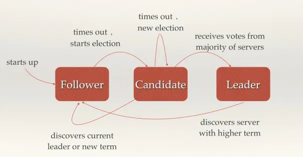
每个节点上都有一个倒计时器 (Election Timeout)，时间随机在 150ms 到 300ms 之间。有几种情况会重设 Timeout：

1. 收到选举的请求
2. 收到 Leader 的 Heartbeat (后面会讲到)

在 Raft 运行过程中，最主要进行两个活动：

1. 选主 Leader Election
2. 复制日志 Log Replication

## 2. 选主 Leader Election
### 2.1 正常情况下选主
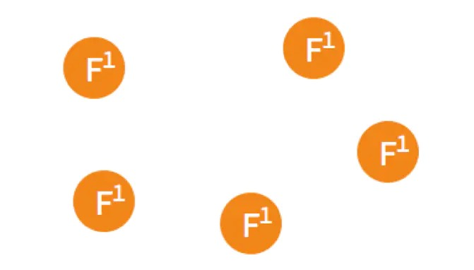
假设现在有如图5个节点，5个节点一开始的状态都是 Follower。
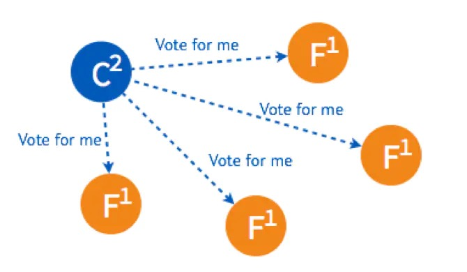
在一个节点倒计时结束 (Timeout) 后，这个节点的状态变成 Candidate 开始选举，它给其他几个节点发送选举请求 (RequestVote)
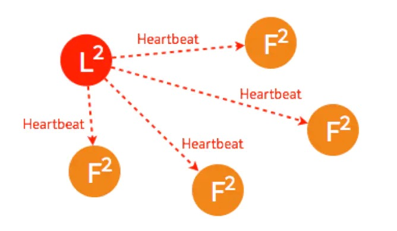
其他四个节点都返回成功，这个节点的状态由 Candidate 变成了 Leader，并在每个一小段时间后，就给所有的 Follower 发送一个 Heartbeat 以保持所有节点的状态，Follower 收到 Leader 的 Heartbeat 后重设 Timeout。

这是最简单的选主情况，只要有超过一半的节点投支持票了，Candidate 才会被选举为 Leader，5个节点的情况下，3个节点 (包括 Candidate 本身) 投了支持就行。
### 2.2 Leader 出故障情况下的选主
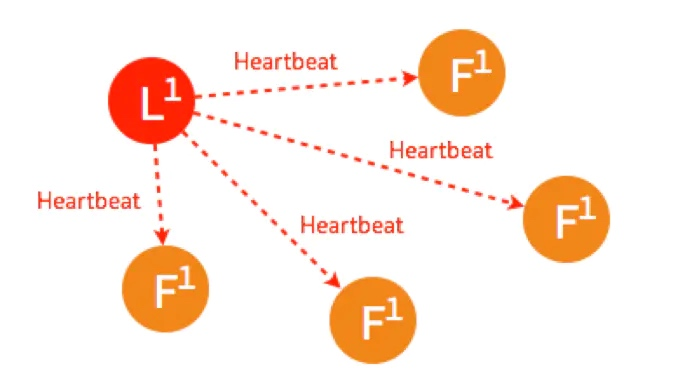
一开始已经有一个 Leader，所有节点正常运行。
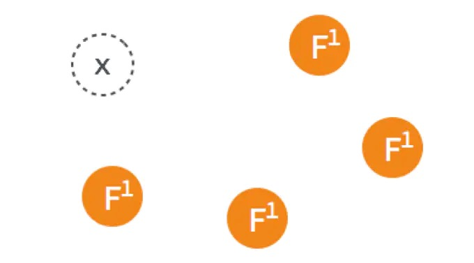
Leader 出故障挂掉了，其他四个 Follower 将进行重新选主。
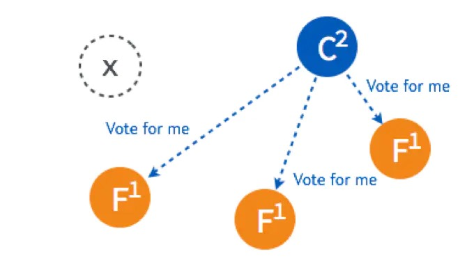
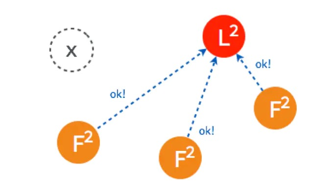
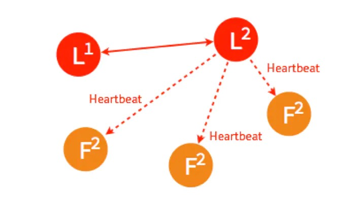
4个节点的选主过程和5个节点的类似，在选出一个新的 Leader 后，原来的 Leader 恢复了又重新加入了，这个时候怎么处理？在 Raft 里，第几轮选举是有记录的，重新加入的 Leader 是第一轮选举 (Term 1) 选出来的，而现在的 Leader 则是 Term 2，所有原来的 Leader 会自觉降级为 Follower。
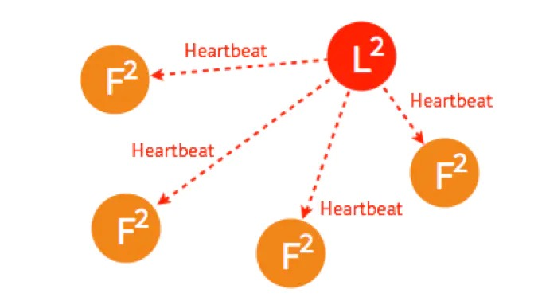

### 2.3 多个 Candidate 情况下的选主
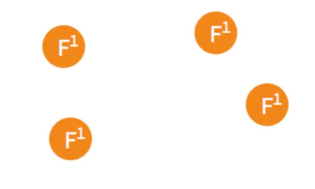
假设一开始有4个节点，都还是 Follower。
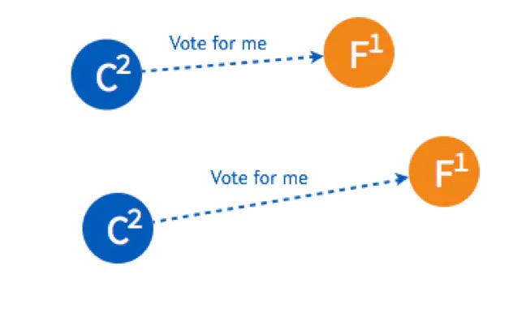
有两个 Follower 同时 Timeout，都变成了 Candidate 开始选举，分别给一个 Follower 发送了投票请求。
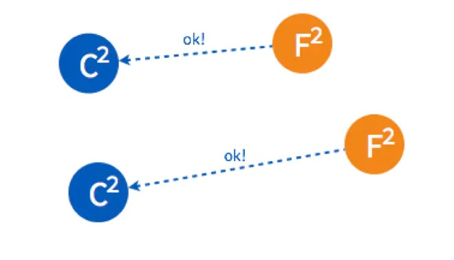
两个 Follower 分别返回了ok，这时两个 Candidate 都只有2票，要3票才能被选成 Leader。
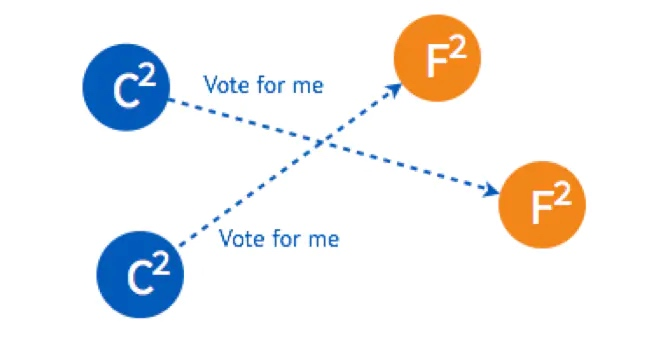
两个 Candidate 会分别给另外一个还没有给自己投票的 Follower 发送投票请求。

但是因为 Follower 在这一轮选举中，都已经投完票了，所以都拒绝了他们的请求。所以在 Term 2 没有 Leader 被选出来。
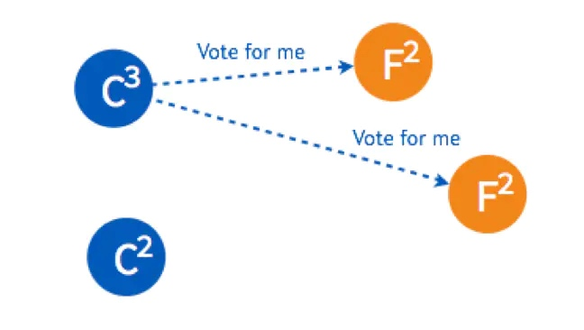
这时，两个节点的状态是 Candidate，两个是 Follower，但是他们的倒计时器仍然在运行，最先 Timeout 的那个节点会进行发起新一轮 Term 3 的投票。
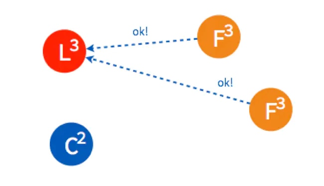
两个 Follower 在 Term 3 还没投过票，所以返回 OK，这时 Candidate 一共有三票，被选为了 Leader。

如果 Leader Heartbeat 的时间晚于另外一个 Candidate timeout 的时间，另外一个 Candidate 仍然会发送选举请求。
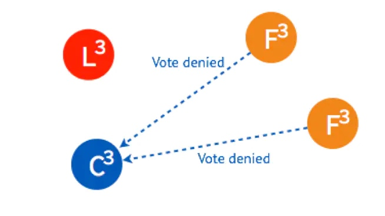
两个 Follower 已经投完票了，拒绝了这个 Candidate 的投票请求。
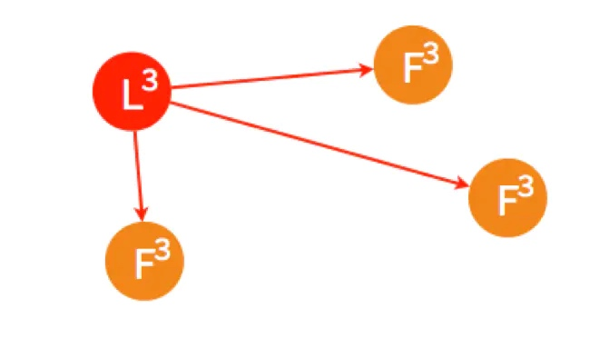
Leader 进行 Heartbeat， Candidate 收到后状态自动转为 Follower，完成选主。

以上是 Raft 最重要活动之一选主的介绍，以及在不同情况下如何进行选主。
## 3. 复制日志 Log Replication
### 3.1 正常情况下复制日志
Raft 在实际应用场景中的一致性更多的是体现在不同节点之间的数据一致性，客户端发送请求到任何一个节点都能收到一致的返回，当一个节点出故障后，其他节点仍然能以已有的数据正常进行。在选主之后的复制日志就是为了达到这个目的。
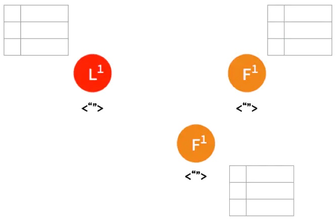
一开始，Leader 和 两个 Follower 都没有任何数据。
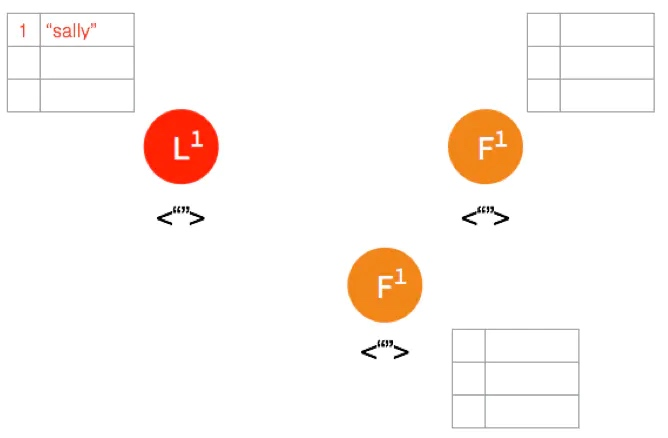
客户端发送请求给 Leader，储存数据 “sally”，Leader 先将数据写在本地日志，这时候数据还是 Uncommitted (还没最终确认，红色表示)
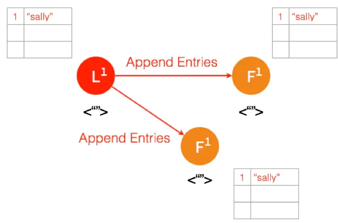
Leader 给两个 Follower 发送 AppendEntries 请求，数据在 Follower 上没有冲突，则将数据暂时写在本地日志，Follower 的数据也还是 Uncommitted。
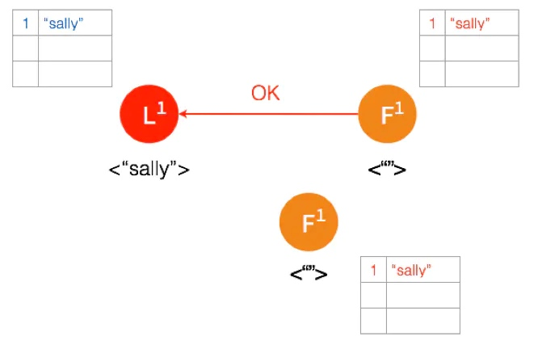
Follower 将数据写到本地后，返回 OK。Leader 收到后成功返回，只要收到的成功的返回数量超过半数 (包含Leader)，Leader 将数据 “sally” 的状态改成 Committed。( 这个时候 Leader 就可以返回给客户端了)

Leader 再次给 Follower 发送 AppendEntries 请求，收到请求后，Follower 将本地日志里 Uncommitted 数据改成 Committed。这样就完成了一整个复制日志的过程，三个节点的数据是一致的
### 3.2 Network Partition 情况下进行复制日志
在 Network Partition 的情况下，部分节点之间没办法互相通信，Raft 也能保证在这种情况下数据的一致性。
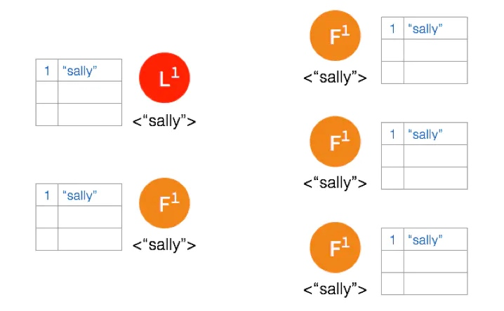
一开始有 5 个节点处于同一网络状态下。
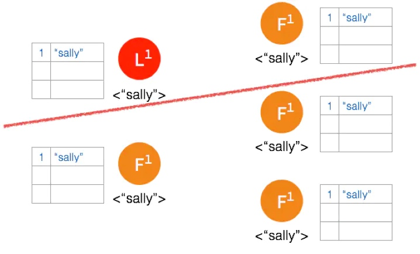
Network Partition 将节点分成两边，一边有两个节点，一边三个节点。

两个节点这边已经有 Leader 了，来自客户端的数据 “bob” 通过 Leader 同步到 Follower。
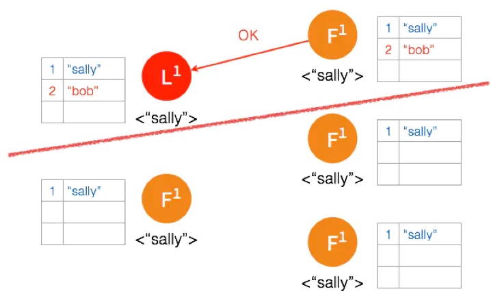
因为只有两个节点，少于3个节点，所以 “bob” 的状态仍是 Uncommitted。所以在这里，服务器会返回错误给客户端
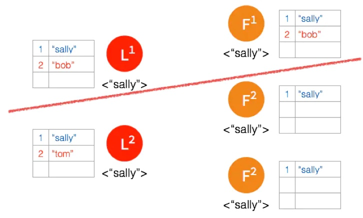
另外一个 Partition 有三个节点，进行重新选主。客户端数据 “tom” 发到新的 Leader，通过和上节网络状态下相似的过程，同步到另外两个 Follower。
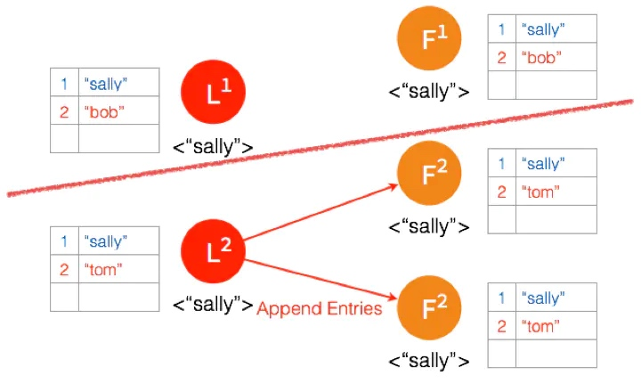
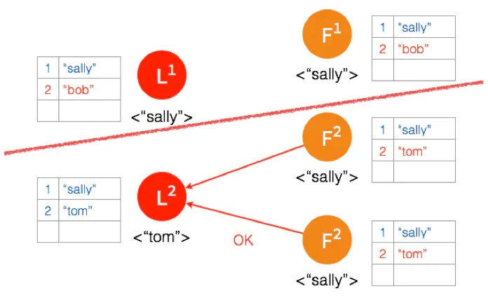
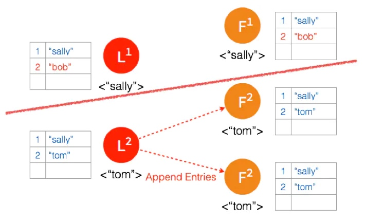
因为这个 Partition 有3个节点，超过半数，所以数据 “tom” 都 Commit 了。
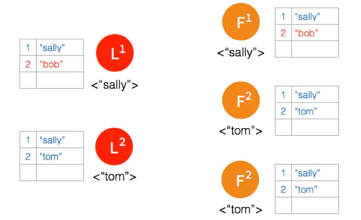
网络状态恢复，5个节点再次处于同一个网络状态下。但是这里出现了数据冲突 “bob" 和 “tom"
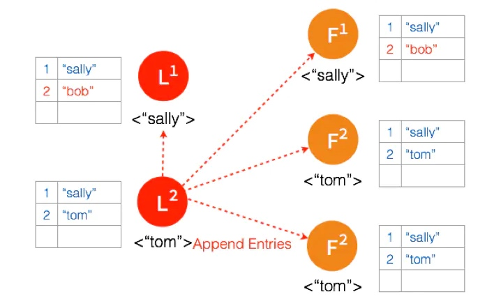
三个节点的 Leader 广播 AppendEntries

三个节点的 Leader 广播 AppendEntries
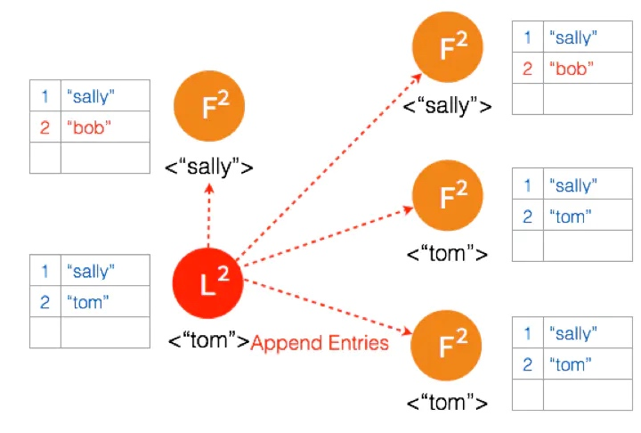
两个节点 Partition 的 Leader 自动降级为 Follower，因为这个 Partition 的数据 “bob” 没有 Commit，返回给客户端的是错误，客户端知道请求没有成功，所以 Follower 在收到 AppendEntries 请求时，可以把 “bob“ 删除，然后同步 ”tom”，通过这么一个过程，就完成了在 Network Partition 情况下的复制日志，保证了数据的一致性。
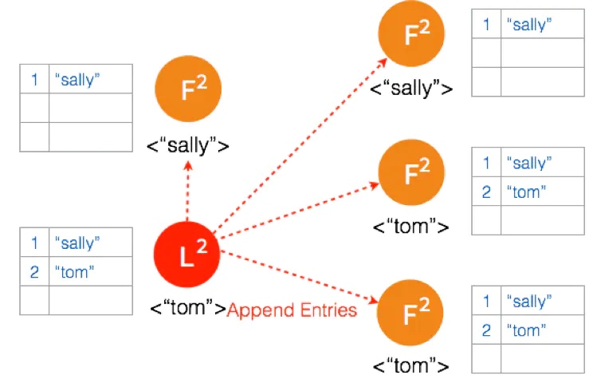
## 小总结
Raft 是能够实现分布式系统强一致性的算法，每个系统节点有三种状态 Follower，Candidate，Leader。
实现 Raft 算法两个最重要的事是：选主和复制日志
## 参考链接：
[Raft官网](https://raft.github.io/)
[Raft动画](http://thesecretlivesofdata.com/raft/)
[Raft 算法解析图片来源](http://www.infoq.com/cn/articles/coreos-analyse-etcd)
