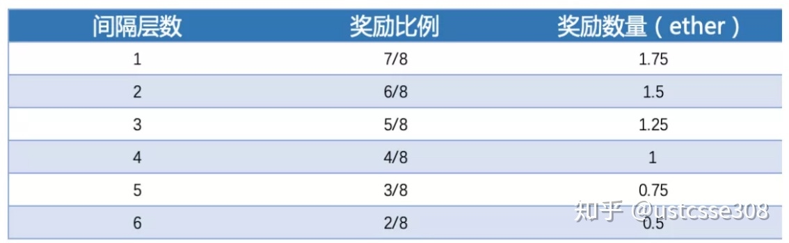
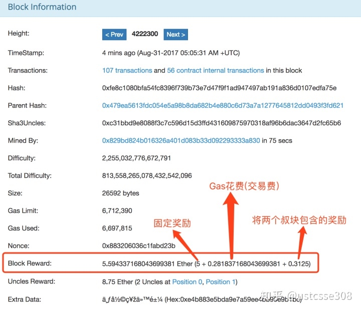
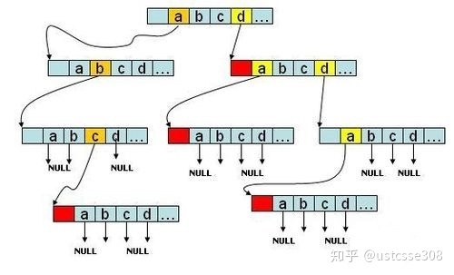

#以太坊 

**比特币系统的脚本语言存在一些严重的限制：**

* **缺少图灵完备性** – 这就是说，尽管比特币脚本语言可以支持多种计算，**但是它不能支持所有的计算。最主要的缺失是循环语句**。不支持循环语句的目的是避免交易确认时出现无限循环。理论上，对于脚本程序员来说，这是可以克服的障碍，因为任何循环都可以用多次重复if语句的方式来模拟，但是这样做会导致脚本空间利用上的低效率，例如，实施一个替代的椭圆曲线签名算法可能将需要256次重复的乘法，而每次都需要单独编码。

* **价值盲（Value-blindness）**。UTXO脚本不能为账户的取款额度提供精细的的控制。例如，预言机合约（oracle contract）的一个强大应用是对冲合约，A和B各自向对冲合约中发送价值1000美元的比特币，30天以后，脚本向A发送价值1000美元的比特币，向B发送剩余的比特币。虽然实现对冲合约需要一个预言机（oracle）决定一比特币值多少美元，但是与现在完全中心化的解决方案相比，这一机制已经在减少信任和基础设施方面有了巨大的进步。**然而，因为UTXO是不可分割的，为实现此合约，唯一的方法是非常低效地采用许多有不同面值的UTXO（例如对应于最大为30的每个k，有一个2^k 的UTXO)并使预言机挑出正确的UTXO发送给A和B。**

* **缺少状态** – UTXO只能是已花费或者未花费状态，这就没有给需要任何其它内部状态的多阶段合约或者脚本留出生存空间。这使得实现多阶段期权合约、去中心化的交换要约或者两阶段加密承诺协议（对确保计算奖励非常必要）非常困难。**这也意味着UTXO只能用于建立简单的、一次性的合约，而不是例如去中心化组织这样的有着更加复杂的状态的合约，使得元协议难以实现。**二元状态与价值盲结合在一起意味着另一个重要的应用-取款限额-是不可能实现的。

* **区块链盲（Blockchain-blindness）**- UTXO看不到区块链的数据，例如随机数和上一个区块的哈希。这一缺陷剥夺了脚本语言所拥有的基于随机性的潜在价值，严重地限制了博彩等其它领域应用。

在白皮书中，引入以太坊的时候，这样介绍：

> “以太坊的目的是基于脚本、竞争币和链上元协议（on-chain meta-protocol）概念进行整合和提高，使得开发者能够创建任意的基于共识的、可扩展的、标准化的、特性完备的、易于开发的和协同的应用。……并且因为图灵完备性、价值知晓（value-awareness）、区块链知晓（blockchain-awareness）和多状态所增加的力量而比比特币脚本所能提供的智能合约强大得多。”

对比一下以太坊白皮书中列出的比特币和以太坊的状态转换图：

**比特币作为状态转移系统:**

**以太坊的状态转换:**

在上图中，起始状态保护了**四个账户**，分别是14c5f8ba、bb75a980、892bf92f、4096ad65。其中14c5f8ba和4096ad65仅维护了余额；bb75a980和892bf92f除了余额之外，还包括一部分的代码和数据。交易数据由14c5f8ba发送到bb75a980，转账10个以太币。同时发送了两个数据2和“charlie”。这个数据传递到账户bb75a980时，触发了bb75a980账户中的代码，意思是如果在对应于交易中携带的数据中的第一个（作为索引），也即tx.data[0]，相对应的位置处的数据是0，则对该位置出的数据进行更新，更新为第二个数据，也即‘charlie’。

## 以太坊账户

> 以太坊的全局“共享状态”是有很多对象（账户）来组成的，这些账户可以通过消息传递架构来与对方进行交互。每个账户都有一个与之关联的状态(state)和一个20字节的地址(address)。在以太坊中一个地址是160位的标识符，用来识别账户的。

**有两种类型的账户：**

1. 外部拥有的账户，被私钥控制且没有任何代码与之关联
2. 合约账户，被它们的合约代码控制且有代码与之关联

### 外部拥有账户（EOA）与合约账户的比较

理解外部拥有账户和合约账户的基本区别是很重要的。一个外部拥有的账户可以通过创建和用自己的私钥来对交易进行签名，来发送消息给另一个外部拥有账户或合约账户。在两个外部拥有账户之间传送的消息只是一个简单的价值转移。但是从外部拥有的账户到合约账户的消息会激活合约账户的代码，允许它执行各种动作。（比如转移代币，写入内部存储，挖出一个新代币，执行一些运算，创建一个新的合约等等）。

**不像外部拥有账户，合约账户不可以自己发起一个交易。**相反，合约账户只有在接收到一个交易之后(从一个外部拥有账户或另一个合约账户接)，为了响应此交易而触发一个交易。我们将会在“交易和消息”部分来了解关于合约与合约之间的通信。

**因此，在以太坊上任何的动作，总是被外部控制账户触发的交易所发动的。**

### 账户状态

账户状态有四个组成部分，不论账户类型是什么，都存在这四个组成部分：

1. nonce：如果账户是一个外部拥有账户，nonce代表从此账户地址发送的交易序号。如果账户是一个合约账户，nonce代表此账户创建的合约序号
2. balance： 此地址拥有Wei的数量。1 Ether=10^18 Wei
3. storageRoot： Merkle Patricia树的根节点Hash值。Merkle树会将此账户存储内容的Hash值进行编码，默认是空值
4. codeHash：此账户EVM（以太坊虚拟机，后面细说）代码的hash值。对于合约账户，就是被Hash的代码并作为codeHash保存。对于外部拥有账户，codeHash域是一个空字符串的Hash值

> **可以简单理解EOA就是实际的用户；而合约账户就是EOA用户部署的合约，外部所有的账户（EOA externally owned account）（由私钥控制的）和合约账户（由合约代码控制）。外部所有的账户没有代码，人们可以通过创建和签名一笔交易从一个外部账户发送消息。每当合约账户收到一条消息，合约内部的代码就会被激活，允许它对内部存储进行读取和写入，和发送其它消息或者创建合约。**

## （一）图灵完备性

之前在介绍比特币脚本的时候，我们提到过比特币的脚本是故意设计成不完备的，为什么呢？因为之前分析过，在交易中写的脚本，是需要有矿工来执行并进行确认的。如果是图灵完备的，那么有可能会出现死循环的代码，对于矿工而言是非常不利的。

既然以太坊明确地在挑刺儿，也就意味着在以太坊中实现的脚本语言是图灵完备的。既然这样，以太坊必须要解决的问题是，如何应对死循环可能会无限地消耗？

> 以太坊中引入了gas（瓦斯、油价等中文翻译）的概念。以太坊在区块链上实现了一个运行环境，被称为以太坊虚拟机（EVM），参与到网络的节点都会运行EVM，验证区块中的每个交易并在EVM中运行交易所触发的代码。合约可以利用的每个命令都会有一个相应的费用值，费用使用gas作为单位计数，也即用户付给矿工的佣金。这里列了一些命令的gas消耗。例：PUSH操作需要消耗3个gas，一次转账一般要消耗21000 gas，gas使用ether（以太币）来支付。

**Gas常用的单位是wei，wei和ether的关系如下所示：**

每笔交易都被要求包括gas limit（startGas，限制）和Gas Price（价格）。Gas Limit 是用户愿意为执行某个操作或确认交易支付的最大Gas量（最少21,000）。Gas Price 是 Gwei 的数量，用户愿意花费于每个 Gas 单位的价钱。发送者支付的Gas Price越高，则其交易的优先级越重要，因为矿工打包该交易获得的报酬会更高，这样这个交易会较快地被打包到区块中，更早地获得确认。

如果该交易需要使用的gas数量小于或等于所设置的gas limit，那么这个交易会被成功处理。如果gas总消耗超过gas limit，那么所有的操作都会被复原（回滚），但是交易费仍然会被矿工收取。区块链会显示这笔交易完成尝试，但因为没有提供足够的gas导致所有的合约命令都被复原。

如果交易里gas没有被消耗完毕，剩下的gas都会以以太币（ether）的形式打回给交易发起者。因为gas消耗一般只是一个大致估算，所以许多用户会超额支付gas来保证他们的交易会被接受。这样如果恶意用户在交易中包括了死循环，那么不论付出多少gas，最终都会消耗完。另外，也正是因为这样的代价问题，虽然以太坊的脚本语言是图灵完备的，也即当前的所有代码都可以在以太坊区块链上运行，但是作为开发者，需要认真考虑代码的效率。两个同样功能的合同，效率高的那个才能生存下来。一个帮助人们理解以太坊合同实际能力的启发问题是：这个功能是否能在一个1999年的智能手机上实现？

> 总结，当进行每笔交易时，用户设定Gas Limit 和Gas Price，在运行时，矿工首先计算 Gas Limit*Gas Price ，就得到了ETH交易佣金的成本，然后这笔费用首先从用户的账户中扣除，交易运行完毕，如果有剩余，再还给用户。如果不够，矿工也不还钱，只是把交易全部回滚。

> 发送者支付的Gas Price越高，则其交易的优先级越重要，因为矿工的报酬会更高。 但是，通过设置较低燃料价格（GasPrice），发送者可以节省资金。以太坊客户端的Frontier版本有一个默认的gasPrice，即0.05e12 wei。矿工为了最大化他们的收益，如果大量的交易都是使用默认gasPrice即0.05e12 wei，那么基本上就很难要矿工去接受一个低gasPrice交易，更别说0 gasPrice交易了。

除了计算交易的花费之外，将交易或者合约上传也需要费用。虽然读取本地区块链是免费的，但写入和运算是花钱的。储存更是尤其昂贵，因为任何写入的信息都会被永久的储存着。相比之下，CPU运算很便宜。以太坊是图灵完备的，谁也拦不住你写一个视频解码器然后发布在区块链上；只不过估计你没钱运行它。假设这样的程序的代码至少有几千行，即使把它上传到区块链上也不会便宜。譬如，gas limit=2000，假设交易长为170字节，每字节的费用是5，减去850，所以还剩1150，剩下的才是运行交易能使用的gas上限。

除此之外，每个块还有Block gas limit，这个值在创世区块的配置文件中可以指定，譬如查看一个区块的信息如下，也即区块的gas limit是3573388。block gas limit的用意是限制一个区块中能够包含的交易的数量。

## Value-blindness

同样的，来回忆一下，比特币为什么放弃了基于账户的概念，而采取UTXO机制的呢？

使用UTXO可以避免维护账户余额的麻烦。为什么维护余额很麻烦呢？因为为了使用余额，也即能够让矿工检查和验证余额，余额必须是全局可见的数据。而基本上每个交易都会对余额产生影响和带来变化。也即，余额必须要全局可见，能快速地更新，而且可以验证。

> **UTXO的优点：** 
> 1. 较高程度的隐私保护。如果用户每次交易都使用一个新的地址，那么账户之间的相互关联就很困难。这样做适用于对安全性要求高的货币系统。
> 2. 潜在地可扩展性。 UTXO在理论上可扩展性更好。对于维护交易的Merkle树，即使所有的人(包括数据的拥有者)都遗忘了某一数据，真正受损也只有数据的拥有者，其他人不受影响。 但在以太坊账户系统中，任何人弄丢了一个账户对应在默克尔树中信息，那么将无法处理任何能够影响账户的消息。相当于UTXO是一次性的；而账户是可重用的。

既然以太坊期望可以有明确的价值，必须能够实现余额的概念。

**余额相对于UTXO也有一些优点：**
1. **节省空间。**如果一个账户有5个UTXO，则从UTXO模式转成账户模式所需空间会从300字节降到30字节。具体计算如下： 300 = (20+32+8）* 5 （20是地址字节数，32是TX的id字节数，8是交易金额值字节数）; 30 = 20 + 8 + 2 ( 20是地址字节数，8是交易金额值字节数，2是nonce②字节数) 但实际节约并没有这么大，因为账户需要被存储在帕特里夏树中。另外以太坊中交易也比比特币中的更小（以太坊中100字节，比特币中200-250字节），因为每次交易只需要生成一次引用，一次签名，以及一个输出。
2. **可替代性更高。** 在UTXO结构中，“有效输出”的源码实现中没有区块链层的概念，所以不管是在技术还是法律上，通过建立一个红名单/黑名单，并依据的这些“有效输出”的来源区分它们并不是很实际。
3. **简单。** 以太坊编码更简单、更易于理解，尤其是在涉及到复杂脚本时。尽管任何去中心化应用都可以用UTXO方式来实现，但这种方式实质上是通过赋予一个脚本限制给定的UTXO能够使用以及请求的UTXO的种类的方式来实现，包括脚本评估的应用更改根状态的默克尔树证明。因此，UTXO实现方式比以太坊使用账户的方式要复杂的多。
4. **轻客户端。**轻客户端可以随时通过沿指定方向扫描状态树来访问与账户相关的所有数据。在UTXO方式中，引用随着每个交易的变化而变化，这对于长时间运行并使用了UTXO根状态传播机制的dapp应用来说，无疑是繁重的。

**账户方式的一个弱点是：为了阻止重播攻击，每笔交易必须有nonce**。nonce的值是上一次使用的nonce值+1，这就使得账户需要跟踪nonce的使用情况，并且必须确认交易的Nonce值比上次使用的Nonce值大1。解决这个问题的一个简单方法是让交易包含一个区块号，这样过一段时间之后，交易便不能重放了。

为了实现账户方式，以太坊的做法是采用状态(state)的概念存储一系列账户，每个账户都有自己的余额，以及以太坊特有的数据（代码或内部存储器）。

> **以太坊的状态由每个交易改变，为了维护这个状态，和比特币不同，比特币在区块中只包括了交易的merkle树根，而以太坊在区块头部中会包括三棵树，分别是世界状态树（world state trie），交易树（transaction trie）以及receipt树。**

### 世界状态树
世界状态是地址（账户）到账户状态的映射。虽然世界状态不保存在区块链上，但在黄皮书的描述中，世界状态也由树来保存数据（此树也被称为状态数据库或者状态树）。**世界状态可以被视作为随着交易的执行而持续更新的全局状态，也是以太坊中唯一的全局的数据。**

以太坊中所有的账户信息都体现在世界状态之中，并由世界状态树保存，状态树持续更新。对于以太坊网络中的每一个账户，状态树中存放了一个键值对，其中键key是160位的账户的地址，值value是账户的相关信息，如上面图中所展示的，包括

    - nonce
    - balance
    - storageRoot
    - codeHash

如果想知道某一账户的余额，或者某智能合约当前的状态，就需要通过查询世界状态树来获取该账户的具体状态信息。其中账户存储树是保存与账户相关联数据的结构。该项只有合约账户才有，而在 EOA 中， storageRoot 留空、 codeHash 则是一串空字符串的哈希值。

**为什么以太坊中需要保存用户状态的历史记录，而比特币中不需要呢？**

因为，比特币中区块生成速度较慢，产生分叉的可能性也较低。而且，即使产生了分叉，由于比特币系统中的交易比较简单，只是简单的转账交易，因此回滚起来比较方便。比较容易实现将被抛弃的分叉中的交易进行回滚。而以太坊就不一样了。以太坊的区块生成速度比较快，十几秒就会产生一个区块，因此产生分叉非常频繁，需要经常进行回滚操作。最重要的一点是，以太坊中有智能合约，使得以太坊是图灵完备的，可以实现很复杂的交易。因此，如果不保存历史记录，就很难进行回滚操作。

### 交易树
每当发布一个区块时，区块中包含的所有交易，会被组织成一棵交易树，该树是一棵Merkle Patricia Tree，查找的键值是交易在发布时的序号（交易的排列顺序是由发布区块的节点决定的）。
交易树用来证明某笔交易在某个区块当中。交易树中包括的交易的细节：

    nonce,
    gas price,
    gas limit,
    recipient,
    transfer value,
    transaction signature values, and
    account initialization (if transaction is of contract creation type), or transaction data (if transaction is a message call)

### 收据树

每个交易执行完之后，会形成一个收据，记录交易的相关信息，而这些收据会被组织成一棵收据树，该树是一棵Merkle Patricia Tree，查找的键值是交易在发布时的序号（交易的排列顺序是由发布区块的节点决定的）。收据树中对应的交易的信息：

    post-transaction state,
    the cumulative gas used,
    the set of logs created through execution of the transaction, and
    the Bloom filter composed from information in those logs

**既然已经有了交易树，为什么还需要收据树这个数据结构呢？**

因为，以太坊拥有智能合约，而智能合约的执行过程比较复杂，**通过增加收据树，有利于系统快速查询执行的结果。**
在以太坊中，每个交易对应的收据中都会包含一个Bloom filter，记录这个交易的类型、地址等信息。发布的区块的块头中也有一个总的Bloom filter，这个Bloom filter是所有收据中的Bloom filter的并集。
如果我们需要查找过去一段时间内发生的和某个智能合约相关的所有交易，首先需要在区块的块头中的Bloom filter中看看有没有我们要查找的交易的类型，如果有的话，再到区块中的每个交易对应的收据的Bloom filter中进行查找；而如果没有的话，那么该区块中一定没有我们要查找的交易类型。通过该种方法，就可以快速排除掉无关的收据，从而提高查找速度。

## GHOST协议

**GHOST（Greedy Heaviest Observed Subtree）是一种主链（非侧链）选择协议。举例来说：经典的Proof-of-Work（POW）是以取最长的主链为基本原则，GHOST协议则是以包含块数最多为基本原则。**

在比特币协议中，最长的链被认为是绝对的正确。如果一个块不是最长链的一部分，那么它被称为是“孤块”。一个孤立的块也是合法的，但是发现的稍晚，或者是网络传输稍慢，而没有能成为最长的链的一部分。在比特币中，孤块没有意义，随后将被抛弃，发现这个孤块的矿工也拿不到采矿相关的奖励。例如：挖矿节点A是一个矿池占有全网30%的算力，挖矿节点B占有全网算力的10%，节点A会有70%的概率产生废块，节点B有90%的概率产生废块。

以太坊平均10多秒发布一个区块，更短的出块时间意味着，临时性分叉的几率将大幅提升。这是因为当矿工A挖出一个新区块后，需要向全网广播，广播的过程需要时间，由于以太坊出块时间短，其他节点可能还没有收到矿工A发布的区块，就已经挖出了同一高度的区块，这就造成了临时分叉。在以太坊网络中，临时性分叉发生的几率在8%左右。

同时，如果新旧区块之间产生的间隔太短, 在上面的例子中，则节点A会因为规模效应而比B节点更为高效。所以新旧区块的间隔过短会导致单一的矿池主导全网的挖矿过程。而区块中的数据重复验证6次（若干次）立即永久封存地区块中，一旦51%算力攻击一旦发生，double-spend等糟糕问题会出现，恶意的数据容易永久封存于区块中，整个blockchain系统需要足够长的时间来处理和恢复黑客恶意攻击所造成的破坏。

**在以太坊中，根据GHOST协议，不认为孤块没有价值，而是会给与发现孤块的矿工以回报。孤块被称为“叔块”(uncle block)，它们可以为主链的安全作出贡献，也同样能获得奖励，这激励了矿工在新发现的块中去引用叔块，减少了孤块的产生。**

**Ghost协议解决了两个问题：摒弃了单一的最长链原则, 取而代之的是最大子数原则；孤块奖励问题。**

如下图所示：

* 如果单纯的计算最长链原则, 主链应该是 0 -> 1B -> 2D -> 3F ->  4C -> 5B.
* 如果采用了GHOST协议, 以前的”废块”也会被考虑到主链的计算量中.每一个节点下含一个子树, 兄弟节点之间子树节点最多的被选为主链. 这样一来 0 -> 1B -> 2C -> 3D -> 4B 成为主链,

如果采用GHOST协议, 一个攻击者仅仅提供一个1A到6A的长链并不能被认为是主链。

**Ghost协议的优势在于：**

* 以太坊十几秒的出块间隔，大大增加了孤块的产生，并且降低了安全性。通过鼓励引用叔块，使引用主链获得更多的安全保证（因为孤块本身也是合法的）
* 比特币中，采矿中心化(大量的集中矿池)成为一个问题。Ghost协议下，叔块也是能够获得报酬，可以一定程度上缓解这个问题。

**孤块奖励问题：**

* 主链节点获得base reward；
* 一个节点最多引用两个叔块；
* 叔块必须是区块的前2层~前7层的祖先的直接子块；
* 被引用过的叔块不能重复引用；
* 引用叔块的区块，可以获得挖矿报酬的1/32，也就是51/32=0.15625 Ether，最多获得20.15625=0.3125 Ether；
* 主链节点的兄弟（非主链节点）获得 ((叔块高度+8-当前块的高度)/8 )*base reward，如下图表格所示；
* 交易费用(transaction fee)不会分配给叔块

我们通过一个例子来介绍上面的规则。

假设当前区块高度为107（上图中绿色区块），它能有效引用的叔块，只能是区块高度为101～106的区块，**换句话说叔块的有效引用区间，最多只能在7代以内。**上图中黄色区块，区块高度为100，就不在107这个区块的有效引用范围。图中红色的区块，因为不是最长链上区块的直接子块，这种区块不能成为叔区块。

如果在101和106的区块高度，有多个没被引用的叔块，高度为107的区块做多只能引用两个，而且一个叔块被它引用后，就不能再被其他区块重复引用。

被引用的叔块获得奖励数量，取决与该叔块和引用区块的“远近”关系。关系越近，叔块得到奖励越多。而引用叔块的区块，每引用一个区块，都能得到系统出块奖励的1/32，最多只能引用两个区块。当前以太坊新区块获得系统奖励为2枚以太币（2ether），如果叔块在间隔一层就被引用，该叔块将获得出块奖励的7/8，也就是1.75ether，如果叔块隔了6层才被引用，它获得奖励只有0.5ether，具体如下表。

看一个真实的块的情况4222300

-------
由于以上特性，以太坊的轻客户端比Bitcoin的轻客户端功能更强。Bitcoin的轻客户端可以证明包含的交易，但是它不能进行涉及当前状态的证明（如数字资产的持有，名称注册，金融合约的状态等）。而以太坊的轻客户端能够轻松地进行并核实以下类型的查询答案：

* 这笔交易被包含在特定的区块中了么？
* 告诉我这个地址在过去30天中，发出X类型事件的所有实例（例如，一个众筹合约完成了它的目标）
* 目前我的账户余额是多少？
* 这个账户是否存在？
* 假装在这个合约中运行这笔交易，它的输出会是什么？

**第一种是由交易树（transaction tree）来处理的；第三和第四种则是由状态树（state tree）负责处理，第二种则由收据树（receipt tree）处理。计算前四个查询任务是相当简单的。服务器简单地找到对象，获取Merkle分支，并通过分支来回复轻客户端。第五种查询任务同样也是由状态树处理，但它的计算方式会比较复杂。**

***_这些树使用了一个非常重要的数据结构。默克尔帕特里夏树_***(Merkle Patricia tree/trie)，由Alan Reiner提出设想，并在瑞波协议中得到实现，是以太坊的主要数据结构，用于存储所有账户状态，以及每个区块中的交易和收据数据。MPT是默克尔树和帕特里夏树的结合缩写，结合这两种树创建的结构具有以下属性：

1. 每个唯一键值对唯一映射到根的hash值；在MPT中，不可能仅用一个键值对来欺骗成员（除非攻击者有~2^128 的算力）；
2. 增、删、改键值对的时间复杂度是对数级别。

MPT为我们提供了一个高效、易更新、且代表整个状态树的“指纹”。

二叉Merkle树对于验证“清单”格式的信息而言，是非常好的数据结构，本质上来讲，它就是一系列前后相连的数据块。对于交易树来说，它们也同样是不错的，因为一旦树已经建立，花多少时间来编辑这棵树并不重要，树一旦建立了，它就会永远存在。

而对状态树来说，情况会更复杂些。以太坊中的状态树基本上包含了一个键值映射，其中的键是地址还有各种值，包括账户的声明、余额、随机数、代码以及每一个账户的存储（其中存储本身就是一颗树）。例如，the Morden testnet 的创始状态如下所示：

    { "0000000000000000000000000000000000000001":{ "balance": "1" }, "0000000000000000000000000000000000000002": { "balance": "1" }, "0000000000000000000000000000000000000003": { "balance": "1" }, "0000000000000000000000000000000000000004": { "balance": "1" }, "102e61f5d8f9bc71d0ad4a084df4e65e05ce0e1c": { "balance": "1606938044258990275541962092341162602522202993782792835301376" } }

不同于交易历史记录，状态树需要经常地进行更新：账户余额和账户的随机数nonce经常会更变，更重要的是，新的账户会频繁地插入，存储的键（ key）也会经常被插入以及删除。MPT的数据结构设计，使得我们可以在一次插入、更新编辑或者删除操作之后，快速地计算出新的树根（tree root），而无需重新计算整颗树。

此外，它还有两个非常好的特性：

1. **树的深度是有限制的。**考虑到攻击者会故意地制造一些交易，使得这棵树尽可能地深，从而可以通过操纵树的深度，执行拒绝服务攻击（DOS attack），使得更新变得极其缓慢。
2. **树的根只取决于数据，和其中的更新顺序无关。**换个顺序进行更新，甚至重新从头计算树，并不会改变根。

## 帕特里夏树（Patricia Trees）(压缩前缀树)

Merkle Patricia Tree（又称为Merkle Patricia Trie）是一种经过改良的、融合了默克尔树和前缀树两种树结构优点的数据结构，是以太坊中用来组织管理账户数据、生成交易集合哈希的重要数据结构。

MPT结合了（1）radix trie (patricia)（2）Merkle tree两种树结构的特点与优势 ，因为Merkle树之前已经详细介绍过，所以这里直接讨论前缀树以及压缩前缀树（patricia树）。

### Trie树

**Trie树，又称前缀树或字典树，是一种有序树，用于保存关联数组，其中的键通常是字符串。与二叉查找树不同，键不是直接保存在节点中，而是由节点在树中的位置决定。一个节点的所有子孙都有相同的前缀，也就是这个节点对应的字符串，而根节点对应空字符串。**

下面这棵trie包含这样一组单词，inn, int, at, age, adv, ant 每个节点存储的是字符串中的部分字符，每个从根到某个节点的路径（不一定到叶子节点）代表了一个存储的字符串，如果想查找adv是否存在，只需要走红圈这样的路径即可。

**Trie的核心思想是空间换时间。利用字符串的公共前缀来降低查询时间的开销以达到提高效率的目的。它有3个基本性质：**

* 根节点不包含字符，除根节点外每一个节点都只包含一个字符。
* 从根节点到某一节点，路径上经过的字符连接起来，为该节点对应的字符串。
* 每个节点的所有子节点包含的字符都不相同。

典型应用是用于统计和排序大量的字符串（但不仅限于字符串），所以经常被搜索引擎系统用于文本词频统计。它的优点是：最大限度地减少无谓的字符串比较。举个具体的例子：

**题目：给你100000个长度不超过10的单词。对于每一个单词，我们要判断它出没出现过，如果出现了，求第一次出现在第几个位置。**

分析：这题当然可以用hash来解决，但是比如说对于某一个单词，我们要询问它的前缀是否出现过。这样hash就不太适用，而用trie还是很简单。
现在回到例子中，如果我们用最朴实的方法，对于每一个单词，我们都要去查找它前面的单词中是否有它。那么这个算法的复杂度就是O(n^2 )。显然对于100000的范围难以接受。现在我们换个思路想。假设我要查询的单词是abcd，那么在前面的单词中，以b，c，d，f之类开头的显然不必考虑。而只要找以a开头的中是否存在abcd就可以了。同样的，在以a开头中的单词中，我们只要考虑以b作为第二个字母的，一次次缩小范围和提高针对性，这样一个树的模型就渐渐清晰了。
好比假设有b，abc，abd，bcd，abcd，efg，hii 这6个单词，我们构建的树就是如下图这样的：

如上图所示，对于每一个节点，从根遍历到他的过程就是一个单词，如果这个节点被标记为红色，就表示这个单词存在，否则不存在。那么，对于一个单词，我只要顺着从根走到对应的节点，再看这个节点是否被标记为红色就可以知道它是否出现过了。把这个节点标记为红色，就相当于插入了这个单词。这样一来我们查询和插入可以一起完成，所用时间仅仅为单词长度，在这一个样例，便是10。

以上只是简化表示，实际上，trie每个节点是一个确定长度的数组，数组中每个节点的值是一个指向子节点的指针，最后有个标志域，标识这个位置为止是否是一个完整的字符串。从这个意义上讲，trie树每一层的节点数是26^i 级别的，但实际上并没有这么多，很多位置的相应指针为空。

常见的用来存英文单词的trie每个节点是一个长度为27的指针数组，index0-25代表a-z字符，26为标志域。如图：

**缺点：**

* 直接查找效率较低
前缀树的查找效率是O(m)，m为所查找节点的key长度，而哈希表的查找效率为O(1)。且一次查找会有m次IO开销，相比于直接查找，无论是速率、还是对磁盘的压力都比较大。

* 可能会造成空间浪费
当存在一个节点，其key值内容很长（如一串很长的字符串），当树中没有与他相同前缀的分支时，为了存储该节点，需要创建许多非叶子节点来构建根节点到该节点间的路径，造成了存储空间的浪费。

### 对前缀树的改进：Patricia树

**Patricia trie，压缩前缀树，是一种更节省空间的Trie。对于基数树的每个节点，如果该节点是唯一的儿子的话，就和父节点合并。**

如之前所提及的，前缀树中会出现严重的存储空间浪费的情况，如上图。图中右侧有一长串节点，这些节点大部分只是充当非叶子节点，用来构建一条路径，目的只是为了存储该路径上的叶子节点。

**针对这种情况，MPT树对此进行了优化：当MPT试图插入一个节点，插入过程中发现目前没有与该节点Key拥有相同前缀的路径。此时MPT把剩余的Key存储在叶子／扩展节点的Key字段中，充当一个”Shortcut“。**

下图中对应着将5个单词test、toaster、toasting、slow、slowly插入到树中，其中有三个单词共享t前缀，两个单词共享s前缀，t和s不同，所以在根节点上有两个分支。在左边的分支（t）上，有两个分支，而且est是没有和其他任何单词共享前缀，也即父节点只有一个孩子，则est可以被压缩。类似地oast和slow以及ly可以进行压缩。

**这种做法有以下几点优势：**

* 提高节点的查找效率，避免过多的磁盘访问；
* 减少存储空间浪费，避免存储无用的节点；

**另外，再看一个例子，这种树可以用来存键值对，key就是路径上的字符串，value的值存储在叶子节点。：**

**树中所存储的键值对：**

    6c0a5c71ec20bq3w => 5
    6c0a5c71ec20CX7j => 27
    6c0a5c71781a1FXq => 18
    6c0a5c71781a9Dog => 64
    6c0a8f743b95zUfe => 30
    6c0a8f743b95jx5R => 2
    6c0a8f740d16y03G => 43
    6c0a8f740d16vcc1 => 48

> **就以太坊而言，状态树的键 / 值映射是地址与相关账户之间的映射，即指向每个账户的 balance、nonce、codeHash 和 storageRoot。**

-------

**在以太坊中的MPT树中，树节点可以分为以下四类：**

* 空节点：(represented as the empty string)
* 分支节点：A 17-item node[ v0 ... v15, vt ]
* 叶子节点：A 2-item node[ encodedPath, value ]
* 扩展节点：A 2-item node[ encodedPath, key ]

1. 空节点，简单的表示空，在代码中是一个空串。

2. 叶子节点（leaf），表示为[key,value]的一个键值对，其中key是key的一种特殊十六进制编码，value是value的RLP编码。

3. 扩展节点（extension），也是[key，value]的一个键值对，但是这里的value是其他节点的hash值，这个hash可以被用来查询数据库中的节点。也就是说通过hash链接到其他节点。

4. 分支节点（branch），因为MPT树中的key被编码成一种特殊的16进制的表示，再加上最后的value，所以分支节点是一个长度为17的list，前16个元素对应着key中的16个可能的十六进制字符，如果有一个[key,value]对在这个分支节点终止，最后一个元素代表一个值，即分支节点既可以搜索路径的终止也可以是路径的中间节点。

### 分支节点
分支节点用来表示MPT树中所有拥有超过1个孩子节点以上的非叶子节点， 其定义如下所示：

    type fullNode struct {
        Children [17]node // Actual trie node data to encode/decode (needs custom encoder)
        flags    nodeFlag
    }

    // nodeFlag contains caching-related metadata about a node.
    type nodeFlag struct {
        hash  hashNode // cached hash of the node (may be nil)
        gen   uint16   // cache generation counter
        dirty bool     // whether the node has changes that must    be written to the database
    }

与前缀树相同，MPT同样是把key-value数据项的key编码在树的路径中，但是key的每一个字节值的范围太大（[0-127]，ASCII码的范围），因此在以太坊中，**在进行树操作之前，首先会进行一个key编码的转换（下节会详述），将一个字节的高低四位内容分拆成两个字节存储。**通过编码转换，key'的每一位的值范围都在[0, 15]内。因此，一个分支节点的孩子至多只有16个。以太坊通过这种方式，减小了每个分支节点的容量，但是增加了树高。

**分支节点的孩子列表中，最后一个元素是用来存储自身的内容。**

**此外，每个分支节点会有一个附带的字段nodeFlag，记录了一些辅助数据：**

* **节点哈希：**若该字段不为空，则当需要进行哈希计算时，可以跳过计算过程而直接使用上次计算的结果（当节点变脏时，该字段被置空）；
* **脏标志：**当一个节点被修改时，该标志位被置为1；
* **诞生标志：**当该节点第一次被载入内存中（或被修改时），会被赋予一个计数值作为诞生标志，该标志会被作为节点驱除的依据，清除内存中“太老”的未被修改的节点，防止占用的内存空间过多；

### 叶子节点&&扩展节点

叶子节点与扩展节点的定义相似，如下所示：

    type shortNode struct {
        Key   []byte
        Val   node
        flags nodeFlag
    }

其中关键的字段为：

* Key：用来存储属于该节点范围的key；
* Val：用来存储该节点的内容；

其中 Key 是MPT树实现树高压缩的关键。当MPT试图插入一个节点，插入过程中发现目前没有与该节点 Key 拥有相同前缀的路径。此时MPT把**剩余的 Key** 存储在叶子／扩展节点的 Key 字段中，充当一个”Shortcut“。【可以结合上面toasting的例子】

此外Val字段用来存储叶子／扩展节点的内容，对于叶子节点来说，**该字段存储的是一个数据项的内容；而对于扩展节点来说，该字段可以是以下两种内容：**

* Val字段存储的是其孩子节点在数据库中存储的索引值（其实该索引值也是孩子节点的哈希值）；
* Val字段存储的是其孩子节点的引用；

**由于叶子/扩展节点共享一套定义，那么怎么来区分Val字段存储的到底是一个数据项的内容，还是一串哈希索引呢？**

在以太坊中，通过在Key中加入特殊的标志来区分两种类型的节点。

## key值编码

在以太坊中，MPT树的key值共有三种不同的编码方式，以满足不同场景的不同需求，在这里单独作为一节进行介绍。

三种编码方式分别为：

* Raw编码（原生的字符）；
* Hex编码（扩展的16进制编码）；
* Hex-Prefix编码（16进制前缀编码）；

### Raw编码

Raw编码就是原生的key值，不做任何改变。这种编码方式的key，是MPT对外提供接口的默认编码方式。

> 例如一条key为“cat”，value为“dog”的数据项，其Raw编码就是['c', 'a', 't']，换成ASCII表示方式就是[63, 61, 74]

### Hex编码

**在介绍分支节点的时候，我们介绍了，为了减少分支节点孩子的个数，需要将key的编码进行转换，将原key的高低四位分拆成两个字节进行存储。这种转换后的key的编码方式，就是Hex编码。**

**从Raw编码向Hex编码的转换规则是：**

* 将Raw编码的每个字符，根据高4位低4位(nibble)拆成两个字节；
* 若该Key对应的节点存储的是真实的数据项内容（即该节点是叶子节点），则在末位添加一个ASCII值为16的字符作为终止标志符；
* 若该key对应的节点存储的是另外一个节点的哈希索引（即该节点是扩展节点），则不加任何字符；

> key为“cat”, value为“dog”的数据项，其Hex编码为[6, 3, 6, 1, 7, 4, 10]

Hex编码用于对内存中MPT树节点key进行编码

### HP编码

**MPT树中另外一个重要的概念是一个特殊的十六进制前缀(hex-prefix, HP)编码，用来对key进行编码。因为有两种[key,value]节点(叶节点和扩展节点)，所以需要对它们进行区分。此时，引进一种特殊的标识（一个bit即可）来标识key所对应的是值是叶子，还是其他节点的hash。如果标识符是1，那么key对应的是叶节点，反之则是扩展节点。**

另外需要注意的一点是，在某个节点处，当前路径的长度可能是奇数。此时会面临的一个问题是，因为路径本身是按照4位，也即一个nibble为单位的，但是存储的时候总是以字节为单位的。假设当前有两个路径分别是‘136’和‘0136’，在存储的时候是没有办法区分的，因为以字节为单位进行存储的时候，总是会转化为01 + 36两个字节。所以，在HP编码中，还必须有一个标识进行路径长度奇偶性的标识。**【注：要结合下面具体的例子看，这里的路径不是从根到叶子的完整的路径（总是偶数），而是当前在叶子节点/扩展节点中存储的路径的长度】**

**所以在MPT树中，对每个路径（叶子节点首先移除末尾的16），总是要首先加上一个nibble，这个Nibble的最低位表示节点路径长度奇偶性，第二低位表示节点的性质。**

如果key是偶数长度，那么因为又加了一个四个比特，所以需要加上另外一个值为0的nibble，使得整体长度为偶数。

**HP编码的规则如下：**

* 若原key的末尾字节的值为16（即该节点是叶子节点），去掉该字节；
* 在key之前增加一个半字节，其中最低位用来编码原本key长度的奇偶信息，key长度为奇数，则该位为1；低2位中编码一个特殊的终止标记符，若该节点为叶子节点，则该位为1；
* 若原本key的长度为偶数，则在key之前再增加一个值为0x0的半字节；
* 将原本key的内容作压缩，即将两个字符以高4位低4位进行划分，存储在一个字节中（Hex扩展的逆过程）；

> 若Hex编码为[6, 3, 6, 1, 7, 4, 10]，则HP编码的值为[20, 63, 61, 74]

> **解析：
>     [6, 3, 6, 1, 7, 4, 10] = [0110,0011,0110,0001,0111,0100,00010000]
>     其中key长度为偶数，且末尾字节的值为16，表示该节点为叶节点。
>     所以去掉末尾字节，在key前增加一个值为0x0的半字节，再增加一个0010的半字节表示叶节点。
>     编码后为[00100000,0110,0011,0110,0001,0111,0100]**

所添加的nibble的值和所对应的节点的路径的性质表如下：

    hex char    bits    |    node type partial     path length
    ----------------------------------------------------------
       0        0000    |       extension              even -> 00       
       1        0001    |       extension              odd  -> 1         
       2        0010    |   terminating (leaf)         even -> 20        
       3        0011    |   terminating (leaf)         odd  -> 3
    
根据bits可以判断出节点的类型和搜索路径长度的奇偶性。0000，查看最后两位的情况，倒数第二位是0，说明是extension节点；最后一位是0，说明路径长度是偶数。0011，最后两位的值是11，第二低位是1说明是扩展节点，最后一位是1说明路径长度为奇数。剩下两种情况类似可分析。

### 转换关系

**以上三种编码方式的转换关系为：**

> * Raw编码：原生的key编码，是MPT对外提供接口中使用的编码方式，当数据项被插入到树中时，Raw编码被转换成Hex编码；

> * Hex编码：16进制扩展编码，用于对内存中树节点key进行编码，当树节点被持久化到数据库时，Hex编码被转换成HP编码；

> * HP编码：16进制前缀编码，用于对数据库中树节点key进行编码，当树节点被加载到内存时，HP编码被转换成Hex编码；

下面结合一个具体的例子再来描述一遍这个过程。

在上图中，共有四个键值对。四个key有共同的前缀a7，因此，第一个节点（也是root节点）是一个扩展节点。之后接下来有三个分支，分别是1、7和f。因此，扩展节点之后跟着一个分支节点，分支节点中有三个分支。其中分支1和f之后只有一个节点，因此直接到达了叶子节点。分支7之后有两个节点，并且这两个节点有共同的前缀‘d3’，所以分支7连着一个扩展节点。扩展节点之后有两个分支，3和9，因此再跟上一个分支节点。分支节点之后是两个叶子节点。**（以上图叶子结点和扩展结点的数据结构实际是相同的，图上value值实际上是一段哈希，写成这样是方便理解）**

**然后再分析一下前缀的情况。**
> 1. 在路径为'a7'的扩展节点中，路径长度为偶数，本身为扩展节点，因此，第一个nibble为0000，长度为偶数，添加一个nibble 0000，前缀应该为00。**(shared nibble为2个长度，所以为偶）**
> 2. 第二层的两个叶子节点，长度都为偶数，所以第一个nibble是0010，再添加一个nibble 0000,所以最终前缀应该为20。**（看key-end长度都为4，所以为偶）**
> 3. 第二层中的扩展节点，同样长度为偶数，所以前缀应该是00。**（share nibble为两个长度，所以为偶）**
> 4. 最后一层的叶子节点中，长度为奇数，所以添加的nibble是0011，也即3。**（key-end为一个长度，所以为奇）**

### 练习

**完成下列节点的Hex编码到HP编码。**

    [ 1, 2, 3, 4, 5, ...] 【扩展结点，路径长度为奇数，添加0001（bit），也即1(nibble)】
    ->'11 23 45'
    
    > [ 0, 1, 2, 3, 4, 5, ...]【扩展结点，路径长度为偶数，添加0000，也即0，然后补一个0000】
    ->'00 01 23 45'
    
    [ 0, f, 1, c, b, 8, 10] 【叶子节点，长度为偶数（最后一个10也即16，补充位，需要移除），添加0010，也即2，然后补0000，也即0】
    ->'20 0f 1c b8'
    
    > [ f, 1, c, b, 8, 10] 【叶子节点，长度为奇数，添加11，也即3】
    ->'3f 1c b8'

**请画出下面的MPT。**

假设我们想要一个包含四个路径/值对的trie:
('do', 'verb'), ('dog', 'puppy'), ('doge', 'coin'), ('horse', 'stallion').

首先，我们将路径和值都转换为字节。下面，路径的实际字节表示用<>表示，尽管值仍然显示为字符串，用' '表示，为了更容易理解(它们实际上也是字节):

    <64 6f> : 'verb'
    <64 6f 67> : 'puppy'
    <64 6f 67 65> : 'coin'
    <68 6f 72 73 65> : 'stallion'

现在，我们用下面的键/值对在底层数据库中构建这样一个trie:

    rootHash: [ <16>, hashA ]
    hashA:    [ <>, <>, <>, <>, hashB, <>, <>, <>, hashC, <>, <>, <>, <>, <>, <>, <>, <> ]
    hashC:    [ <20 6f 72 73 65>, 'stallion' ]
    hashB:    [ <00 6f>, hashD ]
    hashD:    [ <>, <>, <>, <>, <>, <>, hashE, <>, <>, <>, <>, <>, <>, <>, <>, <>, 'verb' ]
    hashE:    [ <17>, hashF ]
    hashF:    [ <>, <>, <>, <>, <>, <>, hashG, <>, <>, <>, <>, <>, <>, <>, <>, <>, 'puppy' ]
    hashG:    [ <35>, 'coin' ]
    
以上四个键，共享一个公共前缀6，所以第一个节点应该是扩展节点，其后4和8有两个分支，因此扩展节点之后跟着分支节点，其中第一个分支节点4之后有三个有共同前缀‘6f’键值对，所以分支4之后是一个扩展节点。而8之后只有一个节点，所以8之后是一个叶子节点。4之后的扩展节点有共同前缀‘6f’，‘6f‘之后有两种情况，分别是空和‘6’。**所以该扩展节点之后跟着分支节点。分支节点中6之后跟着扩展节点，因为有两个键值对共享7前缀。空的位置则对应着‘verb’值本身。6之后的扩展节点的共享前缀是'7'，7之后有两种情况，分别是空和'6'。类似地，空的位置对应着单词'puppy'；分支6之后对应着叶子节点‘coin’。**

> **注意：verb值添加在第二个分支节点的末尾，puppy添加在第三个分支节点的末尾。**

**最后，再构造好Particia树之后，是怎么样和Merkle树结合起来了呢？**
> 这里主要是如上所示，对所有的节点的值都做了Hash。

