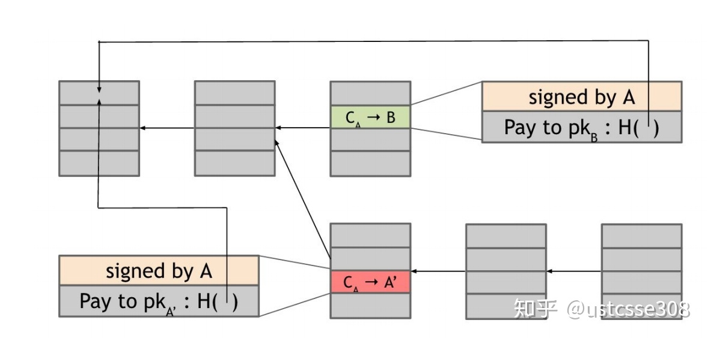
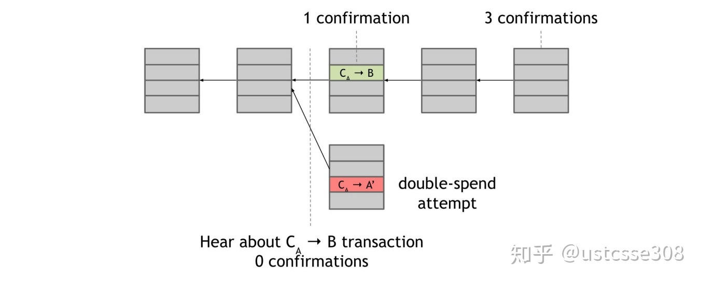
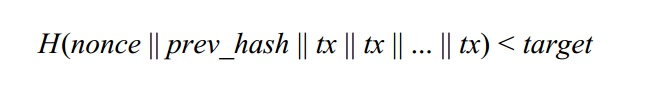

# 去中心化
## 一致性
对于系统中的多个服务节点，给定一系列操作，在协议（往往通过某种共识算法）保障下，试图使得他们对处理结果达成某种程度的一致。而缺少中心节点的统一管理，在分布式的系统中达成一致是一件不容易的事情。【注意：一致性并不代表结果正确与否，而是系统对外呈现的状态一致与否，例如，所有节点都达成失败状态也是一种一致。】

一致性问题主要是来源于分布式网络中的诸如机器宕机或网络异常（包括消息的延迟、丢失、重复、乱序）的情况，如何在一个可能发生上述异常的分布式系统中，快速且正确地在系统内部对某个数据的值达成一致，并且保证不论发生以上任何异常，都不会破坏整个系统的一致性。

对于区块链而言，实际上就是负责记录交易的账本的一致性。

所谓的货币实际上就是一个个交易记录。只要大家都认可这个记录就行。特别是对于像比特币这样的电子货币而言，谁能拥有比特币呢？就是一个所有人都认可的账本上写着“中本聪拥有创世区块的50个比特币”。而比特币的流通实际上也就是用户之间的相互转账，只要在账本上存在这样的记录，比特币就担任了货币的流通属性。

## 分布式共识（distributed consensus）
给出分布式共识协议的一个定义和描述：

有 N 个节点，每个节点都有输入值。有一些节点出故障或者是恶意的。分布式共识协议的特点是：

* 必须能够使得所有的诚实节点就输入值达成一致
* 该最终一致的值是由诚实节点产生的

在区块链中，一次交易可能是Alice从Bob那里买了一本书，或者是其它物品，这可以线下商议，然后Alice需要支付给Bob一个比特币。在比特币网络中，Alice需要广播一条消息，譬如“Alice支付给Bob 1个比特币。”并且使用私钥对消息进行签名。

另外，在比特币网络中，有很多节点都在广播不同的交易消息，而在一个不同步的、不可靠的Peer-to-Peer网络中，所有节点都必须达成共识，最终的结果形成一个全局的账本。

账本是由一条条的交易构成的，网络可以以交易为单位进行共识，为了效率，提出了块（block）的概念，一个块中包括多条交易。那么全局的账本中就由一个个的块组成，块需要串起来，就形成了链，从而叫做区块链。

这里问题是，对于网络中的每个节点，它们看到的交易不同，交易顺序不同，如何能达成共识？

一个方法是：每10分钟，网络中的每个节点从自己收到的交易中，挑出一些交易形成一个块，广播自己的新区块。每个节点都可以提出自己的意见，然后通过使用一些共识算法，所有的节点达成一致。

## 比特币系统
* 引入了激励机制。因为比特币本身就是一种货币，所以参与者有强烈的意愿能获得这个奖励。也就是说，维持整个系统正常工作才符合大多数人的利益。
* 比特币的随机性。比特币网络中的共识并不是一下子就确定的，在实际中，差不多是一个小时之后，基本可以认为对一个区块或者一笔交易进行了确认。但是，即使在这个时候，也还不能确认100%。而是，随着时间的流逝，确认性会逐渐增强。

另一方面，在比特币网络中，节点是没有标识的，主要是因为没有一个中心节点来对每一个节点进行认证。在这种情况下，一方面，容易引起一种攻击叫做“sybil attack”；另一方面，缺少标识，不能使用类似“编号为ID的节点发出消息”这样的协议命令，缺少对网络的足够了解和控制。

关于"Sybil Attack"，女巫攻击，来自于一部小说（同名电影），其中女主具有16种人格。这种攻击主要是恶意节点创造出很多节点，对于P2P网络而言，拥有很多节点主要是用于冗余和备份，如果攻击者创造出很多节点，相当于控制了网络的一大部分，可以破坏冗余策略和备份策略。譬如说比较倒霉的，一份文件都备份在攻击者控制的机器上，那么攻击者就可以肆意篡改这份文件。

在这些限制下，比特币网络实现的是隐含共识（implicit consensus）：一个区块就是一个共识的过程，随机的节点可以提出新区块。即使提出新区块的节点是恶意的，提出时也没有显示的投票或者其他过程。建立共识的过程是隐式的，其它节点如果接受这个区块，就会延伸它；否则拒绝这个区块，则会无视它，并尝试建立新区块去取代它

简化的比特币的共识算法过程如下：（这里没有讨论广播新区块的节点是如何选出的）

1. 向所有的节点广播新的交易。
2. 每个节点将新交易打包进区块。
3. 每一轮中一个随机的节点广播该区块。
4. 如果区块中所有的交易都是有效的（比特币没有重花，签名正确等），则其他节点接受这个区块；
5. 节点表示接受该区块的方式是在之后新创建的区块中包括这个块的哈希。

## 双重支付
假设Alice从Bob购买了一个软件，然后她广播了一条交易“Alice付给Bob一些比特币”。诚实的节点看到了这条交易，并且将交易包含在区块中。当Bob看到这条交易被包括进去的时候，Bob认为Alice已经支付了，所以将软件发送给了Alice。然后Alice开始准备攻击，她自己或者她控制的节点开始准备下一个区块，在这个区块中包含的消息是把Alice刚才付给Bob的币付给自己或者她控制的账号“Alice付给Alice一些比特币”。如果Alice能够给成功地将第二条支付信息包含在区块链中，那么第一条消息，将会被忽视，就像从来没有出现过一样。

问题是，双重攻击能否成功，完全取决于区块链到底沿着那条链延续。诚实的节点会沿着最长的链创建自己的区块。所以答案就是，没有正确的答案。

在Alice创建了双重攻击的区块之后，对于其他的节点而言，两个分支具有一样的长度；而且两个块都是有效的，那么其他节点会选择哪个分支就决定了攻击成功与否。但是对于其他的节点而言，这两个交易的地位是完全相同的。我们认为Alice付给自己的交易是欺骗，那是因为我们知道Alice首先付给了Bob。但是，对于没有全局时间的网络而言，这两个交易是等价的。而且Alice还可以通过一些方法使得下一个区块沿着自己的分支延伸。

那么Bob如何应对这个问题呢？

如果Bob容易轻信，那么他可能在发现Alice发布了付币给自己的时候就同意将软件发给Alice，这个时候，称作Zero-Confirmation Transaction（零确认交易）。如果Bob有更多的保护自己的意识，他会等到Alice付钱给自己的交易被多次确认之后才将软件发给Alice。当交易被包含在区块中，称作一次确认；如果包含交易的区块之后又来了一个区块，称作2次确认。以此类推。

只要Bob等足够的时间，那么当他发现包含Alice付钱给自己的区块已经被遗弃的时候，他会放弃这次交易并且拒绝将软件发给Alice。一般而言，一个交易获得的确认越多，这个交易成为最终的系统的共识的概率越大。

> **在比特币系统中的一般做法是等6个确认。6是在等待时间和确认之间的一个折中。**

> 综上，能够防止双重支付成功的原因，也即，包括双重支付的区块不能最终包括在链中的原因是我们假设大部分的节点是诚实的。从密码学的角度，两个交易都是正确的。 所以，为了确认形成了共识，需要等待一段时间，确定最终区块链中到底包含了哪一个块。而且，随着区块的增加（确认数的增加），交易变无效的可能性是指数级降低的。因此，可以等待6个区块，也即差不多1个小时的时间，基本上不会再翻盘了

## 激励和工作证明（PoW）
在之前的过程中，我们多次做了假设，大部分的节点是诚实节点——诚实的节点会将自己收到的广播的交易打包，诚实的节点会沿着最长的分支扩展。但是，节点有没有必要保持诚实呢？或者说，能不能给节点激励，让节点维持诚实？

在比特币网络中，共有两个激励方式。**一种是Block reward（区块奖励）**，**一种是transaction fees（交易费用）**。

### 区块奖励
任何创造出区块的节点可以在区块中包括一个特殊的交易——创造币的交易，并且节点可以选择交易的接收地址。当然， 节点大概率把接收地址设置为自己。可以理解为这是对节点创造区块的奖励。

目前为止，创造一个区块的奖励是25个币，然后每210,000个区块这个数字会减半。按照生成区块的速度，差不多每四年，区块奖励会减半。

第一眼看来，这个好像没什么用处。因为，不管节点创造的是好的区块还是包括攻击交易的区块，他都能获得奖励。但是，这个奖励什么时候才有用呢？只有在他的区块被包括在长链中才行。因此，如果一个区块中包括无效的交易，这个区块相当于会被丢弃。所以，所有的节点都能尽力表现得诚实，这样，其他节点才会沿着他的区块继续添加新的区块。

### 交易费用
比特币中的第二个激励机制是交易费用。交易的创建者可以在创建交易时，输入大于输出，其中的差值就是交易费用。所以，即使当创建区块不会产生币的时候，交易费用会变得很重要。同时，对于交易者而言，如果希望自己的交易被快速地确认，毫无疑问地，在交易中包括多一点的费用是一个好的方法。

## 哈希
比特币的工作证明就是hash puzzles。为了创建一个区块，节点需要能够找到一个数值nonce，使得当计算哈希时，前一个hash、包含在区块中的交易、以及nonce这三者连接之后，它的哈希值小于某个target。
用公式写出来，长这样：

之前我们讲过hash具有的特点是puzzle friendliness，找到这个Nonce的唯一方法就是尝试各种值，直到运气好找到一个。

工作证明的存在基本上实现了对随机性的要求，没有谁能够指定哪个节点可以产生下一个区块；同时，排除了Sybil Attack的可能，创建有竞争力的节点代价太高。

比特币中的hash计算有三个特点。1. 很难计算。在2014年，产生一个区块需要的计算大概是 [公式] 次哈希。面对这样的计算量，普通的笔记本电脑根本没有竞争力。也因此，参与计算的行为被称作mining，挖矿。2. 难度可调节。每2016个块，所有的节点一起参与计算，重新定义target。target的目标是，使得每隔10分钟才能产生一个新区块。按照这个速度，每两周，target重新定义一次。这也意味着，随着整个系统的算力增加， 创建一个区块会越来越难。为什么需要10分钟创建一个区块呢？如果不自动调整target，随着算力的增加，创建区块的速度会越来越快，可能打包的交易会变少。当然，速度太慢就不适合一些吞吐量大的服务。所以最佳速度一直是个问题。3. 验证非常容易。

也正是因为工作量证明，保证了如果大部分的节点（以算力而不是个数）是诚实的，那么至少有50%的可能，下一个区块来自于诚实的节点。

