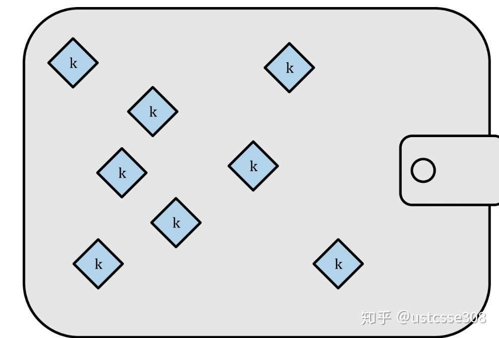
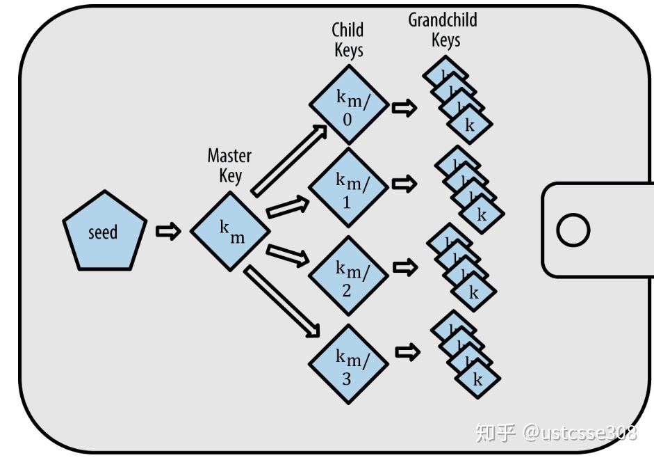
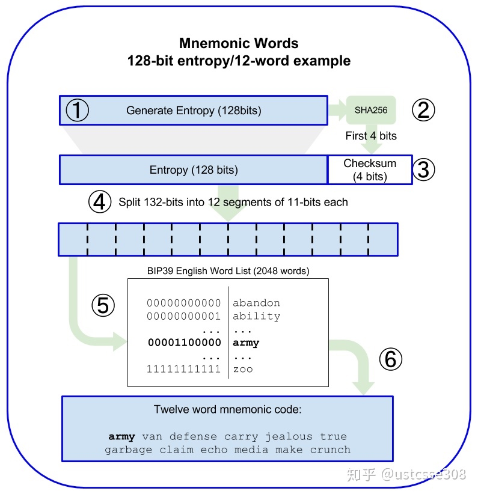
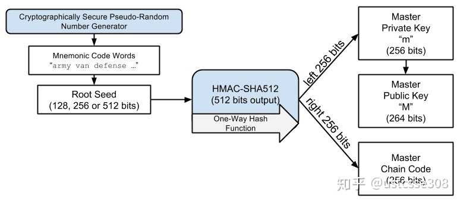
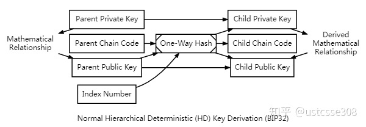
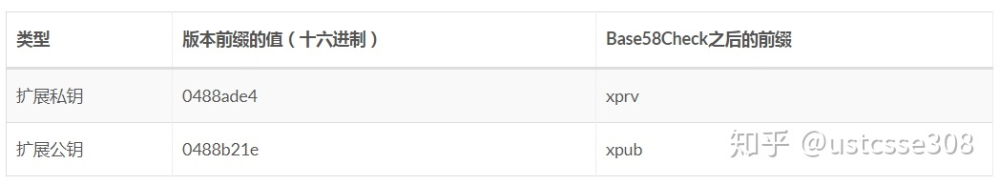
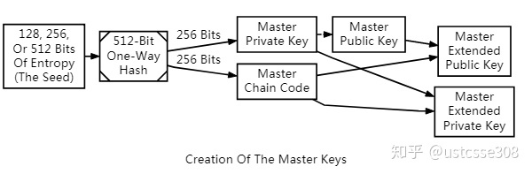
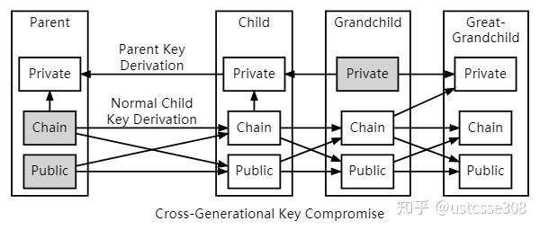
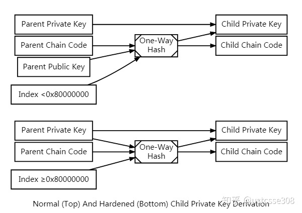
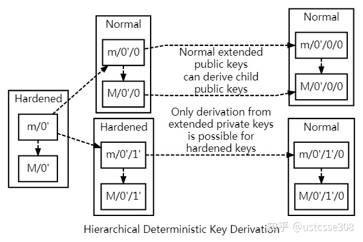

# 助记词

我们首先来考虑下，如果有了比特币，应该怎么保管。有一个误解是，比特币钱包里含有比特币。事实上，钱包里只含有钥匙。 “钱币”被记录在比特币网络的区块链中。 用户通过钱包中的密钥签名交易，从而来控制网络上的钱币。 在某种意义上，比特币钱包是密钥链。每个用户有一个包含多个密钥的钱包。 钱包只包含私钥/公钥对的密钥链

管理私钥需要考虑三个目标，所有各种保管密钥的方法就是这三个目标的折中：

* 可用性：当需要使用比特币的时候，可以用得上；
* 安全性：保证其他人不能使用你的私钥；
* 方便性：用的时候比较简单。

之前介绍非对称密码的时候，了解过公钥和私钥，知道给定公钥或私钥中的一个，我们可以生成相对应的密钥。这样一次性生成一个密钥，而且密钥根据随机数生成，多次生成的密钥之间也没有相关性。并且每一笔交易之后，必须进行备份，防止私钥丢失。早期的做法是一次性生成100个左右的公私钥对，从最开始就生成足够多的私钥并且每个密钥只使用一次。管理这种密钥的钱包称作，非确定性钱包（nondeterministic wallet），这种钱包也被称为“Just a Bunch Of Keys（一堆密钥）”，简称JBOK钱包。这种钱包的缺点很明显，因为很难管理。如果生成多个密钥，必须保存所有的副本。而且一旦钱包不能访问，所有的资金就不能使用了。在建议每个比特币地址只使用一次的情况时，这种钱包不是好的选择，虽然比特币核心客户端包含了这种钱包，但是不鼓励大家使用。这种钱包现在正在被确定性钱包替换。

> 第二种类型是确定性钱包（deterministic wallet），**其中所有的密钥都是从一个主密钥派生出来，这个主密钥即为种子（seed）。**该类型钱包中所有密钥都相互关联，如果有原始种子，则可以再次生成全部密钥。确定性钱包中使用了许多不同的密钥推导方法。最常用的推导方法是使用树状结构，称为分级确定性钱包或HD钱包。确定性钱包由种子衍生创造。**为了便于使用，种子被编码为英文单词，也称为助记词。**

**下列 BIP 共同定义了一种确定性钱包的实现，这种钱包被称为分层确定性（HD，Hierarchical Deterministic）钱包。**

* BIP-32，HD 钱包中的密钥如何衍生
* BIP-39，HD 钱包助记词（Mnemonic）和种子（Seed）的创建规则
* BIP-44，支持多币种和多账户的 HD 钱包

除此之外，还有

* BIP-43，多用途（purpose）HD 钱包的结构定义
* BIP-45，通过 P2SH 实现多签的 HD 钱包

**BIP-32/BIP-44**

BIP-32标准定义了HD钱包。HD钱包包含以树状结构衍生的密钥，使得父密钥可以衍生一系列子密钥，每个子密钥也可以衍生出一系列孙密钥，以此类推。

HD钱包有两个主要的优势。
第一，树状结构可以被用来表达额外的组织含义。比如当一个特定分支的子密钥被用来接收交易收入并且有另一个分支的子密钥用来负责支付花费。不同分支的密钥都可以被用在企业环境中，这就可以支配不同的分支部门、子公司、具体功能以及会计类别。
第二，**用户可以建立一个公钥的序列而不需要访问相对应的私钥。**所以HD钱包在不安全的服务器中使用或者在每笔交易中发行不同的公钥。公钥不需要被预先加载或者提前衍生，而在服务器中不需要可用来支付的私钥。

## 如何从种子生成密钥树

因为16进制表示的种子： 0C1E24E5917779D297E14D45F14E1A1A 难以记忆，所以BIP-39标准中定义了助记词。上面的种子相对应的助记词表示：

    army van defense carry jealous true garbage claim echo media make crunch
        
思考：128位是如何生成12个助记词的？

助记词是由钱包使用BIP-39中定义的标准化过程自动生成的。 钱包从熵源开始，增加校验和，然后将熵映射到单词列表：

1. 创建一个128到256位的随机序列（熵）。
2. 提出SHA256哈希前几位（熵长/ 32），就可以创造一个随机序列的校验和。
3. 将校验和添加到随机序列的末尾。
4. 将序列划分为包含11位的不同部分。
5. 将每个包含11位部分的值与一个已经预先定义2048个单词的字典做对应。
6. **生成的有顺序的单词组就是助记码。（必须有序，因为有校验）**

> **总结：HD钱包具有管理多个密钥和地址的强大机制。由一系列英文单词生成种子是个标准化的方法，这样易于在钱包中转移、导出和导入， 这些英文单词被称为助记词，标准由BIP-39定义。大多数比特币钱包（以及其他加密货币的钱包）使用此标准，并可以使用可互操作的助记词导入和导出种子进行备份和恢复。**

> 16进制表示： 

> 0C1E24E5917779D297E14D45F14E1A1A

> 助记词表示：

> army van defense carry jealous true garbage claim echo media make crunch

> 助记词表示长度为128至256位的熵。 通过使用密钥延伸函数PBKDF2，熵被用于导出较长的（512位）种子。将所得的种子用于构建确定性钱包并得到其密钥。

思考：能不能暴力破解他人的钱包？

创建助记词之后的7-9步是：

7. PBKDF2密钥延伸函数的第一个参数是从步骤6生成的助记符。
8. PBKDF2密钥延伸函数的第二个参数是盐。 由字符串常数“助记词”与可选的用户提供的密码字符串连接组成。
9. PBKDF2使用HMAC-SHA512算法，使用2048次哈希来延伸助记符和盐参数，产生一个512位的值作为其最终输出。 **这个512位的值就是种子。**

有个这个512比特的种子，可以开始公私钥对的生成。

> **总结：HD钱包从单个根种子（root seed）中创建。最常见的是，这个种子是从助记符产生的，HD钱包的所有的确定性都衍生自这个根种子。任何兼容HD钱包的根种子也可重新创造整个HD钱包。所以简单的转移HD钱包的根种子就让HD钱包中所包含的成千上百万的密钥被复制，储存导出以及导入。**

> 从上图可以看出，从root seed生成公私钥对的过程，就是对root seed进行一次HMAC-SHA512的加密哈希，在生成512的结果之后，将512位结果划分为两个256部分，分别是Master private key（主私钥）和Master Chain Code（主链码）。

HMAC-SHA512 使用 SHA512 哈希算法，以一个消息（Message）和一个密钥（Key）作为输入，生成 512 位（64 字节）的消息摘要（Digest）作为输出。

从种子计算主私钥时，种子作为输入的消息，字符串Bitcoin seed作为输入的密钥，计算产生 512 位的输出。

* 输出的高 256 位，是主私钥
* 输出的低 256 位，是主链码（Master Chain Code）

> 总结一下：

> * 种子从助记词和用户密语计算而来
> * 助记词从一个随机序列计算而来，查阅特定的单词表后最终确定
> * 即使随机序列的内容一样，查阅不同语言的单词表，可以得到不同的助记词，从而计算出不同的种子
> * 即使助记词的内容一样，指定不同的密语，可以得到不同的种子

**HD钱包的确定性来源于种子，当种子确定后，钱包中的所有私钥就都是确定的，都可以从种子计算出来。**

所以用户可以直接记录下这个种子的值，作为 HD 钱包的备份，只不过这一大串内容抄写起来有点麻烦。

对一个 HD 钱包，初始化种子的过程涉及到两个变量：

* 助记词（由随机序列的内容和助记词的语言共同决定）
* 用户指定的密语

**所以在备份 HD 钱包时，需要同时备份助记词和密语，这样就相当于备份了整个钱包内的所有私钥。**

HD钱包中的私钥是树状的层级结构。

* 树根位置的私钥，称为主私钥（Master Private Key），从种子直接计算得到
* 树中的某个私钥，从其父私钥计算得到。

-------

### Master Chain Code（主链码）

然后从上图中还可以看到从主私钥有个箭头到Master Public Key，也即从私钥到公钥。

> **HD协议使用的是ECDSA公钥函数 point()，这个函数接受一个大整数（也即私钥），将它转换成图上的一个点，也即公钥。这也和我们的常识是符合的，非对称加密系统中，公私钥可以互相生成。而且椭圆曲线数学方案使得可以在不泄露私钥的情况下计算公钥。**例如，这允许网络商店业务让其网络服务器为每个订单或每个客户生成新的地址（公钥哈希），而无需让网络服务器访问相应的私钥（花费收到的资金是必需的）。

    point(private_key) == public_key

**为什么剩下的256位要作为链码呢？链码是用来干啥的呢？**

这里我们要稍微了解一下point的工作特点。下面的这个等式是成立的。意味着什么呢？这里的参数 i 可以理解为index，也即生成子密钥时的索引。通过将祖先私钥与索引 i 相加，然后传入到point()中，可以生成子公钥，这是左边的计算（私钥生成公钥，改变私钥，也就生成新的公私钥对）。等式右边显示的是，新生成的这个公钥完全不需要使用私钥来生成，直接根据祖先公钥来做就行了。也即，只要有公钥，就可以生成新的公钥。

    point( (parent_private_key + i) % p ) == parent_public_key + point(i)

    注：parent_public_key + point(i) = child_public_key
    
新生成的子公钥可以继续生成后代公钥。

    point( (child_private_key + i) % p ) == child_public_key + point(i)

#### 这个特点带来的影响是什么呢？

1. 如果共享一对祖先密钥的两个程序想就一系列的公私钥对达成一致，它们只需要共同商议确定下来一系列的整数就行了。

2. 知道一个祖先公钥，可以生成多个子公钥，然后这些子公钥可以用来在不安全的服务器上使用，作为付款的接收地址。因为服务器并不知道私钥，所以服务器即使被攻击，也不会有私钥泄露的危险。

3. 不论是子公钥还是更下层的后代公钥，如果是从子公钥能够推导出自己的兄弟姐妹公钥，那么生成多个公钥和只有一个公钥没有什么区别。因为任何人只要知道其中的一个，就能找出其他所有的。所以需要加入新的计算参数，切断同一父节点生成的兄弟姐妹公钥之间的联系。

以下都是对这些影响的解决方式
-------

### 扩展密钥（加了链码的公钥或私钥）

HD协议使用256位的Chain Code（也称作熵）来生成子密钥对，而且每个子密钥对都有自己的chain code。这样，即使有一个子密钥分支被攻击，其他的分支可以不受影响。

如上图所示，HD密钥的生成接收了四个输入：

* 祖先私钥 和 祖先公钥
* 256位的祖先链码
* 32位的索引值

上图的计算中，链码、公钥和索引值作为HMAC-SHA512的参数输入，产生512位确定的但是足够随机的输出。这512位输出的右一半的256位作为子密钥的链码。左一半的256位作为生成子密钥的输入。

    child_private_key == (parent_private_key + lefthand_hash_output) % G
    
    child_public_key == point( (parent_private_key + lefthand_hash_output) % G )
    
    child_public_key == point(child_private_key) == parent_public_key + point(lefthand_hash_output)

> lefthand_hash_output = hash(parent_public_key,parent_chaincode,i)

上面的三个等式，第一个是子私钥的生成；第二个是从子私钥生成子公钥；第三个是从父公钥直接生成子公钥。

【注1：因为子公钥和父公钥之间的关系依赖于 point(lefthand_hash_output)， 而point(lefthand_hash_output)的值依赖于链码、父公钥和索引，缺少的值仅仅是链码】
【注2：因为父公钥已知，链码在同一对父公私钥的情况下的是固定的，如果链码泄露的情况下，还是可以推导出兄弟姐妹公钥；】
【注3：因此，扩展公钥，不同于公钥，公钥是理所当然应该公开的；而扩展公钥因为是公钥和链码的连接，为了保护链码，应该保护扩展公钥】

> **链码就是为了切断兄弟姐妹之间公钥的联系。**

总结一下，根据 BIP-32 的定义：

* 可以从私钥和链码，衍生出其所有的子私钥及对应的子公钥（及之后每层所有的子私钥及对应的子公钥）
* 可以从公钥和链码，衍生出其常规衍生的子公钥（及之后每层常规衍生的子公钥）
* 无法从某个密钥（公钥和私钥）计算出其父密钥，或同层的其他兄弟密钥

-------

> **可以将密钥和链码编码在一起，得到扩展密钥（Extended Key）。扩展私钥和相对应的扩展公钥具有相同的链码。扩展密钥使用 Base58Check 编码，并添加特定的版本前缀。**

安全性：

扩展密钥使用方便，但要注意：

* 虽然泄露某个扩展公钥不会丢币，但会导致以此为根节点衍生出的扩展公钥全部泄露，破坏了隐私性
* 泄露扩展公钥和该公钥衍生出的之后任一代公钥对应的私钥，有被推导出该扩展公钥所有后代私钥的可能

> 也即，如果攻击者获得了父链码和父公钥，那么就可以获得所有的子链码。有了子链码，如果又获得了底层的某一个私钥（孙子密钥），那么可以根据这个链码生成所有的扩展私钥。

更惨的是，攻击者可能通过子密钥逆推回祖先私钥。也即，如果攻击者获得了一个扩展公钥，以及任何它的子孙私钥，那么就能够推出这个公钥对应的私钥，以及所有的后代密钥。

-------

### 强化子密钥

**因此，扩展公钥的链码部分需要好好保存。也因此提出了强化子密钥的概念。**

> 强化的子密钥生成需要祖先链码、祖先私钥和索引值生成子链码和子私钥。这样的话，仅仅知道祖先扩展公钥不能用来生成强化的子公钥。（无法生成Left-hand-output，所以知道父公钥的情况下，也不能直接计算出子公钥；

> 因此，强化的子密钥的应用场景没有正常生成的子密钥多。但是可以防御上面的攻击。

m表示私钥，M表示公钥；有小撇号的表示强化的子密钥。

HD钱包树状结构提供了极大的灵活性。每一个母扩展密钥有40亿个子密钥：20亿个常规子密钥和20亿个强化子密钥。 而每个子密钥又会有40亿个子密钥并且以此类推。只要你愿意，这个树结构可以无限类推到无穷代。但是，又由于有了这个灵活性，对无限的树状结构进行导航就变得异常困难。为了能方便表示密钥间关系，定义了衍生路径（Derivation Path）的概念。

* 序号之间以/分隔
* m表示主密钥
* i表示第i个常规衍生的子密钥，即第i个子密钥
* i'表示第i个硬化衍生的子密钥，即第 (2^31 +i) 个子密钥

m/0'/1'/2表示主密钥的第 0 个强化衍生子密钥的第 1 个强化衍生子密钥的第 2 个常规衍生子密钥（树形结构）。

扩展密钥加上衍生路径，可以确定 HD 钱包里的一个密钥及从这个密钥衍生的之后所有层的子密钥（以这个密钥为根的子树）。

-------

BIP-44提议了多账户结构作为“purpose”。所有遵循BIP-44的HD钱包依据只使用树的第一个分支的要求而被定义：m/44'/。 BIP-44指定了包含5个预定义树状层级的结构：

    m / purpose' / coin_type' / account' / change / address_index
    
* 第一层的purpose总是被设定为44'。

* 第二层的“coin_type”特指币种并且允许多元货币HD钱包中的货币在第二个层级下有自己的亚树状结构。目前有三种货币被定义：Bitcoin is m/44'/0'、Bitcoin Testnet is m/44'/1'，以及 Litecoin is m/44'/2'。

* 树的第三层级是“account”，这可以允许使用者为了会计或者组织目的，而去再细分他们的钱包到独立的逻辑性亚账户。 举个例子，一个HD钱包可能包含两个比特币“账户”：m/44'/0'/0' 和 m/44'/0'/1'。每个账户都是它自己亚树的根。

* 第四层级就是“change”。每一个HD钱包有两个亚树，一个是用来接收地址，一个是用来创造找零地址。注意无论先前的层级是否使用强化衍生，这一层级使用的都是常规衍生。这是为了允许这一层级的树可以在不安全环境下，输出扩展公钥。

* 被HD钱包衍生的可用的地址是第四层级的子级，就是第五层级的树的“address_index”。比如，第三个主账户接收比特币支付的地址就是 M/44'/0'/0'/0/2。

举个例子：

用户初始化了一个 HD 钱包，使用衍生路径m/44'/236'/0'作为存放 Bitcoin SV（BSV）的“账户”，那么：

> * 第一个收款地址是公钥m/44'/236'/0'/0/0对应的地址，第二个收款地址是公钥m/44'/236'/0'/0/1对应的地址，以此类推
> * 当完成第一次支付并存在找零时，会找零到地址m/44'/236'/0'/1/0，下一次支付找零到的地址会是m/44'/236'/0'/1/1，以此类推
> * 如果想再新建一个 BSV “账户”另作他用，可以使用路径m/44'/236'/1'
> * 如果还想用这个 HD 钱包存放 BCH，可以使用路径m/44'/145'/0'

### HD 钱包的优势

**HD 钱包在备份时十分方便。**

> * 只需要备份助记词和密语，就等于备份了整个钱包内的所有私钥
> * 除此之外，你还要记下使用的衍生路径，这样才能知道使用了哪些私钥

> 另外，从扩展公钥可以常规衍生子公钥及对应地址而不用访问扩展私钥或私钥本身，这是 HD 钱包一个很重要的安全特性。

密钥间的树形结构，与机构的部门设置十分相似，如果一家企业准备使用比特币进行财务收支，可以：

* 将路径m/0'/0'/x'的扩展公钥交给各销售部门独自管理和使用
* 销售部门可以为每笔订单生成不同的收款地址，方便状态跟踪
* 因为从扩展公钥无法衍生出子私钥，所以销售部门只能收款而无法支付账户里的比特币
* 将路径m/0'/0'的扩展公钥交给市场部，市场部可以查阅所有订单的销售记录，同样无法支付比特币
* 将路径m/0'/0'的扩展私钥交给财务部，财务部可以用这个更上层的扩展私钥，管理整个公司的加密资产

配合 BIP-45 定义的 HD 钱包多签方案，可以方便、安全、灵活的管理公司的加密资产。

