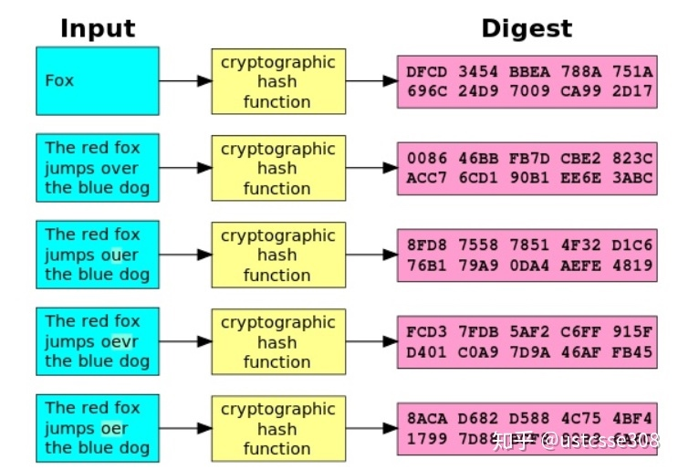
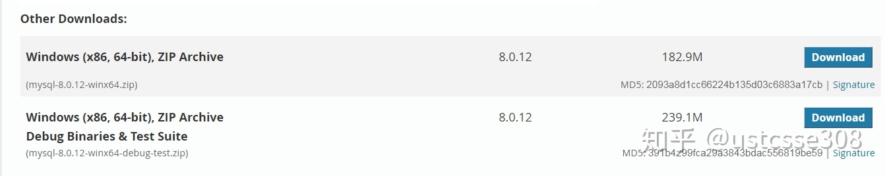
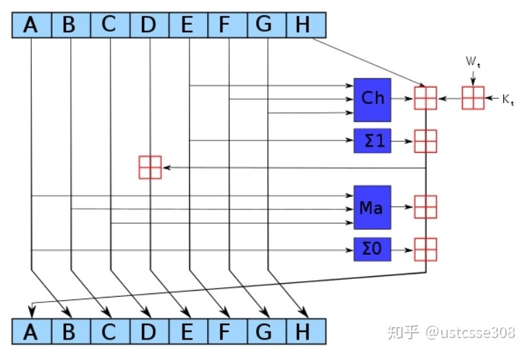
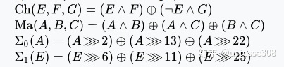
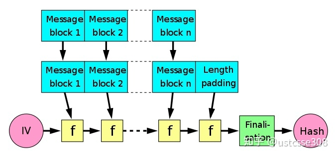

# 加密哈希

加密哈希是哈希函数的一种，它具有某些属性，使其适用于加密。**通过加密哈希，它将任意大小的数据映射到固定大小的位串（散列），并被设计为单向函数，即一个不可逆的函数。**从理想的加密散列函数输出重新创建输入数据的唯一方法是尝试对可能的输入进行暴力搜索，以查看它们是否产生匹配，或使用匹配哈希的彩虹表。布鲁斯施奈尔称单向散列函数是“现代密码学的主力”。**输入数据通常称为消息（Message），输出（散列值或散列）通常称为消息摘要或简称为摘要（Digest）。**

**理想的加密哈希函数有五个主要属性：**

1. 它是确定性的，因此相同的消息总是产生相同的散列

2. 可以快速计算任何给定消息的哈希值

3. 除了通过尝试所有可能的消息之外，从其散列值生成消息是不可行的

4. 对消息进行小的更改便能引起哈希值的巨大改变，以使新哈希值看起来与旧哈希值不相关

5. 找到具有相同散列值的两个不同消息是不可行的

**下面对上面的五个属性进行简单解释。**

1. 确定性的。
常见的哈希函数都满足这个特性。（只要计算过程中没有引入随机数/调度，应该都满足？）

2. 快速计算

SHA-256算法的主要操作时异或运算，位运算非常快。

3. Hiding

hiding就是知道哈希的结果不能倒推输入。简单来说，譬如 x mod 100这样的哈希函数，如果结果是1，那么x可能是1、101、201等无穷的数。从SHA族算法，从结果完全得不到输入的任何信息。

4. 雪崩效应

对输入的一点修改“over”，结果变化很大，也叫“雪崩效应”。
也可以看出，输入和输出之间没有什么关联。

5. 抗冲突（collision-resistance）

当两个输入产生同一个输出，就发生了冲突。这里的抗冲突不是说肯定不会冲突，由鸽笼原理很容易看出，只要定义域大于值域，肯定会有冲突的。哈希函数的抗冲突指的是，虽然冲突就在那里，那就是找不到——或者说在可接受的时间内找不到。

## 抗冲突
### 抗冲突是指不可能找到两个x和y，其中x ≠ y，而 H(x) = H(y)。

注意这里说的是不可能找到，而不是说不存在。实际上根据鸽笼原理，对于输出是256比特的SHA-256，那么只要找到2^256+1的输入，肯定可以找到至少两个值有冲突。

上面的方法是肯定可以找到冲突，把复杂度降低一点，利用生日攻击原理，如果随机挑选2^130 +1的输入，有99.8%的概率可以找到冲突。

但即使如此，找到一个冲突所需的时间也是不能接受的。如果每秒中可以计算10,000次哈希，将会需要10^27 年来计算2^128 次哈希。

另外，关于哈希算法的抗冲突性，到目前为止，没有哪个哈希算法被证明是抗冲突的，只是人们一直在努力找到针对算法的冲突方法，有些找到了如MD5，有些一直没有被找到。所以，目前为止我们相信它们是抗冲突的。

### 抗冲突的应用

抗冲突的一个主要应用是信息摘要（message digest）。

对于抗冲突性的哈希函数而言，如果两个输入x和y不同，那么就可以认为H(x)和H(y)不同——否则的话，就违反了抗冲突性。

这个性质就可以做信息摘要。考虑2015年的xcode后门事件，因为国内的开发者从苹果官网下载xcode开发框架速度太慢，所以一些公司的开发人员直接从百度云上下载了某些人“好心”提供的版本。腾讯的安全实验发现很多app出现异常流量后发现源头在于使用的xcode，即使开发人员本身写的代码是正确的，经过篡改的xcode可以将恶意代码链入到app中。所以带来的一个问题是，当我们下载开源的软件使用时，怎么可以保证下载到的软件是官方的而不是经过第三方恶意修改过的呢？

这是mysql的下载页面，可以看到在提供下载链接的同时，提供了MD5散列摘要。如果想要保证安全，可以在第三方下载软件之后，使用同样的算法做一次散列，如果相同，可以放心使用。

## Hiding
### Hiding的意思是如果有哈希函数的输出y，那么不可能找到x，使得h(x)=y。

关于hiding的含义前面已经解释过。现在的一个问题是，如果输入值本身是有限的，譬如在一个掷硬币的游戏中，如果扔出来head，那么就计算“head”的哈希值；如果扔出来tail，那么就计算"tail"的哈希值。那么在一次投掷过后，公布哈希值，能知道这次投掷的结果吗？

这个问题的特点是输入值的空间太小，如果想要知道输入是什么，只需要遍历一遍，把所有可能的值计算一下，然后进行比对就行。譬如在这里，只需要算两个值，那么肯定可以知道投掷的结果。所以也就失去了hiding的特点。

如果想对head/tail的结果进行隐藏，有什么办法吗？

答案就是通过对简单的"head"和"tail"后面跟上一个随机性较强的串r，这样就能实现hiding。譬如，后面跟上长度为256bit的串，这样因为r的随机性足够强，即使head和tail很简单，也有足够的隐藏性。

### hiding的应用

commitment（承诺）。承诺的场景，譬如，世界杯预测结果，每个人都把自己预测结果放在信封里，并且封上信封，放在桌上。这相当于做出了一个承诺。然后世界杯结束后，大家拆开信封，看看当初谁预测得最准确。

在密码学中，可以这样计算：

com := commit(msg, nonce), nonce是一个随机的秘密的数字（譬如256位）；然后公开com；相当于把公布了一个密封的信封；大家都知道做出了承诺，但是具体值是什么还没有公开

verify(com,msg,nonce)，如果要检验，则用户提供原始的msg和nonce，通过同样的方法计算，看com是否和commit计算出来的结果相同

（考虑一下，为什么需要一个Nonce？）

这里的commit就可以使用哈希函数来实现。

### puzzle friendliness

对于每一个可能的 n 位输出 y ，如果 k 是随机性很强的值（譬如长度为256位的随机二进制串），那么找到一个合适的 x 使得 H ( k || x ) = y 是不可能显著地低于 2^n  的时间复杂度。

> 这个特点强调的是，如果给定特殊的哈希结果 y ，并且输入中有一部分随机性很强 k ，那么找到输入的另一个部分 x 使得哈希的结果等于y，那么就只能依靠暴力搜索。

> 应用： search puzzle ；区块链中的工作量证明。

# 哈希算法SHA-256

SHA-256是SHA-2中的一个算法。SHA-2，也即第二代安全散列算法（Secure Hash Algorithm 2），由美国国家安全局2001年公布的标准哈希算法，是SHA-1的后继。

SHA-2下包括六个不同的算法标准：SHA-224、SHA-256、SHA-384、SHA-512、SHA-512/224、SHA-512/256。这些不同的算法使用不同生成摘要的长度 、循环运行的次数，但算法的基本结构是一致的。现在已知SHA-2容易受到长度扩展攻击，所以推荐使用SHA-3来取代它。

对于任意长度的消息，SHA256都产生256bit长的哈希值，也即32字节，或者64位的16进制数，或者8个8位的16机制数 。:)

为什么要强调这个呢？

简单说一下SHA-256的计算过程。

这里A～H共有8个，初始值分别是

h0 := 0x6a09e667
h1 := 0xbb67ae85
h2 := 0x3c6ef372
h3 := 0xa54ff53a
h4 := 0x510e527f
h5 := 0x9b05688c
h6 := 0x1f83d9ab
h7 := 0x5be0cd19

> 看一下，分别是8个16进制数，所以总共有256位，这个就叫做初始向量（IV）。这8个数是前8个素数取平方根，前32位小数。最终生成的哈希值也是这么长，所以，每一轮的计算就是如上图所示，更新这8个值。

那怎么更新呢？

每一轮计算64次。在上图中可以看到，除了A～H外，有两个输入，分别是 W(t)和 K(t)。也即每一轮中有64个 W ，以及64个 K 。每个 W 长度为32bit，也即4个字节。**64个 W 来自于哈希函数的输入，也即，对于输入，不论长短，长的就分成每512bit一个块（64个字节），短的补足512bit。这64个字节构成了前16个 W  ，后面的48个 W 通过前面的16个生成。**

    for i from 16 to 63
    s0 := (w[i-15] rightrotate 7) xor (w[i-15] rightrotate 18) xor (w[i-15] rightshift 3)
    s1 := (w[i-2] rightrotate 17) xor (w[i-2] rightrotate 19) xor (w[i-2] rightshift 10)
    w[i] := w[i-16] + s0 + w[i-7] + s1
        
**64个 K 是64个常量**

    k[0..63] :=
    0x428a2f98, 0x71374491, 0xb5c0fbcf, 0xe9b5dba5, 0x3956c25b, 0x59f111f1, 0x923f82a4, 0xab1c5ed5, 0xd807aa98, 0x12835b01, 0x243185be, 0x550c7dc3, 0x72be5d74, 0x80deb1fe, 0x9bdc06a7, 0xc19bf174, 0xe49b69c1, 0xefbe4786, 0x0fc19dc6, 0x240ca1cc, 0x2de92c6f, 0x4a7484aa, 0x5cb0a9dc, 0x76f988da,
    0x983e5152, 0xa831c66d, 0xb00327c8, 0xbf597fc7, 0xc6e00bf3, 0xd5a79147, 0x06ca6351, 0x14292967, 0x27b70a85, 0x2e1b2138, 0x4d2c6dfc, 0x53380d13, 0x650a7354, 0x766a0abb, 0x81c2c92e, 0x92722c85, 0xa2bfe8a1, 0xa81a664b, 0xc24b8b70, 0xc76c51a3, 0xd192e819, 0xd6990624, 0xf40e3585, 0x106aa070,
    0x19a4c116, 0x1e376c08, 0x2748774c, 0x34b0bcb5, 0x391c0cb3, 0x4ed8aa4a, 0x5b9cca4f, 0x682e6ff3, 0x748f82ee, 0x78a5636f, 0x84c87814, 0x8cc70208, 0x90befffa, 0xa4506ceb, 0xbef9a3f7, 0xc67178f2

**这64个常量来自于自然数中前64个质数取立方根，前32bit而来。**

然后每一次的计算，

    h := g
    g := f
    f := e
    e := d + temp1
    d := c
    c := b
    b := a
    a := temp1 + temp2

关于短的输入如何补足也有一些细节，在输入末尾进行填充，使输入长度在对512取模以后的余数是448。填充的具体过程：先补第一个比特为1，然后都补0，直到长度满足对512取模后余数是448。需要注意的是，信息必须进行填充，也就是说，即使长度已经满足对512取模后余数是448，补位也必须要进行，这时要填充512个比特。因此，填充是至少补一位，最多补512位。为什么余数是448呢?因为，还有需要有64位的数据表示原始输入的长度，加上这64bit的长度信息448+64=512，刚好512位。

## 在区块链中的应用

哈希在区块链中的用处包括：

* 利用puzzle-friendliness的工作量证明，也即，要求生成一个新区块时，哈希值一定要是以一定数量的连续的0开始的；

* 对每个区块的内容进行哈希，后面的区块相当于一直在对前面的区块进行哈希，所以一般来说，如果一个区块之后如果跟上其他6个区块之后，一般认为该区块的内容已经被公认了，不可更改。
