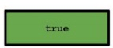

比特币的共识机制生成了一个append-only的账本，一旦交易在账本中，再也不能更改。矿工——也即一些有较高计算力的节点，生成区块，并且验证交易是正确的（签名是正确的、币没有重复花费）等。账本和区块链网络使得比特币成为一种货币。在本文中，将介绍一些细节。

# 交易
比特币并没有使用account-based的记账方法。比特币的记账方式是类似于这样的：

每一笔交易指明了输入和输出，每一笔交易有唯一的标识符，每一笔交易可以有多个输入和多个输出。上面的例子做了简化，使得可以方便地使用序号来指代交易。

使用这样的记账方式的好处是可以方便地验证交易的正确性。在验证一个交易时，我们首先找到输入所指向的交易的输出，同时为了确保它并没有被花掉，所以我们需要扫描所指向的交易区块和最新区块之间所有的区块，而不需要找到创世区块。

因为一个交易可以包括多个输入和多个输出，所以可以方便地实现各种目的。譬如，Bob接收到Alice的17个币，收到Carol的2个币，那么Bob可以将创建一个新的交易，将两个交易中的输出作为输入，从而将零钱合并为整钱。

如果Bob和Carol要同时支付给David，那么在同一个交易中的输入可以包含Bob和Carol的币。在这种情况下， 交易生效的条件同时需要Bob和Carol两人的签名。

# 交易的语法

如上图所示，交易由三部分构成：元数据、输入（多个）和输出（多个）。

* 元数据：顾名思义，元数据记录交易的基本信息，如交易的大小，交易的输入个数Vinsz，交易的输出个数Voutsz，以及整个交易的哈希值作为交易的唯一的ID。如果看的仔细，还能发现有一个lock_time，锁定时间，在后面会有具体的例子来介绍它的用法。

* 输入：交易的输入构成一个数组，多个输入中每一个结构都一样。因为它指定了之前的一个交易的输出，所以需要包含之前的交易的哈希值（哈希指针），同时指出该输入是之前交易的第几个输出。除此之外，每个输入还必须包括一个签名（scriptSig），这个签名就是一个凭证，证明交易的创建者确实有使用这个输出的权利。

* 输出：输出同样构成一个数组。每个输出有两个部分，value值和scriptPubkey。所有输出的value的和不能大于所有输入值的和。**如果所有输出的和小于所有输入和，那么差值部分就成为矿工的交易费用。**

现在可能有个疑问，本来是签名和公钥地址的位置出现的是scriptSig和scriptPubKey，而不是简单的Signature和PubKey。而且在scriptPubkey的地方，有一些奇怪的符号如OP_DUP，OP_Hash等。这就是接下来要介绍的比特币脚本，Bitcoin script。

这里要强调一下，scriptPubkey相当于是一把锁（lock），交易Tx1的创建者（如Alice）指定了只有Bob才能拿走交易Tx1的输出，那么scriptPubkey一定要能够保证确实是Bob才能使用；而Bob在创建交易Tx2的时候也必须提供锁的钥匙，就是scriptSig，证明自己。当然，scriptPubkey的锁可能是各种各样的，可以是特定身份的人；也可以是一个问题的答案，不论是谁，只要回答出来，就可以拿走output。可以看下面的例子。

# 比特币脚本
比特币脚本是基于栈的语言。脚本语言通过从左至右地处理每个项目的方式执行脚本。数字指令直接入栈，操作指令向堆栈推送（或移除）一个或多个参数，对它们进行处理，或者可以将结果入栈。例如，OP_ADD将从堆栈移除两个项目，将二者相加，然后再将二者相加之和推送到堆栈。

脚本的一个重要作用就是判断是否满足条件，譬如OP_EQUAL判断栈中的两个值是否相等，如果相等则将栈上的两个值出栈，入栈TRUE。如果最后栈的结果为TRUE，则条件满足。举一个非常简单的例子，譬如有钱任性Alice将自己的10个币写在一个交易中，然后加的锁是

**3 OP_ADD 5 OP_EQUAL**

之后如果有人能够给出满足这个条件的结果，也即最后的OP_EQUAL返回的结果是TRUE，那么则可以使用这10个币。在上面的这个锁中，就没有指定特定的人才能使用这个output，任何人能够提供问题的答案就行。

这个问题的答案是2。

任何一个人X在自己新创建的交易中的scriptSig中给出2这个答案，就可以使用Alice交易中的输出，也即拿走这10个币。看一下矿工打包的时候的计算过程。

最常见的一种比特币交易应该就是通过签名获取之前交易的比特币输出。也即输出中应该指明“这一笔输出应该由这个公钥址所对应的私钥的拥有者使用。”但是回想一下，比特币中，交易地址实际上是公钥的哈希，而不是真正的公钥。因此，矿工并不知道公钥，从而也无法来验证签名。为了进行验证，每一个输出实际上指明的是“这一笔输出可以由哈希为x的公钥，以及公钥对应的私钥的所有者使用。”

为了表达这个含义，来看一下交易中的输出：

顾名思义，OP_DUP是duplicate复制，OPHASH160是进行哈希，69e0....串是指定的地址，OP_EQUALVERIFY是验证是否相等，以及OP_CHECKSIG是进行签名验证。

那现在的问题是，第一个OP_DUP是用来复制什么呢？

答案就是，每一个交易的输入部分的scriptSig也是脚本。为了成功地使用之前交易的输出，我们需要将新交易的输入与之前交易的输出进行合并，然后执行合并之后的脚本，如果验证成功，则该交易是合法的；否则，这个交易就是无效的。

如图：**上半部分是新交易的输入，下半部分是之前交易的输出**

比特币脚本简称就是Script，它是一种简单的基于栈的编程语言。基于栈意味着每个指令以线性的方式仅仅执行一遍。特别地，**比特币脚本中没有循环**。因此，脚本的指令的数量就暗示了执行脚本的时间和所用的内存的上限。**该语言不是图灵完备的，也即不能执行任意复杂的操作**。这也是合理的，因为矿工需要验证交易，也即矿工需要执行这些脚本，如果脚本中出现了死循环，矿工就被坑了。

交易的执行结果要么就是成功的，也即交易是合法的，可以被包括在区块链中；要么就是失败，也即交易是无效的，不能被包括在区块链中。

比特币脚本语言非常小，总共只有256个指令，因为每个指令使用一个字节来表示。其中，有15个指令现在已经禁用；75个预留的，有可能将来添加。大部分的指令是在普通的编程语言中见到的，有一些是和密码学相关的，如哈希，签名验证等。

首先来具体看一下scriptSig的样子。下面是一个例子。
 
        8c4930460221009e0339f72c793a89e664a8a932df073962a3f84eda0bd9e02084a6a9567f75aa022100bd9cbaca2e5ec195751efdfac164b76250b1e21302e51ca86dd7ebd7020cdc0601410450863ad64a87ae8a2fe83c1af1a8403cb53f53e486d8511dad8a04887e5b23522cd470243453a299fa9e77237716103abc11a1df38855ed6f2ee187e9c582ba6
    
它实际上是由四（五）个部分构成：

1. 8c：一个字节指示整个签名（scriptSig）的长度，共140字节

2. 49：一个字节指示实际签名（DER-encoded）的长度（本例中72）加上一个字节的哈希类型SIGHASH_ALL（0x01），共73字节；73=72+1

3. 签名:
    
            30460221009e0339f72c793a89e664a8a932df073962a3f84eda0bd9e02084a6a9567f75aa022100bd9cbaca2e5ec195751efdfac164b76250b1e21302e51ca86dd7ebd7020cdc06（72字节），然后紧跟着01，sighash类型

4. 41：一个字节指示公钥的长度，共65字节

5. 公钥：
  
            0450863ad64a87ae8a2fe83c1af1a8403cb53f53e486d8511dad8a04887e5b23522cd470243453a299fa9e77237716103abc11a1df38855ed6f2ee187e9c582ba6（65字节）

-------

也即，从新交易的scriptSig中可以获得对应着下图中的第一部分和第二部分。

下图实际上是从左向右逐步执行脚本中每一个指令的过程。上部是栈的变化，下部分是执行的具体指令。

sig和pubKey是两条数据指令，当遇到数据指令时，直接入栈；所以将新交易的输入中的scriptSig部分中的签名部分和公钥部分入栈。后面五条指令中除pubKeyHash外都是操作指令，基于栈的语言从栈顶获得输入，然后将结果入栈。所以第一条Dup复制指令直接把pubkey复制了一份；Hash160指令对pubkey进行哈希，将结果入栈；**然后然后接下来是数据指令将新交易所引用的交易的输出中的公钥哈希入栈**，然后是比较指令，比较栈顶的两个元素是否相等，如果相等弹出，如果不等则报错。最后是checksig，使用public key来验证签名。如果验证成功，那么栈顶的两个元素出栈，然后结果True入栈。

现在我们用一个例子再详细地过一遍这个过程。之前的交易Tx1，也即新交易中的输入的来源，我们假设是Alice支付给Bob的交易；新交易Tx2，也即Bob需要使用他在Tx1中获得的币。

> 为了验证这个交易的合法性，矿工要能够验证Bob确实可以使用Tx1中的输出。如何证明呢？首先就是因为Alice在Tx1交易中的scriptPubKey中，明确指定了一个哈希地址，这个哈希地址就是Bob的公钥的哈希。Bob为了证明自己就是这笔输出的合法主人，他必须提供身份信息，也即，在Tx2的输入部分的scriptSig中他提供了签名和完整的公钥，签名是使用私钥对交易的签名。

然后矿工开始执行验证过程。矿工将Tx2的scriptSig部分和Tx1的scriptPubKey部分简单的拼在一起，然后执行每一条指令。

首先是<sig>指令，这是数据指令，是来自于Bob的签名，也即Tx2的中scriptSig的第一部分，入栈。

接下来是<pubkey>，同样是数据指令，是来自于Bob的完整公钥，也即Tx2的中scriptSig的第二部分，入栈。

第三条指令是OP_DUP，这是来自Tx1的Alice的输出的scriptPubKey，OP_DUP添加到堆栈，因为是复制，所以把当前栈顶的数据复制一份放到栈顶，这样把BOB提供的公钥复制了一份。

第四个指令是OP_HASH160，入栈，对下面的数据，也即Bob的公钥进行两次哈希（SHA-256以及RIPEMD-160），把自己替换掉。这样就获得了Bob公钥的哈希值。

第五条指令是数据指令，<pubkeyhash>，同样来自于交易Tx1，Alice指定的的输出地址，入栈。这样栈顶就有两份哈希值了。

下一条指令稍微复杂点，OP_EQUALVERIFY，入栈，相当于展开成EQUAL和VERIFY两个操作。EQUAL的操作是检查它下面的两个值是否相等，这里，也即检查Alice指定的地址（栈顶）和Bob提供的完整公钥生成的哈希（栈顶第二个）是否相等。EQUAL会得到0(false)或者1(true)。VERIFY检查EQUAL的返回值，如果是false，则交易非法，如果是true，则将自己和true出栈。这里，是为true的情况。

最后一条指令是OP_CHECKSIG入栈，对栈中的两个元素进行检查，当前栈中的数据实际就是Bob的输入中提供的完整公钥和对应私钥的签名，如果验证通过则True入栈。

以上就是一个正确的***Pay-to-PubKeyHash（P2PKH***）的例子。

-------
另外要注意一点细节就是如何使用公钥来验证签名。也即，这个签名是怎么产生的？签名是对什么的签名？我们知道签名实际上就是使用私钥对一段明文进行加密，那这里的明文是什么？这里的问题是，首先，这段明文是矿工能够访问的，不然无法验证；其次，这段明文必须是唯一的，不然Bob之前的签名可能被攻击者复制进行重放。

**这里答案就是整个交易Tx2。**

确切地说，就是交易Tx2的除了签名部分之外的内容（可以通过标志位对进行签名的交易内容进行简化，在这个例子中，使用pubkey Script替代Signature做填充）。上图共有三个部分，中间是Signed Data，也即被签名的数据。上部是Tx1和Bob自己的数据，下部分是Bob最终形成的Tx2。从上部分和中间部分形成了下部。（签名的另一个好处是，Tx2的明文部分也不能被攻击者随意篡改）

-------
一、 在验证过程中，最后一步OP_CHECKSIG的输入实际上就是在新交易中Bob提供的scriptSig的两个部分，最后一步的验证也就是在验证Bob的私钥。那中间还有那么多步骤能不能省略呢？

答：不能。因为最后一步只要提供任意一对公私钥都可以验证。

二、在引入比特币地址（公钥的哈希）之前，早期的比特币版本支持p2pk形式的交易，也即pay-to-public-key。这种交易的缺点是需要提前知道公钥，而且针对攻击的保护性较差【如果一个地址只用一次，那么P2PKH的话没有人提前知道公钥】。问题是：这种交易的scriptSig和scriptPubKey应该怎么写？

答：

    <Signature from Private Key> <Public Key> OP_CHECKSIG

-------

