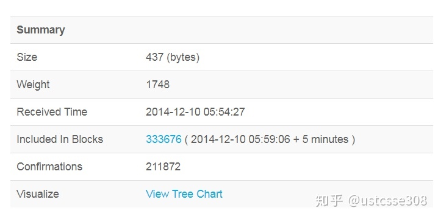
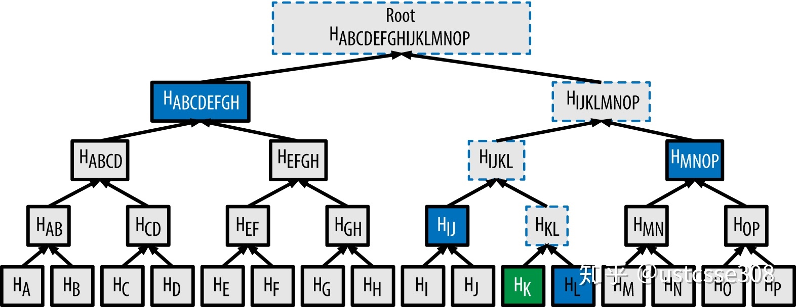

到目前为止，我们重点介绍了单个交易的构建和赎出的过程。在区块链中，多个交易是被打包到一个区块中。使用包含多个交易区块而不是单个交易作为共识的单位，主要的目的是优化，因为如果矿工是针对每个交易而不是多个交易一起进行共识，那么效率就太低了。这一节中，我们主要对区块进行一些介绍

# Merkle树

之前查看交易信息的时候，可以看到每个交易都是自己相关的区块信息，

可以看到交易包含在333676区块中，333676也称为区块的高度；

区块是一种被包含在公开账簿（区块链）里的聚合了交易信息的容器数据结构。它由一个包含元数据的区块头和紧跟其后的构成区块主体的一长串交易列表组成。区块头是80字节，而平均每个交易至少是250字节，而且平均每个区块至少包含超过500个交易。具体看一下，区块的结构：

区块链中的区块主要依赖于两种基于Hash的数据结构，一是区块的哈希链，通过哈希指针（hash pointer）形成的链，在上面的链接中，通过点击哈希值，页面可以跳转到之前或者之后的区块；二是区块内的每个块内的交易组成的树状结构。如下图所示。

【哈希指针是一种数据结构，是一个指向数据存储位置及其位置数据的哈希值的指针。这就使得正常的指针可用于取回信息，**哈希指针用于验证信息是否发生改变。**】

上图中，图的上半部分是区块头；下半部分则是对区块头部中的Merkle根的计算过程的展开。**每个区块中的交易形成了一棵Merkle树，Merkle树的根包括在区块头中。**区块通过保存前一个块的哈希值形成了一条链。区块包括头部和具体的交易，具体来说，区块头部包括如下信息：

由于区块头里面包含“父区块哈希值”字段，所以当前区块的哈希值也受到该字段的影响。如果父区块的身份标识发生变化，子区块的身份标识也会跟着变化。当父区块有任何改动时，父区块的哈希值也发生变化。这将迫使子区块的“父区块哈希值”字段发生改变，从而又将导致子区块的哈希值发生改变。而子区块的哈希值发生改变又将迫使孙区块的“父区块哈希值”字段发生改变，又因此改变了孙区块哈希值，以此类推。一旦一个区块有很多代以后，这种瀑布效应将保证该区块不会被改变，除非强制重新计算该区块所有后续的区块。**正是这样的重新计算需要耗费巨大的计算量，所以一个长区块链的存在可以让区块链的历史不可改变，这也是比特币安全性的一个关键特征。**

> 区块主标识符是它的加密哈希值，一个通过SHA256算法对区块头进行二次哈希计算而得到的数字指纹。产生的32字节哈希值被称为区块哈希值，但是更准确的名称是：区块头哈希值，因为只有区块头被用于计算。例 如: 000000000019d6689c085ae165831e934ff763ae46a2a6c172b3f1b60a8ce26f是第一个比特币区块的区块哈希值。区块哈希值可以唯一、明确地标识一个区块，并且任何节点通过简单地对区块头进行哈希计算都可以独立地获取该区块哈希值。

每个区块都包含一个或多个交易。每个区块的第一个交易是coinbase transaction，也即generation transaction，作为矿工打包交易生成区块的奖励，当前的挖矿奖励是12.5个比特币。**coinbase交易的UTXO有一个特殊的规定，至少在100个区块之后才能作为输入进行花费。主要是防止矿工在区块还没有被正式确认的情况下就把币给花了(防止分叉太多)。**虽然区块并不要求除了coinbase之外的交易，但是矿工们一般都会尽量多打包一些交易，以获得尽可能多的交易费用。

区块中的所有交易都使用二进制raw transaction的格式保存在区块中，然后对raw transaction进行哈希得到交易id（txid）。merkle树就是使用这样的txid进行构造的。

> Merkle tree是一种哈希二叉树。在密码学和计算机科学当中，哈希树或Merkle tree是一种特殊的树结构，**其每个非叶节点通过其子节点的标记或者值（子节点为叶节点）的哈希值来进行标注。**哈希树为大型的数据结构提供了高效安全的验证手段。**在比特币网络中，Merkle树被用来归纳一个区块中的所有交易，同时生成整个交易集合的数字指纹，且提供了一种校验区块是否存在某交易的高效途径。**生成一棵完整的Merkle树需要递归地对哈希节点对进行哈希，并将新生成的哈希节点插入到Merkle树中，直到只剩一个哈希节点，该节点就是Merkle树的根。**在比特币的Merkle树中两次使用到了SHA256算法，因此其加密哈希算法也被称为double-SHA256。**

典型的Merkle树如下所示：

在上图中， TA ~ TH 是区块中包括的正常的交易。从底层向上构建Merkle树，对每个交易都进行哈希，分别得到 HA ~ HH 。生成的单个哈希与邻近的哈希值组合，再次进行哈希。譬如 HA 和 HB 组合，再次进行哈希，得到 HAB 。这个过程一直持续下去，从底层一直到树根。可以看出，Merkle树的特点是：

* Merkle Tree的叶子节点是数据块的哈希。
* Merkle Tree的非叶子节点的哈希值根据它下面所有叶子节点的值哈希计算得到。

如果节点总数是奇数个，则复制一份最后一个节点。譬如对于5个叶子节点的情况，最终生成的树可能是这样的：

如果叶子恰好是2的次方，则在树根处的情况如下：

在上图中，merkle root，标记为 HABCDEFGHIJKLMNOP ，是一个32字节的数据，并且会被放置在区块头中，代表了整个区块的交易数据。

> 由于哈希的单向性，可以得出结论，**如果两棵Merkle树的merkle root相同，那么这两棵树的结构和每个节点也必然是相同的。**另外，只要存储的叶子节点数据有任何的变动，就会逐级向上传递到相应的父节点，最终使得Merkle树的根节点哈希值发生变化。

除了区块链之外，Merkle可信树在其他领域应用也很多，如在分布式系统中用于数据一致性验证，git中的版本一致性验证也是基于Merkle树。**大部分Merkle树是二叉哈希树，在比特币中，merkle树主要适用于组织正常的交易，使得交易易于验证并且使用较少的资源。**

为什么要使用这样的数据结构呢？树这种数据结构我们应该是比较熟悉的，特别是这种满二叉树。那我们来算一下，如果如上图所示，**有16个叶子节点，也即一个区块中有16个交易，那么总共需要多少次哈希计算？(31次，每个节点都要计算）**如果是为了保证区块中的交易没有被篡改，那么实际上只需要把16个交易连接起来，然后对整个内容做一次哈希就够了，为什么要这么麻烦形成一棵树，而且做这么多次的计算呢？

-------

我们来使用分布式文件服务器做例子。如果两个服务器A和B都是对某个文件系统的冗余备份。现在希望A和B通信来确认一下，它们所保存的文件是一致的。如果不使用哈希，那么这个通信代价是整个的文件系统，需要把所有的文件都传递到一个进行比较的服务器上，然后进行字符串比较。这无疑是非常低效的。比较哈希当然是一个好方法。因为哈希的单向性和固定的输出长度，所以通信代价就大大降低了。那么为什么要用一棵树呢？

如果A和B两个服务器上存储的文件系统都是一致的，也即两个的哈希值是一样的，那么自然是很好的。如果两个不一致呢？譬如说A服务器上有一个文件更新了，而B服务器还没有来得及更新。怎么样能够快速地定位到导致两个文件系统不一致的文件？

这时就能体现树结构的好处了。如果两个哈希值不一致，A服务器就可以向B服务器要两个子节点的哈希值；然后沿着不一样的路径一直走下去，从而可以确定导致根哈希值不同的文件。而且确定这个不一致文件的复杂度是？

-------

以上是分布式文件服务器的例子。那么在比特币中，Merkle树的作用是什么呢？

默认情况下，一旦接受到一个新交易，节点需要验证它，特别是，验证交易的输入中的每一个之前是否被花费。为了完成这个验证，需要访问区块链。如果节点不信任网络上的其他节点，那么 这个节点需要保存网络上的所有区块，以便验证交易。这种节点称作全节点。在比特币发展的早期，所有节点都是全节点；当前的比特币核心客户端也是完整区块链节点。

在当前的比特币网络中，实际参与共识的全验证节点（fully validating nodes）并不多，因为全验证节点会维护整个区块链的数据，由于区块链的不可篡改和append-only，随着时间的增加，整个区块链的数据量非常大。在2014年4月份，比特币网络中存储所有区块的数据，需要15GB的空间，现在要完整下载比特币的所有区块数据，需要200GB以上的空间。

全节点要检查第300,000号区块中的某个交易，它会把从该区块开始一直回溯到创世区块的300,000个区块全部都链接起来，建立一个完整的UTXO数据库，通过确认该UTXO是否还未被支付来证实交易的有效性。全验证节点维护所有的UTXO， 最好是存在RAM中，这样，当网络中有新的交易广播时，全验证节点可以快速地进行查询、运行脚本、确定交易是否正确、签名是否有效，如果全部正确，则将交易添加到交易池中。

全验证节点对硬件提出了很高要求，个人用户（移动设备）参与这个过程几乎是不可能的。为了客户友好，对于仅仅使用钱包的普通用户，也即轻量级的节点，比特币网络中的大部分用户都是轻量级的用户，比特币网络并不要求它们也存储所有的信息。这种节点只需要维护能够验证用户自己所care的交易的部分信息就行了。这也是中本聪在比特币白皮书中所提出的SPV（simple payment verification）的概念。SPV可以不需整个网络的数据而确认交易是否存在。

轻量级节点往往只需要存储区块链头部就可以了。使用有限的信息，轻节点就能够证明某一笔交易是否存在与区块链中。区块头是80字节，一个区块至少是1M，完整交易的区块比区块头的要大的多。因为区块头部信息很少，每年的增加总量大概是在5M左右，所以简单的硬件设备也完全可以运行。

那问题是，SPV是怎么实现的呢？为什么仅仅需要有限的信息就可以进行验证？

譬如用户Bob收到用户Alice发来的一笔支付交易，这时Bob必须要验证这笔交易（1）确实存在，并且（2）不是双重支付。对于SPV用户而言，需要从可信节点获得区块链的完整的头部信息，以及和他想验证的交易的Merkle分支。这样，虽然用户不能自己验证交易，但如果能够从区块链的某处找到符合的交易，就可以知道这笔交易已被网络确认，也可以确认该笔交易得到网络多少笔确认。譬如，SPV节点要验证第300,000号区块中的某个交易，它需要获得300,000区块中交易的Merkle分支（Merkle路径）进行验证，并且等到序号从300,001到300,006的六个区块堆叠在该交易所在的区块上。如果网络中的其他节点都接受了第300,000区块，并通过足够的工作在该块之上又生成了六个区块，就可以证明该交易不是双重支付。

使用Merkle分支进行验证是Merkle树的Tamper proof性质，使用Merkle树之后，可以很容易验证区块中的交易有没有被篡改。譬如在上图中的例子，如果一个交易 TH 被篡改成了 T? ，那么交易的哈希值会不同，沿着从底层到根节点的路径向上，会导致最终树的merkle root不同，也即保存在区块链头的值不同。相反，如果从叶子节点到Merkle根的路径上，所有的哈希值都验证正确，那么可以证明这个交易确实存在于这个区块中。

如上图，如果需要证明某个区块上是否存在一笔交易Tx3，那么全节点返回的Merkle路径是Hash2和Hash01。只需要这两个值就可以进行验证过程如下：

* Step1：计算交易Tx3的哈希值，得到Hash3
* Step2：通过Hash2和Hash3的哈希值，得到父节点的哈希值Hash23
* Step3：同上，通过计算Hash23和Hash01哈希值，得到根节点的哈希值。
* Step4：将上一步得到的根哈希值对比区块头中MerkleTree的根哈希值，如果相同，则证明该区块中存在交易Tx3，否则说明不存在。

**使用Merkle树可以大大降低SPV节点的存储和计算负担；**

## SPV节点的安全性

（1）若全节点返回的是一条恶意的路径？试图为一个不存在于区块链中的节点伪造一条合法的merkle路径，使得最终的计算结果与区块头中的默克尔根哈希相同。

> 由于哈希的计算具有不可预测性，使得一个恶意的“全”节点想要为一条不存在的节点伪造一条“伪路径”使得最终计算的根哈希与轻节点所维护的根哈希相同是不可能的。

（2）为什么不直接向全节点请求该节点是否存在于区块链中？

> 由于在公链的环境中，无法判断请求的全节点是否为恶意节点，因此直接向某一个或者多个全节点请求得到的结果是无法得到保证的。但是轻节点本地维护的区块头信息，是经过工作量证明验证的，也就是经过共识一定正确的，若利用全节点提供的Merkle路径，与待验证的节点进行哈希计算，若最终结果与本地维护的区块头中根哈希一致，则能够证明该节点一定存在于默克尔树中。

（3）SPV容易受到什么攻击？

> SPV节点毫无疑问可以证实某个交易的存在性，它也能够证明某个区块中不存在某个交易，但它不能验证某个交易（譬如同一个UTXO的双重支付）在整个链中不存在，这是因为SPV节点没有一份关于所有交易的记录。这个漏洞会被针对SPV节点的拒绝服务攻击或双重支付型攻击所利用。为了防御这些攻击，SPV节点需要随机连接到多个节点，以增加与至少一个可靠节点相连接的概率。这种随机连接的需求意味着SPV节点也容易受到网络分区攻击或Sybil攻击。在后者情况中，SPV节点被连接到虚假节点或虚假网络中，没有通向可靠节点或真正的比特币网络的连接。

在绝大多数的实际情况中，具有良好连接的SPV节点是足够安全的，它在资源需求、实用性和安全性之间维持恰当的平衡。当然，如果要保证万无一失的安全性，最可靠的方法还是运行完整区块链的节点。

> **完整的区块链节点是通过检查整个链中在它之下的数千个区块来保证这个UTXO没有被支付，从而验证交易。而SPV节点是通过检查在包含该交易的区块所收到的确认数目来验证交易。**

# Bloom Filter

在之前的例子中，我们并没有涉及一些细节。譬如，SPV节点直接就向全节点请求某一交易的Merkle路径。SPV节点怎么样从网络中接收到与自己相关的交易，确定交易所在的区块呢？

SPV节点一般只需要的是和自己的地址相关的交易。在BIP37之前，SPV的做法是将所有的区块和交易都下载下来，然后本地将不相关的交易给删掉。当然带来的问题就是同步慢、浪费带宽、增加内存使用。在BIP-37中就提到了因为这一点，导致用户对手机APP“Bitcoin Wallet”有所抱怨。

> **为了解决这个问题，最直接的做法就是SPV节点仅向全节点请求和自己地址相关的交易，也即请全节点过滤和自己地址不相关的信息，如果全节点发现某个交易符合SPV节点的需求时，就将以Merkleblock消息的形式发送该交易，Merkleblock消息包含区块头和Merkle路径。此时，SPV就需要在请求中附上自己的地址信息。**

**因此与全区块链节点收集每一个区块内的全部交易所不同，SPV节点对特定数据的请求可能无意中透露了钱包里的地址信息。如果监控网络的第三方跟踪某个SPV节点上的钱包所请求的全部交易信息，就能利用这些交易信息把比特币地址和钱包的用户关联起来。**

举例来说，如果在问路时，使用具体的地址，如“南京路188号”，那么可能得到具体的位置；但同时也泄露了目的地。如果问不同的人，188号在哪里？可能得到所有188号的信息；然后问南京路在哪里？可以得到一整条路的信息。那么虽然获得的答案中包括一些无关的信息；但是，相对应的，隐私得到了一定程度的保护。

因此，在引入SPV节点/轻量级节点后不久，比特币开发人员就添加了一个新功能：Bloom过滤器。这是在2012年的BIP37中引入的。bitcoin/bips 在比特币中，使用Bloom过滤器来加快钱包同步；以太坊使用Bloom过滤器用于快速查询以太坊区块链的日志。

布隆过滤器（Bloom Filter）是1970年由布隆提出的，用来判断某个元素是否在集合内，它具有运行速度快（时间效率），占用内存小的优点（空间效率），但是有一定的误识别率和删除困难的问题。**它能够判断某个元素一定不在集合内或可能在集合内，也即Bloom Filter会造成一定的False Positive，但是不会造成False Negative。**

> Bloom过滤器的实现是由一个可变长度（N）的二进制数组（N位二进制数构成一个位域）和数量可变（M）的一组哈希函数组成。这些哈希函数的输出值始终在1和N之间，并且该函数为确定性函数，也即对特定输入总是得到同一个的结果。Bloom过滤器的准确性和私密性能通过改变长度（N）和哈希函数的数量（M）来调节。

**与其它数据结构相比较，Bloom filter的优点包括：空间效率和查找时间复杂性；不需要存储元素本身，在保护隐私方面具有优势。**

下面通过一些例子来具体解释Bloom Filter的工作原理。

这里使用十六位数组（N=16）和三个哈希函数（M=3）来演示Bloom过滤器的应用原理。

> **Bloom过滤器数组里的每一个数的初始值为零。关键词被加到Bloom过滤器中之前，会依次通过每一个哈希函数运算一次。该输入经第一个哈希函数运算后得到了一个在1和N之间的数，它在该数组（编号依次为1至N）中所对应的位被置为1，从而把哈希函数的输出记录下来。接着再进行下一个哈希函数的运算，把另外一位置为1；以此类推。当全部M个哈希函数都运算过之后，一共有M个位的值从0变成了1，这个关键词也被“记录”在了Bloom过滤器里。**

向上图中的简易Bloom过滤器添加关键词“A”。

增加第二个关键词就是简单地重复之前的步骤。关键词依次通过各个哈希函数运算之后，相应的位变为1，Bloom过滤器则记录下该关键词。需要注意的是，当Bloom过滤器里的关键词增加时，它对应的某个哈希函数的输出值的位可能已经是1了，这种情况下，该位不会再次改变。也就是说，**随着更多的关键词指向了重复的位，Bloom过滤器随着位1的增加而饱和，准确性也因此降低了。该过滤器之所以是基于概率的数据结构，就是因为关键词的增加会导致准确性的降低。准确性取决于关键字的数量以及数组大小（N）和哈希函数的多少（M）。更大的数组和更多的哈希函数会记录更多的关键词以提高准确性。而小的数组及有限的哈希函数只能记录有限的关键词从而降低准确性。**

> 问题：如果N比较小，当添加关键词时，所有的位都成为1，意味着什么？

> 答：所有参与测试的关键词都能通过过滤器，导致所有的关键词都是哈希相关的

**为测试某一关键词是否被记录在某个Bloom过滤器中，则将该关键词逐一代入各哈希函数中运算，并将所得的结果与原数组进行对比。如果所有的结果对应的位都变为了1，则表示这个关键词有可能已被该过滤器记录。之所以这一结论并不确定，是因为这些字节1也有可能是其他关键词运算的重叠结果。简单来说，Bloom过滤器正匹配代表着“可能是”。**

下图是一个验证关键词“X”是否在前述Bloom过滤器中的例子。相应的比特位都被置为1，所以这个关键词很有可能是匹配的。

另一方面，如果我们代入关键词计算后的结果某位为0，说明该关键词并没有被记录在过滤器里。负匹配的结果不是可能，而是一定。也就是说，负匹配代表着“一定不是”。

下图验证关键词“Y”是否存在于简易Bloom过滤器中的图例。图中某个结果字段为0，该字段一定没有被匹配。

通过使用Bloom Filter，使得SPV节点只接收交易信息的子集，同时不会泄露哪些是它们感兴趣的地址。实际上，再对Bloom Filter进行设置时，如果带宽和硬件条件宽裕，SPV节点可以选择具有高FP（false positive）率的Bloom Filter，此时如果有第三方对SPV进行跟踪，看到的将是大量的数据中混杂着与节点相关的数据，从而隐私性得到了保护。相反，如果带宽和硬件条件不宽裕，则可以选择尽可能精确的设置从而过滤掉不相关的数据，但是第三方就有可能将交易和IP地址关联起来。

## 工作过程

1. SPV节点会初始化一个不会匹配任何关键词的“空白”Bloom过滤器。
2. SPV节点会创建一个包含钱包中所有地址信息的列表，并创建一个与每个地址相对应的交易输出相匹配的搜索模式。通常，这种搜索模式是一个向公钥付款的哈希脚本，该脚本是一个会出现在每一个向公钥哈希地址（P2PKH）付款的交易中的锁定脚本。如果SPV节点需要追踪P2SH地址余额，搜索模式就会变成P2SH脚本。
3. SPV节点会把每一个搜索模式添加至Bloom过滤器里，这样只要关键词出现在交易中就能够被过滤器识别出来。
4. 对等节点会用收到的Bloom过滤器来匹配传送至SPV节点的交易。

### Filter匹配算法

Bloom filter可以用于测试任何的数据，查看数据是否与用户加入filter中的数据相关。

在BIP37中，确定交易是否匹配filter，使用以下算法，一旦发现了匹配，则算法停止。

> 1. 测试交易本身的哈希。
> 2. 对于每个输出，测试输出脚本中的每一个数据项。每一个哈希（密钥）都单独测试。如果在测试交易的时候发现了匹配的输出，那么节点也可以升级filter，将该输出的COutPoint结构也添加到filter中。也即，将该交易的输出中与SPV用户自己相关的部分（可用于其他交易的输入）添加到filter中。
> 3. 对于每一个输入，测试COutPoint结构。
> 4. 对于每一个输入，测试输入脚本ScriptSig的每一个数据项。
> 5. 否则，没有匹配。

> 来分析一下：

> 1. 步骤1是因为用户有可能对某一个特定的交易感兴趣；
> 2. 步骤2是因为用户可能在过滤器中加入了自己的公钥或地址；如果某一笔交易发钱给自己，那么用该COutpoint来更新过滤器；【检查自己的收入】
> 3. 步骤3检查自己的花费；
> 4. 步骤4检查自己的花费；

**问题：哪些数据应该加入到filter中呢？**

在上面的算法中，在step 2中提到“匹配的输出，那么节点也可以更新filter，将该输出的COutPoint结构也添加到filter中”。**为什么要对filter进行及时的更新呢？**

对outpoints的测试是为了确保能找到花费钱包中的输出的交易，即使你对它们的形式一无所知。正如你所看到的，一旦在连接上设置了过滤器，过滤器就不是静态的，它可以在整个连接的生命周期内改变。这样做是为了避免出现下面的race condition。

客户端设置了与钱包中的密钥（公钥、地址）相匹配的过滤器。然后他们开始下载区块链。客户端缺少的那部分区块链是使用getblocks请求的。

* 第一个区块是由服务节点从磁盘上读取的。它包含TX 1，TX1向客户的密钥（公钥、地址）发送资金。它与过滤器相匹配，因此被发送到客户端。
* 第二个块是由服务节点从磁盘上读取的。它包含TX 2，它花费了TX 1。然而TX 2不包含任何客户的密钥（公钥、地址），因此没有被发送。客户端不知道他们收到的钱已经被花掉了。

BIP 37在实现时，提供了Bloom_update_none选项，也即不更新。主要是因为，随着加入项的增多，Bloom Filter的效率会变低。用户可能需要定时刷新filter。

另外提供了Bloom_update_all选项，也即上文提到的将输出中的scriptpbk中的outpoint都加入进来；

另外，还提供了Bloom_update_P2PUBKEY_ONLY选项，也即仅在输出脚本是 pay-to-pubkey或者是pay to multisig形式的时候才将outpoint添加到filter中。

思考：为什么有Bloom_update_P2PUBKEY_ONLY选项？

【在P2PKH类型的交易中，如果要花费，则在scriptsig中一定会有用户的公钥提供，所以用户可以通过在filter中添加自己的公钥来查询；从而防止filter性能快速下降】

> **问题：能不能通过删除项来更新bloom filter?**

> 答：不能，因为有可能部分位置已经被待删除的项置为1。若要删除需对每个位置出现的1进行计数。

**最后，分析一下Bloom Filter的效率和内容占用情况，为何说它速度快，占用内存小。**

Bloom filter被广泛应用于各种领域，比如拼写检查、字符串匹配算法、网络包分析工具、Web Cache、文件系统、存储系统等。

这里举例分析一下Bloom filter在重复数据删除应用中的空间和时间效率。重复数据删除技术的基本原理是对文件进行定长或变长分块，然后利用hash函数计算数据块指纹，如果两个数据块指纹相同则认为是重复数据块（存在数据碰撞问题），只保存一个数据块副本即可，其他相同数据块使用该副本索引号表示，从而实现数据缩减存储空间并提高存储效率。

为了查询一个数据块是否重复或者已经存在，需要计算数据块指纹并进行查找，并记录所有唯一数据块的指纹。举一个例子：32TB的数据，平均数据块大小为8KB，每个数据块使用MD5和SHA1计算两个指纹并用64位整数表示唯一块号则共占用44字节((128+160+64)/8），则总共最多需要176GB（32TB/8KB * 44 Byte）的存储空间来保存数据块信息。

现在的去重系统数据容量通常多达数十到数百TB，如果把数据块信息全部保存在内存中，显然对内存的需求量非常巨大。通常的做法是把数据块信息保存在磁盘或SSD上，使用一定内存量作 Cache缓存数据块指纹，利用时间局部性和空间局部性来提高查找性能。这种方法的一个关键问题是，如果新的数据块是不重复的，查找时会出现Cache不命中，从而引起大量的磁盘读写操作。由于磁盘或SSD性能要远远小于内存的，对查找性能影响非常大。

Bloom filter可以有效解决这个问题，DataDomain中的Summary Vector就是采用Bloom filter来实现的。对于前面的例子，一个数据块用3个hash函数计算指纹最多占用3个位，则Bloom filter仅需要1.5GB = 32TB/8KB * 3 /8 bytes的内存空间。引入Bloom filter机制后，对于一个新数据块，首先查找Bloom filter，如果未命中则说明这是一个新的唯一数据块，直接保存数据块和并Cache数据块信息即可；如果命中，则说明这有可能是一个重复数据块，需要通过进一步的hash或tree查找进行确认，此时需要Cache与Disk进行交互。受益于Bloom filter以及Cache，DataDomain系统可以减少99%的磁盘访问，从而利用少量的内存空间大幅提高了数据块查重性能。

