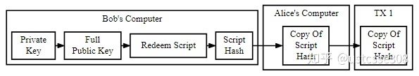
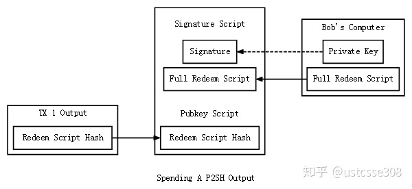
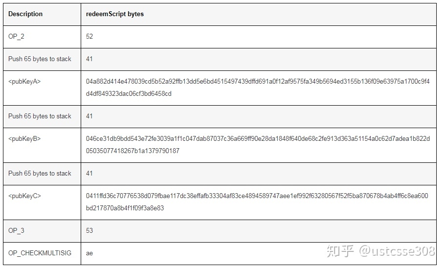
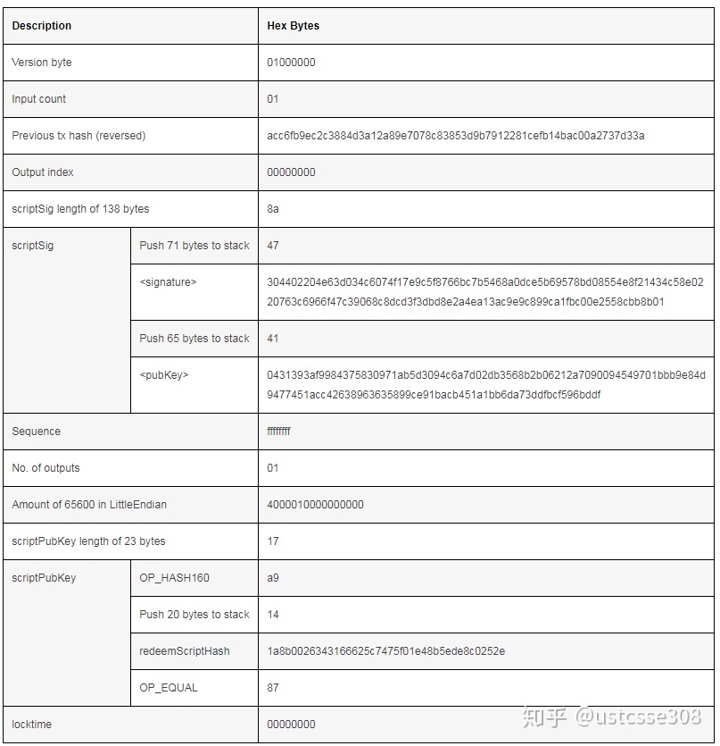
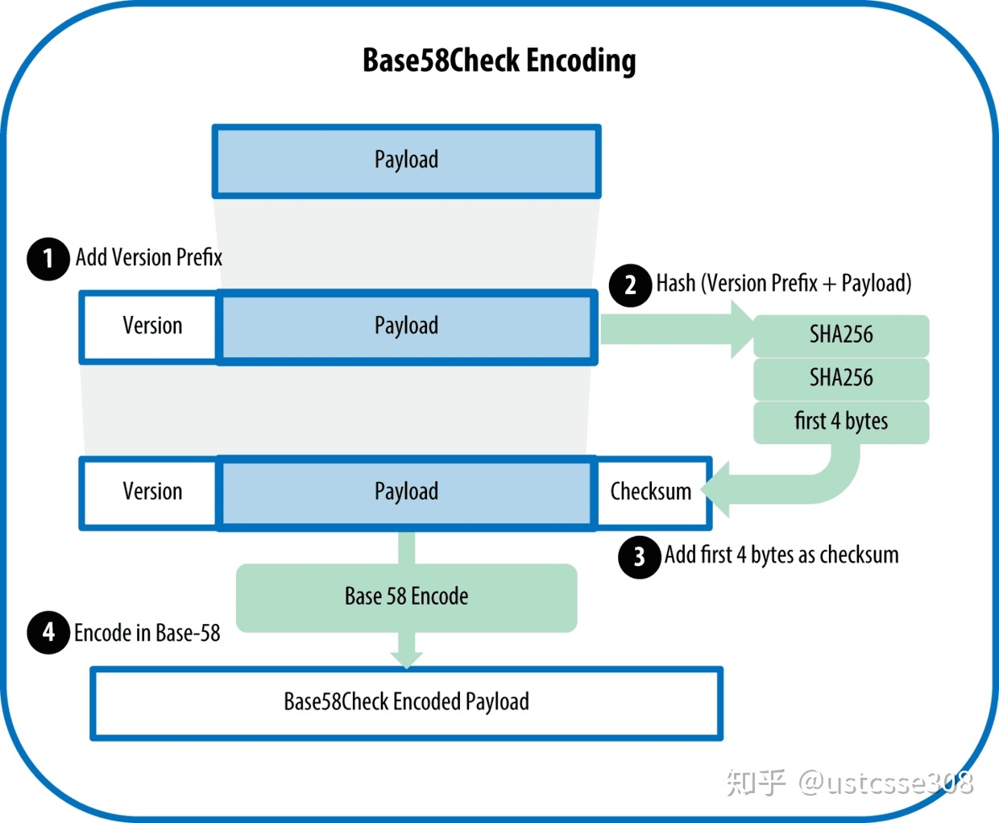
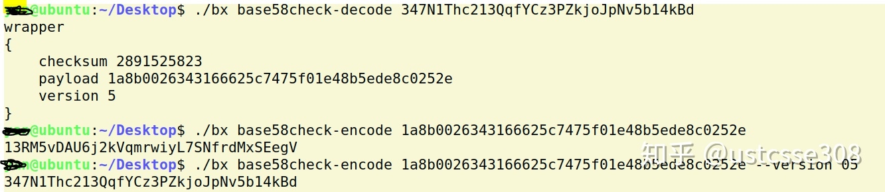
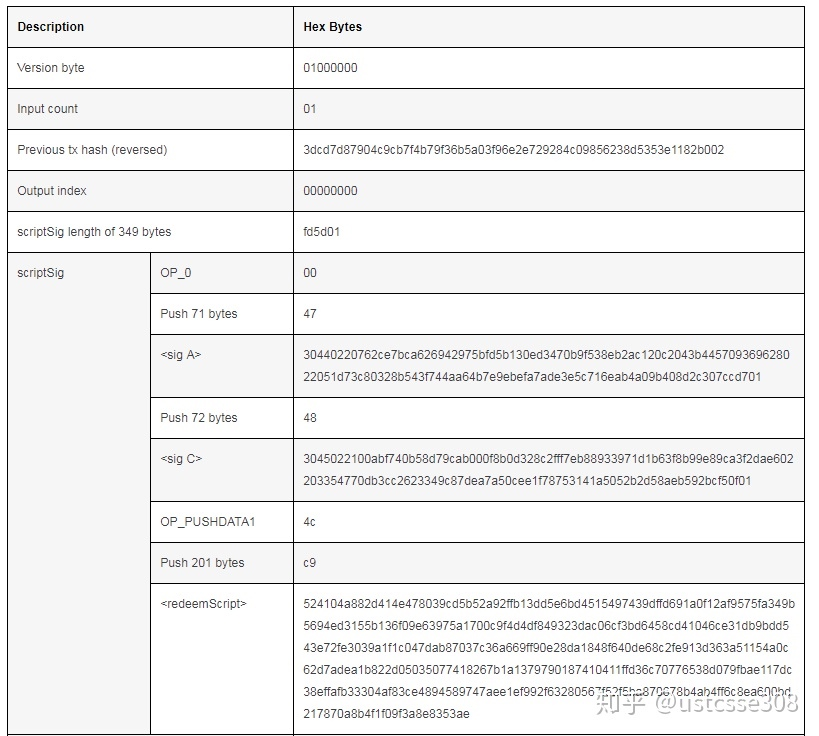
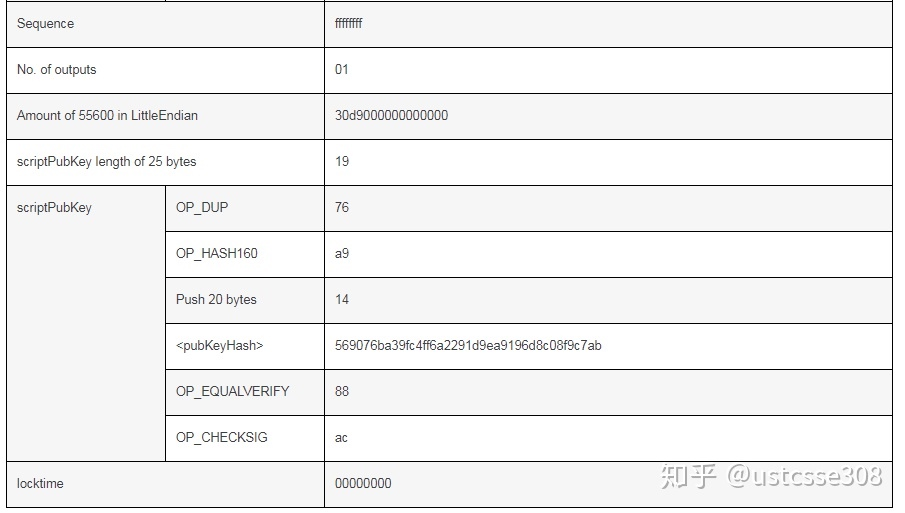

# OP_CHECKMULSIG
和OP_CHECKSIG相比，OP_CHECKMULSIG多了个MUL，也即它需要检查多个签名。

提出该指令的目的是使能安全钱包、托管交易、以及其他需要多于一个签名的使用情况。举例来说，可以使用的例子包括：

* 使用WPS（wallet protection service）保护的钱包。譬如需要2-of-2的签名的交易，其中一个签名来自于安装了钱包的（可能不安全的）电脑，另一个签名来自WPS。当发送受保护的比特币时，用户的比特币客户端会将交易发给WPS，WPS会向用户请求确认，譬如用户确实发起了这个交易，以及交易的细节是正确的。

* 组织资金使用：2-of-3的情况，由三名董事组成的董事会，为他们的组织维护资金-除非其中两名董事同意，否则不得动用这些资金。 较大的组织可以进行更大的多重签名交易，例如3-of-5, 5-of-9等。

* 第三方托管服务（买方、卖方、以及信任第三方）。适用于需要2-of-3签名的交易。买方、卖方和第三方没人都提供公钥，买方将创建交易，并使用2-of-3 CHECKMULTISIG，然后将交易ID发送给卖方和第三方。卖方履行自己的责任，然后要求买方共同签名，才能获得支付的币。如果买卖双方起了争执，则第三方会参与进来，譬如如果买方收到货却不肯签名，那么第三方将进行签名，这样满足条件，从而卖方可以获得应得的报酬。

## 第三方托管
关于第三方托管的例子，详细来说，譬如Alice想要使用比特币向Bob购买一些物品。问题是，Alice希望在收到物品之后才付钱，而Bob希望收到钱之后才发货。这时候就需要第三方托管（支付宝）。而第三方托管可以通过MultiSig方便地实现。

Alice和Bob同意找到信任的第三方Carol。然后Alice创建了交易。但是这个交易不是直接发给Bob的，而是一个MULTISIG的交易，需要2-of-3的签名。也即，Alice将自己的币发给了一个地址，要求Alice、Bob以及Carol三人中任意两人的签名才能使用这个输出。

这个交易首先是正常的交易，因为Alice确实拥有这个币。然后如果Alice和Bob都是诚实的，也即Bob看到Alice创建的交易之后便发货，而Alice收到货之后也承认收到货，那么为了使用MULTISIG交易中的币，只要Alice和Bob两人签名就可以创建一个新的交易，这个交易的输入是MULTISIG交易中的输出，输出则是Bob的地址，那么Bob就能获得币。此时，并不需要第三方Carol的参与。

如果Alice不诚实，也即收到货了又不承认，此时Bob可以向Coral申请仲裁，如果Coral相信Bob确实发了货，那么Coral可以和Bob两人创建新的交易，将币从MULTISIG交易中赎出，并且输出是Bob的地址。这样Bob也能够获得币。即使Alice想抵赖也不能成功。

如果Bob不诚实，没有发货或者发的货物不对，那么Alice可以向Carol申请仲裁。如果Carol相信了Alice，那么就可以和Alice一起签名，将币从MULTISIG交易中赎出，并且输出是Alice的地址。这样Alice就能够获得退款。即使Bob想抵赖也不能成功。

-------

MULTISIG的规范如下：

scriptPubKey 中包括的内容：

    m {pubkey}...{pubkey} n OP_CHECKMULTISIG

m的值小于或等于n。

OP_CHECKMULTISIG交易赎出币时需要如下的scriptSig:

    OP_0 ...signatures...
    
这里需要OP_0是因为OP_CHECKMULTISIG中存在Bug，它在实现的时候多出栈了一个元素，所以只好使用OP_0进行填充。

再具体看一下MULTISIG的运行情况。

譬如说赎出币的交易中（新交易Tx2）的scriptSig是这样的：

    (sig2)
    (sig1)
        0
        
MultiSig交易（Tx1）中的输出部分的scriptPubKey是这样的：

    3
    (pubKey3)
    (pubKey2)
    (pubKey1)
    2

当运行时，在 OP_CHECKMULTISIG执行之前，栈中的数据是这样的：

    3
    (pubKey3)
    (pubKey2)
    (pubKey1)
    2
    (sig2)
    (sig1)
    0

初始化之后，各个变量获得了值：

    n->    3
    ikey-> (pubKey3)
           (pubKey2)
           (pubKey1)
    m->    2
    isig-> (sig2)
           (sig1)
           0
           
然后首先尝试使用pubKey3来验证sig2, 很明显会失败，那么将ikey朝前走一步指向pubKey2，isig保持不动：

    n->    3
           (pubKey3)
    ikey-> (pubKey2)
           (pubKey1)
    m->    2
    isig-> (sig2)
           (sig1)
           0
    
使用pubKey2验证sig2成功了，然后ikey和isig都向前:

    n->    3
           (pubKey3)
           (pubKey2)
    ikey-> (pubKey1)
    m->    2
           (sig2)
    isig-> (sig1)
           0
    
基本算法如下：

1. 首先弹出 N , N 是公钥的个数
2. 出栈 N 个公钥
3. 出栈 M ， M 是所需的签名的个数
4. 出栈 M 个签名
5. 将OP_0出栈（历史遗留问题）
6. 对公钥可以循环，从最上面的开始，对每一个公钥，检查一个签名。都从最上的开始，如果失败，则使用下一个公钥来检查同一个签名；如果成功，则使用下一个公钥来检查下一个签名（签名必须和公钥的顺序相同）。
7. 如果签名成功，则CHECKMULTISIG返回1，否则返回0。

以上部分是对MULTISIG的介绍，下面将介绍P2SH，顺便用一下MULTISIG。

# P2SH（pay-to-script-hash）

之前我们介绍了两种交易类型P2PKH和P2PK，现在来讨论一种新的交易类型，pay-to-script-hash。顾名思义，pay-to-script-hash就是把币发到一个脚本的哈希，而不是公钥或者公钥哈希。

典型的比特币地址长得像*15Cytz9sHqeqtKCw2vnpEyNQ8teKtrTPjp*，也是Pay-to-PubKeyHash (P2PKH) 的输出脚本中所用的地址。Pay-to-ScriptHash (P2SH) 长的和用的都不一样。典型的P2SH地址像*347N1Thc213QqfYCz3PZkjoJpNv5b14kBd*，另外，**P2SH 总是以3开头的**，**而P2PKH地址总是以1开头**。这是因为P2SH地址的版本前缀是0x05， 而P2PKH的地址前缀是0x00, 在base58check编码中分别生成3和1。

和MULTICHECKSIG一样，P2SH也不是比特币诞生之初就有的，它是2012年的BIP 16中提出的。提出P2SH的目的主要是因为在之前的交易中，都是由发送者负责指定赎出币的条件。这样的话，如果赎出币的过程比较复杂，譬如要使用MULTISIG，那么对付钱的用户，也就是买家，就不够友好。**使用P2SH的方式，可以由币的接收方设计好执行的脚本，然后不论脚本多么复杂，发送方只需要将币发送到一个20字节的哈希地址就行。**

譬如Alice向Bob购买一件物品，但是Bob的物品不是自己独有的，他需要和其他人一起分享Alice付的币，就例如上面介绍的MULTICHECK，需要3个人中的两人同意才能使用币。把这个任务交给Alice是不合理的，因为Alice只关心自己付了钱能够拿到物品，并不关心Bob拿到钱之后怎么分。这个时候Bob可以创建一个Script，然后Alice可以将币发送到这个Script地址。

我们来看一下P2SH的规范：

在支付用户的交易Tx1中的输出脚本是：

    OP_HASH160 [20-byte-hash-value] OP_EQUAL

其中，[20-byte-hash-value]是push-20-bytes-onto-the-stack opcode (0x14) 之后跟着20个字节。考虑到验证时是将Bob的签名脚本+Alice的输出脚本，所以基本上可以猜出，在OP_HASH160之前，栈里应该是Bob提供给Alice的脚本的原文，然后Alice的输出脚本中的SH也入栈，最后是运行OP_EQUAL，判断是否相等。

然后接收方Bob要提取币的时候，scriptSig的形式应该是:

    ...signatures... {serialized script}

scriptSig首先需要满足Alice的scriptPubKey的要求，也即需要提供一个script原文，使得经过哈希之后的值等于Alice的scriptPubKey中指定的哈希值；另一方面，作为P2SH类型的交易，Bob还必须提供满足脚本本身的条件的signatures。相当于比Alice直接写脚本多了一步。

做一个具体的例子。在这个例子中，P2SH的脚本是一个2-of-3的多签名。

首先Bob需要创建2-of-3 multisig P2SH地址。

为了创建这个地址，首先Bob需要生成3个十六进制的公钥地址。这里使用go-bitcoin-multisig生成3对公私钥对：

    go-bitcoin-multisig keys --count 3 --concise                                                      

结果如下：

    --------------
    KEY #1  
    Private key:  
    5JruagvxNLXTnkksyLMfgFgf3CagJ3Ekxu5oGxpTm5mPfTAPez3  
    Public key hex:  
    04a882d414e478039cd5b52a92ffb13dd5e6bd4515497439dffd691a0f12af9575fa349b5694ed3155b136f09e63975a1700c9f4d4df849323dac06cf3bd6458cd  
    Public Bitcoin address:  
    1JzVFZSN1kxGLTHG41EVvY5gHxLAX7q1Rh  
    --------------
    --------------
    KEY #2  
    Private key:  
    5JX3qAwDEEaapvLXRfbXRMSiyRgRSW9WjgxeyJQWwBugbudCwsk  
    Public key hex:  
    046ce31db9bdd543e72fe3039a1f1c047dab87037c36a669ff90e28da1848f640de68c2fe913d363a51154a0c62d7adea1b822d05035077418267b1a1379790187  
    Public Bitcoin address:  
    14JfSvgEq8A8S7qcvxeaSCxhn1u1L71vo4  
    --------------
    --------------
    KEY #3  
    Private key:  
    5JjHVMwJdjPEPQhq34WMUhzLcEd4SD7HgZktEh8WHstWcCLRceV  
    Public key hex:  
    0411ffd36c70776538d079fbae117dc38effafb33304af83ce4894589747aee1ef992f63280567f52f5ba870678b4ab4ff6c8ea600bd217870a8b4f1f09f3a8e83  
    Public Bitcoin address:  
    1Kyy7pxzSKG75L9HhahRZgYoer9FePZL4R  
    --------------
    
这样我们就有了三个十六进制的公钥：

    Key A:
    04a882d414e478039cd5b52a92ffb13dd5e6bd4515497439dffd691a0f12af9575fa349b5694ed3155b136f09e63975a1700c9f4d4df849323dac06cf3bd6458cd
    
    Key B:
    046ce31db9bdd543e72fe3039a1f1c047dab87037c36a669ff90e28da1848f640de68c2fe913d363a51154a0c62d7adea1b822d05035077418267b1a1379790187
    
    Key C:
    0411ffd36c70776538d079fbae117dc38effafb33304af83ce4894589747aee1ef992f63280567f52f5ba870678b4ab4ff6c8ea600bd217870a8b4f1f09f3a8e83

然后，我们指明我们需要一个2-of-3的地址，并且将我们的3个公钥作为输入，以生成该P2SH地址：

    go-bitcoin-multisig address --m 2 --n 3 --public-keys 04a882d414e478039cd5b52a92ffb13dd5e6bd4515497439dffd691a0f12af9575fa349b5694ed3155b136f09e63975a1700c9f4d4df849323dac06cf3bd6458cd,046ce31db9bdd543e72fe3039a1f1c047dab87037c36a669ff90e28da1848f640de68c2fe913d363a51154a0c62d7adea1b822d05035077418267b1a1379790187,0411ffd36c70776538d079fbae117dc38effafb33304af83ce4894589747aee1ef992f63280567f52f5ba870678b4ab4ff6c8ea600bd217870a8b4f1f09f3a8e83

以上命令的输出是：

    ---------------------
    Your *P2SH ADDRESS* is:  
    347N1Thc213QqfYCz3PZkjoJpNv5b14kBd  
    Give this to sender funding multisig address with Bitcoin.  
    ---------------------
    ---------------------
    Your *REDEEM SCRIPT* is:  
    524104a882d414e478039cd5b52a92ffb13dd5e6bd4515497439dffd691a0f12af9575fa349b5694ed3155b136f09e63975a1700c9f4d4df849323dac06cf3bd6458cd41046ce31db9bdd543e72fe3039a1f1c047dab87037c36a669ff90e28da1848f640de68c2fe913d363a51154a0c62d7adea1b822d05035077418267b1a1379790187410411ffd36c70776538d079fbae117dc38effafb33304af83ce4894589747aee1ef992f63280567f52f5ba870678b4ab4ff6c8ea600bd217870a8b4f1f09f3a8e8353ae  
    Keep private and provide this to redeem multisig balance later.  
    ---------------------
    
生成的P2SH地址提供给Alice。

同时生成了Redeem Script，也即Bob在将Alice支付的钱赎出的时候提供的签名脚本。我们来细致地看一下这个redeem script的组成。根据Bitocoin协议的multisignature redeem script, 也结合上面对multisig的解释，一个正确的Multisig的赎出脚本应该是这样的：

    <OP_2> <A pubkey> <B pubkey> <C pubkey> <OP_3> <OP_CHECKMULTISIG>

（OP_2~OP_16，指令代码0x52~0x60就是将2~16入栈）

以上redeem的输出脚本的内容分解一下如下：

使用这个redeemScript，又经过两个步骤生成了P2SH地址:

1. 对redeemScript进行两次哈希：
    
        redeemScriptHash = RIPEMD160(SHA256(redeemScript))
    
2. Base58check使用前缀0x05对redeemscriptHash进行编码：

        P2SHAddress := base58check.Encode("05", redeemScriptHash)

这样就得到了go-bitcoin-multisig给出的P2SH 地址***347N1Thc213QqfYCz3PZkjoJpNv5b14kBd***。 这时候可以将这个地址发送给Alice，Alice可以用这个地址生成支付交易。

基本流程（个人总结）：
Alice向Bob买产品，但产品不是Bob独有，因此他需要与其他两人其中之二同意
1. 卖方Bob先生成3个公钥地址。
2. 声明需要一个2-of-3地址，将3个公钥作为输入
3. 生成的P2SH地址可提供给Alice
4. 同时生成了Redeem Script（Bob取钱需提供的脚本）
5. 对该脚本进行两次哈希得到redeemscriptHash
6. 使用前缀0x05对redeemscriptHash进行编码生成了P2SH地址
7. 此时将P2SH地址发给Alice，Alice直接支付给该地址。

## 使用P2SH地址生成交易

为了形成交易，Alice需要以下的信息：来自标准 P2PKH的输出，该 P2PKH的交易id（txid），相对应的私钥，需要发送的币的个数，以及目标P2SH地址（也就是上面刚生成的地址）。

使用如下命令：

    go-bitcoin-multisig fund --input-tx 3ad337270ac0ba14fbce812291b7d95338c878709ea8123a4d88c3c29efbc6ac --private-key 5JJyqG4bb15zqi7fTA4b227aUxQhBo1Ux6qX69ngeXYLr7fk2hs --destination 347N1Thc213QqfYCz3PZkjoJpNv5b14kBd --amount 65600

输出是：

    
    Your raw funding transaction is:  
    0100000001acc6fb9ec2c3884d3a12a89e7078c83853d9b7912281cefb14bac00a2737d33a000000008a47304402204e63d034c6074f17e9c5f8766bc7b5468a0dce5b69578bd08554e8f21434c58e0220763c6966f47c39068c8dcd3f3dbd8e2a4ea13ac9e9c899ca1fbc00e2558cbb8b01410431393af9984375830971ab5d3094c6a7d02db3568b2b06212a7090094549701bbb9e84d9477451acc42638963635899ce91bacb451a1bb6da73ddfbcf596bddfffffffff01400001000000000017a9141a8b0026343166625c7475f01e48b5ede8c0252e8700000000  
    Broadcast this transaction to fund your P2SH address.  

注意的是，如果多次运行这个命令，每次结果会有些不同，因为在生成数字签名的时候nonce值每次会不同，其他值应该都是一样的。

同样地，来分解一下这个结果：

**和典型P2PKH 交易的主要不同之处在于scriptPubKey，这里scriptPubKey的形式是：**

    <OP_HASH160> <redeemScriptHash> <OP_EQUAL>

这里OP_HASH160 就是RIPEMD160(SHA256()) 函数。

这是便可以将以上交易向网络广播，以获得认证。以上交易的 txid 为02b082113e35d5386285094c2829e7e2963fa0b5369fb7f4b79c4c90877dcd3d。

**【这里需要额外强调一下：redeemScriptHash和P2SHaddress的区别】**

Base58
-------

为什么会使用Base58呢？

主要是为了更简洁方便地表示长串的数字。譬如，十进制计数系统使用0-9十个数字，而十六进制系统使用了额外的 A-F 六个字母。同样的数字，它的十六进制表 示就会比十进制表示更短。更进一步，Base64使用了26个小写字母、26个大写字母、10个数字以及两个符号（例 如“+”和“/”）。Base58是Base64编码格式的子集，同样使用大小写字母和10个数字，但舍弃了一些容易错 读和在特定字体中容易混淆的字符。具体地，Base58不含Base64中的0（数字0）、O（大写字母o）、l（小写字母 L）、I（大写字母i），以及“+”和“/”两个字符。**简而言之，Base58就是由不包括（0，O，l，I）的大小写字母和数字组成。**之所以做出这样的选择，就是对人友好，让人在看到Base58编码的数据之后不会疑惑，从而防止出错。这是因为，如果在比特币交易中如果因为看不清楚地址而输错了目标地址，那么付出去的钱是拿不回来的，所以一定要防止这种错误。

Base58是怎么工作的呢？

Base58 用在比特币和其它的加密货币中，不仅实现了数据压缩，保持了易读性，还具有错误诊断功能。具体工作方式如下图。

**在上面的例子中，payload就是1a8b.......252e，共20个字节（160位）；然后增加前缀，这里是0x05；新生成的字符串进行连续两次的SHA256哈希，取结果的前四个字节作为校验和形成后缀；这些进行base58编码的就是25个字节。**

Base58编码实际上就相当于是10进制转换为16进制，只不过范围更大而不仅仅是0~F；Base58的字符集范围是123456789ABCDEFGHJKLMNPQRSTUVWXYZabcdefghijkmnopqrstuvwxyz。但是和十六进制转换思路是一样的。也和进制转换可以相互转一样，经过Base58编码的数据也很容易到推出原始数据。

所以虽然命令的输入是347N.....4kBd，但是倒推出1a8b.......252e是没有问题的。

Base58介绍结束，继续P2SH
-------

## 赎回multisig P2SH币

在Alice的支付交易获得确认之后，Bob就可以输出其中的币了。现在生成另一对公私钥作为Bob赎出币后的目的地址。

    go-bitcoin-multisig keys --concise

输出如下：

    --------------
    KEY #1  
    Private key:  
    5Jmnhuc5gPWtTNczYVfL9yTbM6RArzXe3QYdnE9nbV4SBfppLcx  
    Public key hex:  
    04459b7e1711f31e64507061bccb89fb618e86b254140dc98a42093e449fef067f2ece0a9b11a63697a11c5176528c436570499a13aa22824be53ea2718173b45a  
    Public Bitcoin address:  
    18tiB1yNTzJMCg6bQS1Eh29dvJngq8QTfx  
    --------------
    
现在，需要上面生成P2SH地址的3对密钥中的两个私钥来生成Tx2中的签名脚本。在这里使用第一个和第三个私钥做例子。

为了生成tx2交易，Bob需要以下信息：首先是**输入txid**，也即Alice生成的交易Tx1的txid，**使用的数量**，以及**支付的目标**。同时在签名脚本中还必须有**redeem script原文**。因为之前仅提供了redeem script的哈希，所以只有Alice交易的接收方才知道它的原文。

    go-bitcoin-multisig spend --input-tx 02b082113e35d5386285094c2829e7e2963fa0b5369fb7f4b79c4c90877dcd3d --amount 55600 --destination 18tiB1yNTzJMCg6bQS1Eh29dvJngq8QTfx --private-keys 5JruagvxNLXTnkksyLMfgFgf3CagJ3Ekxu5oGxpTm5mPfTAPez3,5JjHVMwJdjPEPQhq34WMUhzLcEd4SD7HgZktEh8WHstWcCLRceV --redeemScript 524104a882d414e478039cd5b52a92ffb13dd5e6bd4515497439dffd691a0f12af9575fa349b5694ed3155b136f09e63975a1700c9f4d4df849323dac06cf3bd6458cd41046ce31db9bdd543e72fe3039a1f1c047dab87037c36a669ff90e28da1848f640de68c2fe913d363a51154a0c62d7adea1b822d05035077418267b1a1379790187410411ffd36c70776538d079fbae117dc38effafb33304af83ce4894589747aee1ef992f63280567f52f5ba870678b4ab4ff6c8ea600bd217870a8b4f1f09f3a8e8353ae

使用以上信息可以生成输出：

    Your raw spending transaction is:  
    01000000013dcd7d87904c9cb7f4b79f36b5a03f96e2e729284c09856238d5353e1182b00200000000fd5d01004730440220762ce7bca626942975bfd5b130ed3470b9f538eb2ac120c2043b445709369628022051d73c80328b543f744aa64b7e9ebefa7ade3e5c716eab4a09b408d2c307ccd701483045022100abf740b58d79cab000f8b0d328c2fff7eb88933971d1b63f8b99e89ca3f2dae602203354770db3cc2623349c87dea7a50cee1f78753141a5052b2d58aeb592bcf50f014cc9524104a882d414e478039cd5b52a92ffb13dd5e6bd4515497439dffd691a0f12af9575fa349b5694ed3155b136f09e63975a1700c9f4d4df849323dac06cf3bd6458cd41046ce31db9bdd543e72fe3039a1f1c047dab87037c36a669ff90e28da1848f640de68c2fe913d363a51154a0c62d7adea1b822d05035077418267b1a1379790187410411ffd36c70776538d079fbae117dc38effafb33304af83ce4894589747aee1ef992f63280567f52f5ba870678b4ab4ff6c8ea600bd217870a8b4f1f09f3a8e8353aeffffffff0130d90000000000001976a914569076ba39fc4ff6a2291d9ea9196d8c08f9c7ab88ac00000000  
    Broadcast this transaction to spend your multisig P2SH funds.

同样地，来分析一下这个交易：

OP_PUSHDATA1命令的功能是指出下一个字节是将要入栈的字节数。

来具体地看一下Bitcoin协议怎么样运行这个脚本，首先是将scriptPubKey脚本和scriptSig脚本合并，然后得到：

    <OP_0> <sig A> <sig C> <redeemScript> <OP_HASH160> <redeemScriptHash> <OP_EQUAL>
    
详细的步骤：

1. OP_0和 sigA 以及 sigC 入栈。
2. redeemScript 入栈。
3. OP_HASH160 对redeemScript执行哈希，栈顶是redeemScript的哈希值。
4. redeemScriptHash入栈。
5. OP_EQUAL将会比较 OP_HASH160(redeemScript)的结果和后入栈的 redeemScriptHash ，这一步证明了是否提供了正确的redeemscript，也即是否是币的合法的所有者。
6. 然后开始执行redeemScript:

        <OP_2> <A pubkey> <B pubkey> <C pubkey> <OP_3> <OP_CHECKMULTISIG>
    
7. OP_CHECKMULTISIG 将对3个公钥和栈中的2个签名进行验证。

注意事项：

* 上一节中我们讲过生成scriptSig时，为了对交易进行签名，（因为签名是交易的一部分，在在生成签名之前，需要有替代的填充项），使用了scriptPubkey作为填充，在P2SH中，进行填充的是redeemScript。
* 当将数据入栈的时候，一般的格式是<size of item> <item>，但是，如果<item>多于75字节，则需要使用特殊的指令 OP_PUSHDATA1, OP_PUSHDATA2 and OP_PUSHDATA4，分别指示其后1、2、4个字节是需要入栈的数据的长度 。
* scriptSig的长度需要包括在交易中，数据类型是var_int，如果scriptSig长度很长，长于253 ,则需要使用额外的字节表示。此时，使用 0xfd (253) 后面跟上2个字节指示scriptSig 的长度。但是，一定要是必要的时候，也即scriptSig确实很长的时候才这样做，否则会出错。
* 
此时就可以将本交易广播，可以看到这个交易已经被确认了， txid 是eeab3ef6cbea5f812b1bb8b8270a163b781eb7cde10ae5a7d8a3f452a57dca93。

## TimeLock

在刚开始看交易的细节时，我们就遇到过Lock Time这个域。Lock Time顾名思义，就是锁定一些币，在达到某个时间或者某个区块之前不能使用这些币。在之前的交易中这个值都是0，也即不用锁定。那么在什么情况下需要使用lock time呢？

虽说比特币交易比传统的交易费用低——譬如信用卡，当使用信用卡时，如果花费的金额较低，商家可能会拒绝接受信用卡，因为每一笔信用卡使用都需要付手续费，但是为了鼓励矿工尽快将自己的交易打包，一般都会在交易中预留交易费用。但是，有些情况下，可能需要快速地变更支付的费用，因此，就有必要防止快速而经常地进行交易而导致的交易费用。

例如，用户需要在一段时间内连续地使用咖啡店的wifi，咖啡店希望每天支付一次流量费用。但是如果每天产生一笔交易，交易费用会很高。可以提出一种zero-trust的方案，意味着，交易是完全自动的，只需要在最初预留一部分钱，然后系统会自动地按需进行支付，而咖啡店也能够放心地让用户使用而不至于担心用户会赖账。而真正进行广播，也即需要支付交易费用的交易的数量也能受到控制。

思路是这样的：

假设Alice是用户，Bob代表咖啡店。首先Alice生成一个交易Tx1，譬如支付100个币到一个2-of-2的multisig地址，也即这笔钱需要Alice和Bob共同签名才能使用。Alice首先对这个交易进行签名，然后广播这个交易。

Bob看到这个交易之后可以让Alice使用wifi。接下来每天Alice生成新的一个交易发给Bob，使用Tx1中的钱支付给Bob，譬如第一天支付1个币给Bob，99个币给Alice；第二天支付2个币给Bob，98个币给Alice；等等。每天Bob看到这个交易，就会同意Alice继续使用网络。因为Tx1是2-of-2的交易类型，所以Bob看到Alice的签名，如果他想要获得支付，只要完成自己的签名部分就行了，所以Bob可以放心Alice不会赖账。

当第28天Alice的工作完成不再需要咖啡店的网络了，就会通知Bob，对第28天的交易进行签名，也即总共支付28个币给Bob，剩余的72个币会返还给Alice。

我们来想一下，这个过程中，Bob可以放心，对Alice会不会有损失？

如果Bob是诚实的，这个过程会很顺利；但是如果Bob比较坑，在Alice使用完网络之后他一直不签名，那么Alice预付的100个币就一直锁死在网络中了。虽然Bob没有获得自己应得的那部分钱，但是Alice的损失更大。

为了防止出现这种情况，可以使用lock_time。

1. 首先Alice创建public key (K1)，然后请求Bob的公钥(K2)。
2. 创建一个OP_CHECKMULTISIG交易Tx1，支付100个币到Multisig地址，也即需要Alice和Bob两人签名才能使用。Alice对这个交易签名，但是暂时并不广播。
3. Alice创建退款交易Tx2，Tx2使用Tx1的输出作为输入，并且将所有的钱都返回给Alice。这个交易设置了lock_time，譬如30天之后。Alice将这个交易提供给Bob。
4. Tx2主要是为了防止Bob坑，所以Bob为了证明自己不坑，会给Tx2签名，然后将签名返回给Alice。
5. Alice验证Bob的签名，如果正确，说明她的退款有保障，因此也就可以放心。
6. Alice此时对Tx1进行签名（这是对Tx1的input的支付签名），并且将签名发送给Bob。此时Alice或者Bob可以发布Tx1。此时Alice的100个币相当于被锁定了。
7. 然后Alice创建新的交易Tx3，使用Tx1的输出作为输入。Tx3类似于Tx2，但是有两个输出，譬如1个币给Bob，99个币给Alice。Alice对这个交易签名，发给Bob。
8. Bob收到Tx3和Alice的之后，验证签名的正确性。此时Bob如果加上自己的签名，就可以发布和广播这个交易，并获得1个币。但是因为Alice还在持续地使用Bob提供的服务，马上对这个交易进行签名，很明显是不明智的。
9. 之后每天Alice会继续创建类似的交易Tx3，都是用Tx1的输出作为输入。但是每次支付给Bob的币都在增多，留给自己的在减少。Bob收到之后进行验证。
10. 当Alice决定停止使用服务的时候，通知Bob，Bob对收到的最后一个Tx3进行签名并且广播。

**如果Alice想利用Tx2进行双重支付，会不会成功呢？这时就是locktime起作用的时候了。因为这个Tx2不会立刻生效，所以Bob签字的Tx3会被首先确认，之后Tx2因为和Tx3使用的同一个输入，所以Tx2就是一个无效交易，因此双重支付不会成功。**

# 智能合约

上的例子实际上就是智能合约（在区块链上运行的程序）。通过使用脚本、矿工和交易验证能够实现传统上需要第三方中心机构才能完成的一些功能，这是一件相当了不起的事情。对智能合约的研究远远超出了上面列出来的例子，虽然比特币对智能合约的支持并不完善，但是如上所示，已经可以完成不少有意义的工作。