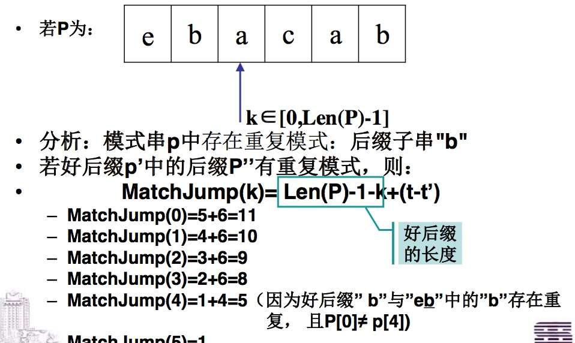

# 实际的内存空间开销

### 实验结果：
    申请分配内存空间一次，额外开销为：24~31B

### 结论：
    应尽可能减少申请分配内存空间的次数

### 好处：
*     减少额外开销
*     可提高运行速度：
        1. 减少额外开销后，cache中的元素数增加了，可以提高处理速度（Malloc之后的cache情况）
        2.  内存的分配和销毁，属于耗时操作

### 如何减少申请分配内存空间的次数：
*     一次性手动申请大片的内存空间作为内存池（还可以尽量避免产生内存碎片）
*     按实际需要从内存池中取出相应大小的空间来使用，若内存池中空闲空间不够，则再申请新的大片内存空间
*     内存空间用完后不直接回收，而是返回给内存池
*     内存池不用时，需手动释放

**问题1:
给定一个英语词典,找出其中的所有变位词集合。例如,”pots”、”stop”和”tops”互为变位词。**                

> 答:
>标识字典中的每一个单词，使得在相同变位词类中的单词具有相同的的标识，然后集中具有相同标识的单词。将每个单词按照字母表排序，排序后得到的字符串作为该单词的标识。那么对于该问题的解题过程可以分为三步：第一步，读入字典文件，对单词进行排序得到标识；第二步，将所有的单词按照其标识的顺序排序；第三步，将同一个变位词类中的各个单词放到同一行中。

**问题2:
给定一个最多包含40亿个随机排列的32 bits整数的顺序文件,找出一个不在文件中的32 bits整数 (在文件中必然缺失一个这样的数——为什么?)。**
1. 在具有足够内存的情况下,如何解决该问题?
2. 如果有几个外部的“临时”文件可用,但是仅有几百字节的内存,又该如何解决?

> 答:
> 1. 直接在内存里排序并二分查找
> 2. 现在外存归并排序，然后在内存进行二分查找

> 1. 输出变量ans初始值为0，当前位i为最高位，比如32；
> 2. 对当前文件进行处理：根据当前第i位为0、为1，将文件一分为二；
> 3. 比较这两组数的二进制1哪个较多，如果第i位为1的组为1较多则ans第i为置0，若第i位为0的组1较多则ans第i位置1；
> 4. 接着继续转向较少的那组数；
> 5. 重复以上步骤2-3

# 线性表

* 什么时候需要用到数据结构?
– 操作对象为:取值为同种类型的很多数据,且这些数据间存在某
种关系或者某些共性操作

* 若需要用到DS,那什么时候可以使用线性结构?
– 被操作的数据之间没有天然的一对多和多对多的关系
– 对已存储的数据进行处理时,处理顺序有明显的唯一的先后次序关系

* 若采用线性结构,具体该使用哪种存储结构(此处,只讨论:顺序表和链表)
– 取决于数据处理时的最频繁操作,为静态操作,还是动态操作?

## 顺序表

**特性:**

– 逻辑上相邻的元素,物理存储地址必相邻 ;

– 可随机存取:通过顺序表的名称和下标可以直接访问顺序表中的任一个元素。


**静态定义**

– 该结构比较机械:分配的内存空间大小固定。 
* List_Size 过小,会导致顺序表上溢;
* List_Size 过大,会导致空间利用率不高

– 在编译的时候,系统在函数栈中分配连续的内存空间。当静态顺序表所在的函数执行完毕后, 由系统来回收所开辟的内存空间。

– 程序运行时,出现上溢问题,将没法修补。

**动态定义**

– 需手动分配存储空间:malloc()

– 可以在程序运行过程中,重新分配空间:realloc() 

– 不再使用顺序表时,需手动释放所占的空间:free() 

– 可以避免“机械”,但是会增加时间开销。

**适用环境**

> * 顺序文件的查找。(有序顺序表+二分查找)
> * 顺序文件的查找,并在文件中添加一个元素。(基于二叉平衡树的查找)

> 结论:顺序表适用于输入数据的大小已知,且无太多动态操作的应用问题。

## 链表

## 顺序表的延伸:位向量/位图

* 采用位向量:即bit数组

* 什么是位向量? 
    –示例:{0,1,2,20,32}用位向量存储为: (33bit)

假设该位向量用包含2个整数的顺序表X表示。则: 

> 问题:若要利用位向量来存储整数64，则该如何存储？
> 1. 64存放在顺序表X的第几个整数中？
>     答: 64 / 32 = 2 , 因而64存放在X[2]中
>     
> 2. 64该如何存放在它对应的整数元素中？
>     答: 64 % 32 = 0 , 因而将X[2]的值加2的0次方即可
    
# 程序的编译和运行

**写完代码到执行程序的过程**

**源代码与PE文件如何对应**

**运行PE文件后,发生了什么?(从OS角度去看)**
> – Step1:创建一个进程。
• 进程的最关键特征:拥有独立的虚拟地址空间,即拥有一个虚拟空间VM到物理内存的映射关系
> 
– Step2:装载相应的PE文件并执行
• 读取可执行文件头,并且建立虚拟空间VM与可执行文件的映射关系
• 将CPU的指令寄存器设置成可执行文件的入口地址,启动运行

# C中进程的虚拟内存分配

* 栈区（stack）：由编译器自动分配和释放，存放函数的参数值、局部变量的值等，甚至函数的调用过程都是用栈来完成。其操作方式类似于数据结构中的栈。
* 堆区（heap）：一般由程序员手动申请以及释放，若程序员不释放，程序结束时可能由OS回收。分配方式类似于链表。
* 全局区（静态区）（static）：全局变量和静态变量的存储是放一块的，初始化的全局变量和静态变量在一块区域，未初始化的全局变量和未初始化的静态变量在相邻的另一块区域。程序结束后由系统释放空间。
* 文字常量区：常量字符串就是放在这里的。程序结束后由系统释放空间。
* 程序代码区：存放函数体的二进制代码。

# 栈
## 递归的实现

* 调用前:
– 现场保护(参数、返回地址、旧基址入栈),
   被调用函数的局部变量的空间分配,控制转移至被调用的函数入口。
   
* 调用后:
– 保存计算结果,释放被调函数的数据区,控制转移回调用处。

* 实现——栈
– “后调用先返回”。系统利用递归工作栈记录各层调用的现场信息。

## 堆栈

堆栈是C语言程序运行时必须的一个记录调用路径和参数的空间
– 函数调用框架
– 传递参数
– 保存返回地址
– 供局部变量空间 
– ......

* 堆栈相关的寄存器
– esp,堆栈指针(stack pointer) 
– ebp,基址指针(base pointer)：在C语言中用作记录当前函数调用基址

* 堆栈操作 
– push
    栈顶地址减少4个字节(32位)
– pop
    栈顶地址增加4个字节(32位)
 
* 其他关键寄存器
– cs : eip:总是指向下一条的指令地址
    1. 顺序执行:总是指向地址连续的下一条指令
    2. 跳转/分支:执行这样的指令的时候,cs : eip的值会根据程序需要被修改
    3. call:将当前cs : eip的值压入栈顶,cs : eip指向被调用函数的入口地址
    4. ret:从栈顶弹出原来保存在这里的cs : eip的值, 放入cs : eip中

### 利用堆栈实现函数调用和返回

1. call xxx
      - 执行call之前
      - 执行call时,cs : eip原来的值指向call的下一条指令,该值被保存到栈顶,然后cs : eip的值指向xxx的入口地址
2. 进入xxx
    - 第一条指令: push ebp 
    - 第二条指令: mov ebp,esp
    - 函数体中的常规操作,可能会压栈、出栈
3. 退出xxx
    - 第三条指令: mov esp,ebp
    - 第四条指令: pop ebp
    - 第五条指令: ret

**问题:读取一个C程序来查明其中是否有任何不匹配的圆括号、方括号和大括号。如“(1+2*(3+5)”。**

> 解题思路:
> Step1:判断输入参数的数量是否正确。 
> Step2:依据文件名称,打开指定的文件并将内容进行读取,若不能正常打开,则报错; 
> Step3:若能正常读取文件,则创建一个空栈。若创建失败,需报错; 
> Step4:创建一个栈元素结点。 
> Step5:逐行读取文件,对于每一行,依次处理该行中所包含的各类括号
*     若是(或[或{,则将该括号及对应的行号保存到新建的结点中,并将该结点入栈;
*     若是)或]或},则将将当前的栈顶元素出栈,并查看是否与当前括号匹配。若匹配,则继续检查后续括号,否则报错,退出程序。

> Step6:若文件读取完毕,栈中仍有元素,则打印出所有不匹配信息。 
> Step7:关闭文件。

### 栈的适用环境

什么时候可以使用栈?
– 程序员需要跟踪程序当前所在的位置
– 程序员需要知道什么动作或数据位于当前正在进行的动作之前。

# 队列
1. 如何判定队空?如何判定队满? 

        队空条件:Q.front == Q.rear 
        队满条件:Q.rear == MAXQSIZE
    
2. 为何要使用循环队列,而不用普通的顺序式队列?
    
        存在假上溢 (由于出队操作,队列空间的上部可能存在空闲空间)

## 顺序循环队列
**假上溢的解决**
– 将队列假想为首尾相接的环,即循环队列。

* 入队:......,Q.rear = ( Q.rear+1)%MAXQSIZE
* 出队:......,Q.front = ( Q.front+1)%MAXQSIZE
* 队空条件:Q.front == Q.rear,由于出队Q.front追上了Q.rear
* 队满条件:Q.front == Q.rear,由于入队Q.rear追上了Q.front

**问题:队空和队满的判断条件一样，如何区分队空和队满?**

– 方案1:设标志位:不足在于需要额外对标志位的判断及维护
– 方案2:在队列的结构中引入长度成员,在初始化队列、入队、出队操作中维护这个成员。
– 方案3:少用一个元素空间,即队满的条件如下: (Q.rear+1)% MAXQSIZE == Q.front

## 链队列

**链队列:用双向链表来实现队列。**
– 队头(front):用链表的头指针来表示; 
– 队尾(rear):用链表的尾指针来表示;

**特点:**
– 无队列满问题:内存可扩充(除非是内存不足);

**问题：是否需要引入头结点**
- 需要。因为空队列入队需要。

# 哈希表

处理冲突的三种方法

* 线性再散列法 
    – di为线性的
* 非线性再散列法 
    – di为非线性的
* 外部拉链法
    – 将散列表看做一个链表数组
    
## 线性再散列法 
di为线性的,可以是1,3,5等与表大小互质的 数即可。互质可以保证表中的每个槽都会被检查到。

**缺点:**
* 不能从hash表中删除数据。
    
    **对策:**把使用过的槽标记为无效,才能执行删除。若查找时遇到无效的槽,则应继续执行查找。
    
* 当表被填满时性能下降明显;

## 非线性再散列法 
* di为非线性的
– 比如,di = 以固定的数作为种子所生成的随机数序列。
* 可以避免相似数据项的聚集。

负载因子α:hash表中的数据项个数(n)除以可用槽的总数(HashTable_Size)。 
    
**负载因子越大,冲突概率越大。**

## 再散列法总结

**优点:**
– 容易进行动态编码;
– 负载因子较低并且不太可能执行删除操作的情况下,它的速度足够快;
– 通常认为,负载因子α>0.5时,再散列将不是一种切实可行的解决方案。

**适用场景:**
– 只应该在快速而又随性的情况下,或者在快速原型化的环境中使用再散列法解决冲突。
– 若不满足上述需求,则应该使用外部拉链法。

## 外部拉链法

**解决冲突的代价:**
– 不会超过向链表中添加一个结点(采用“头插法”) 
– 无需执行再散列。

**与前面的2种再散列法不同之处:**
– 外部拉链法可以容纳的元素只取决于可用的内存大小;
– 而再散列法中hash表的最大表项取决于表的大小。

> * 优点:
– 平均查找时间=链表长度/2+1(链表非空时);
* 缺点:
– 需要多一些的存储空间,因为每次探查时都需要添加结点,而不仅仅是数据项。但是,在硬件便宜的现在,可以忽略不计,故该方法现在用得最多。

## 平均查找长度

# 查找

**问题一：**
在成本低廉的隔日送达时代之前,商店允许顾客通过电话订购商品,并在几天后上门自取。商店的数据库使用客户的电话号码作为其检索的关键字(客户知道他们自己的电话号码,而且这些关键字几乎都是唯一的)。你如何组织商店的数据库,以允许高效的插入和检索操作?

**答：**
> 根据电话号码的最后两位作为客户的哈希索引，进行分类，当顾客打电话下订单的时候，它被放置在一个合适的位置。然后当顾客抵达进行检索商品时，营业员按顺序检索订单，这是经典的解决哈希冲突的解决方法：通过顺序检索。电话号码的最后两位数字是相当随机的，而电话号码的前两位作为索引行不通，因为很多电话号码的前两位是相同的。

**问题二：**
20世纪70年代末期,贝尔实验室开发出了“用户操作的电话号码簿辅助程序”,该程序允许雇员使用标准的按键电话在公司电话号码簿中查找电话号码。比如, 要查找该系统的设计者 “Mike Lesk”的电话,则按 “LESK\**M\**”(也就是“5375\**6\**”),随后,系统会输出他的电话号码。这样的服务现在随时可见。但是,该系统中出现的一个问题是,不同的名字可能具有相 同的按键编码。在这个Lesk系统中,系统会询问用户更多的信息。如何实现一个以名字的按键编码为参数, 并返回所有可能的匹配名字的函数?

**答：**
> 1. 标准的按键电话中，按键与字母是一对多的映射关系(如：2——>A B C) 那么以按键作为标识，对电话簿中的人名进行标识，那么每个人名就有了一个唯一的标识。
> 2. 有了标识，那么就可以创建对应的结构了，诸如：(标识， 用户文件(用户名，电话，地址等)); 这里标识——用户文件是一对多的关系。
> 3. 所有的用户文件加入到该结构中后，依标识排序(用户名排序)，排好序就可以在用户输入时，采取二分搜索来查找对应的用户文件了。

**问题三**
如何用64KB的空间存储30,000个单词,并能实现较准确的、快速的拼写错误检查。

**答：**
* 方法一：利用大小为5的Hash表存储“a list of five words”

这种散列方法用到了一个几乎和单词列表一样大的n元散列表以及把字符串映射为[0,n)范围的整数的散列函数。表的第i项指向一个链表，该链表包含所有散列到i的字符串。
如果要查找单词w，对第h(w)个单元指向的链表进行顺序搜索。

* 方法二：利用大小为23的Hash表存储“a list of five words”

这种方法，几乎所有的非空链表上仅包含一个元素。
然后，在每一个表项中仅存放一个位，而不是存放单词链表。这大大节省了空间，但也容易出错。

> 注：
> * 索引表大小与字典中单词数量差不多,碰撞几率大,需对某个槽上挂的链表进行顺序搜索。
> * 索引表非常大。当索引表大小=2^27 时,几乎所有非空槽上挂的链表仅包含一个元素,且误判概率小(为 30000/2^27 ≈ 1/4000)。检索速度快:每个槽中只存放一个bit,通过直接定位槽就可以判断当前单词是否在字典中; 但需要2^27 bit,大约16MB空间
> * 只存储字典中每个单词的索引值—需要30000*27bit空间(30000个27位的计算机字）
> * 利用差值压缩来缩小空间为50KB。（5、10、13、18、22计算差值压缩为5、5、3、5、4）

**问题四**
有序输出取值范围为0-99的20个不重复的随机整数。

**答：**
> 提示：采用箱数组，每个箱用一个有序链表表示。
> 映射规则：
> 箱0包含0-24范围内的整数；箱1包含25-49范围内的整数；箱2包含50-74范围内的整数；箱3包含75-99范围内的整数；

## Bloom filter
布隆过滤器（Bloom Filter）的核心实现是一个超大的位数组和几个哈希函数。假设位数组的长度为m，哈希函数的个数为k

以上图为例，具体的操作流程：
> 假设集合里面有3个元素{x, y, z}，哈希函数的个数为3。
> 首先将位数组进行初始化，将里面每个位都设置位0。对于集合里面的每一个元素，将元素依次通过3个哈希函数进行映射，每次映射都会产生一个哈希值，这个值对应位数组上面的一个点，然后将位数组对应的位置标记为1。

> 查询W元素是否存在集合中的时候，同样的方法将W通过哈希映射到位数组上的3个点。如果3个点的其中有一个点不为1，则可以判断该元素一定不存在集合中。反之，如果3个点都为1，则该元素可能存在集合中。

> 注意：此处不能判断该元素是否一定存在集合中，可能存在一定的误判率。可以从图中可以看到：假设某个元素通过映射对应下标为4，5，6这3个点。虽然这3个点都为1，但是很明显这3个点是不同元素经过哈希得到的位置，因此这种情况说明元素虽然不在集合中，也可能对应的都是1，这是误判率存在的原因。

**字符串加入了就被不能删除了,因为删除会影响到其他字符串。**

### 总结

* **Bloom Filter中冲突概率取决于:**哈希函数的个数k,以及Bitset的大小。

* **与Bit-Map的不同之处在于:**
– Bloom Filter使用了k个哈希函数,每个字符串与k个bit对应,从而降低了冲突的概率。K越大,冲突的概率越小。
– 存在查询结果的误判。(但节省了存储开销)
– 无需处理碰撞,因此它在增加或查找集合元素时所用的时间完全恒定(等于哈希函数的计算时间),无论集合元素本身有多大,也无论多少集合元素已经加入到了位数组中。

* 当要存储的元素个数n很大时,使用bloom filter可以节省内存开销。

* **如何根据输入元素个数n,确定位数组m的大小及hash函数个数?**
– 当hash函数个数k=(ln2)\**(m/n)时错误率最小。
– 在错误率不大于E的情况下,m至少要等于n\**log2 (1/E) 才能表示任意n个元素的集合。但m还应该更大些,因为还要保证bit数组里至少一半为0,则 m≥nlog2(1/E)*log2e ≈nlog2 (1/E)1.44。
– 例如:假设要求错误率不超过0.001,则此时m应大概是n的13倍,因而k≈8。

* **注意:**这里m与n的单位不同,m是bit为单位, 而n则是以元素个数为单位(准确的说是不同元素的个数)。通常单个元素的长度都是有很多bit的。 所以使用bloom filter内存上通常都是节省的。

* **缺点:**
– 与BitMap类似,通过Bitset无法恢复所表示的数据集合(因为HASH函数是不可逆操作)
– 不能删除元素。但可以采用其变体Counting Bloom Filter来善,CBF通过将每一位扩展 为一个Counter来解决这一问题。(CBF以牺牲存储性能为代价来改善该问题)

**问题五**
A,B两个文件,各存放50亿条 URL,每条URL占用64字节,内存限制是 4G,要求找出A,B文件中共同的URL。

**答案：**
> 将文件a中的每条url使用Bloom filter映射为这340亿bit ;然后依次读取文件b中的每条url,检查其Bloom filter 映射的k比特是否都为1,如果是,那么该url应该是两个 文件共同的url(注意:会有一定的错误率)。

## 蛮力查找

### 算法思路
int BruteSearch(List MyArray, ElemType SearTarg)：
输入：线性表MyArray，要查找的目标项目SearTarg
输出：若查找失败，则输出-1；若查找成功，则输出匹配项的位置。

    int BruteSearch(List MyArray, ElemType SearTarg)
    {
    	for i=[0,n)
    		if (MyArray[i] == SearTarg)
    			return i;
    	return -1;
    }

**算法设计思路：**
Step1: 从线性表MyArray中的第一个元素开始，与目标项进行比较，若匹配，则输出匹配项的位置；否则移动到下一个元素继续比较，直至找到匹配项。
Step2: 若线性表中所有元素都已比较到，但是仍未找到匹配项。则认为查找失败，输出-1。

#### 蛮力查找优化1
优化点：在数组末尾放置一个哨兵值

好处：在循环过程中无需检测是否已到数组末尾。大约加速了5%

    int BruteSearch1(List MyArray, ElemType SearTarg)
    {
    	hold= MyArray[n];
    	MyArray[n]= SearTarg;
    	for (i=0; ;i++)
    		if (MyArray[i] == SearTarg)
    			break;
    	 MyArray[n]= hold; 
    	 if i==n
    		return -1;
    	 else
    		return i;
    }
    
#### 蛮力查找优化2
优化点：将循环展开8次来并行执行（每8次的探查中，才自增1次，自增量取决于元素的匹配判断结果）

好处：将循环展开有助于增加指令的并行性。

    int BruteSearch1(List MyArray, ElemType SearTarg)
    {
    	MyArray[n]= SearTarg;
    	for (i=0; ;i+=8){
    		if (MyArray[i] == SearTarg) {  break; }
    		if (MyArray[i+1] == SearTarg) { i + =1; break; }
    		if (MyArray[i+2] == SearTarg) { i + =2; break; }
    		if (MyArray[i+3] == SearTarg) { i + =3; break; }
    		if (MyArray[i+4] == SearTarg) { i + =4; break; }
    		if (MyArray[i+5] == SearTarg) { i + =5; break; }
    		if (MyArray[i+6] == SearTarg) { i + =6; break; }
    		if (MyArray[i+7] == SearTarg) { i + =7; break; }
    	 if i==n
    		return -1;
    	 else
    		return i;
    	}
    }

## 基于有序表的二分查找

## 字符串的查找

• 朴素的模式匹配算法:
– 需进行回溯
• 字符串查找算法中,最著名的两个算法:KMP算 法(Knuth-Morris-Pratt)和BM算法(Boyer- Moore)
– 它们都是精确字符串匹配算法(区别于模糊匹配)。
– 目标字符串中无需进行回溯。(都比朴素的模式匹配
算法快)
– 模式字符串的移动方向:从目标字符串的第一个字符
开始,朝目标字符串的尾部方向移动搜索匹配子串。
– 每轮匹配时,字符匹配的方向:
• KMP算法:采用从左向右进行字符的匹配比较。 
• BM算法:采用从右向左进行字符的匹配比较。

### 朴素的模式匹配算法

假设目标主串T长度为n，模式子串P长度为m。
朴素的模式匹配算法的**最坏情况下**近似时间复杂度为O((n-m+1)*m)

**最好的情况下**的近似时间复杂度为O(m)。比如,在"googlegood"中查找"google".
若每次不成功的匹配都发生在子串的首字符处, 则**平均情况下**的近似时间复杂度为O(n+m)

## KMP算法

**假定目标串为T,模式串为P。若T[i]≠P[j]导致当 前轮的匹配失败,则下一轮匹配时应该比较T和P中的哪两个字符?**

> * **若当前轮匹配在进行第一个字符比较时就失败,那么 下一轮应该是比较T[i+1]和P[1]**
* **若P中在当前轮成功匹配的子串的后缀与子串的前缀 无重复模式,那么下一轮应该是比较T[i]和P[1]**
* **若P中在当前轮成功匹配的子串的后缀与子串的前缀 有重复模式,那么下一轮应该是比较T[i]和P[next[j]]**

将模式串P自身的重复规律保存到next数组中

**匹配过程:**
若某轮匹配失败,则利用next数组分别计算下一轮匹配时目标串和模式串的开始位置。
若是T[i]≠P[j]导致当前轮的匹配失败,则按照下列规则开始下一轮匹配:
* 若next[j] ≠ 0,则将T[i..]与P[next[j]..]匹配; 
* 若next[j] == 0,则将T[(i+1)..]与P[1..]匹配 。

### next数组的计算示例

一、 P = "abcdex"

1. 当j = 1时，next[1] = 0
2. 当j = 2时，j由1到j - 1就只有字符“a”，属于其他情况next[2] = 1
3. 当j = 3时，j由1到j - 1串时“ab”，显然“a”与“b”不相等，属其他情况，next[3] = 1
4. 以后同理，所以最终此T串的next[j]为011111

二、 P = “abcabx”

1. 当j = 1时 ，next[1] = 0
2. 当j = 2时，同上例说明，next[2] = 1
3. 当j = 3时，同上，next[3] = 1
4. 当j = 4时，同上，next[4] = 1
5. 当j = 5时，此时j由1到j - 1的串时“abcd”，前缀字符“a”与后缀字符“a”相等，因此可推算出k值为2，因此next[5] = 2
6. 当j = 6时，j由1到j - 1的串时“abcab”，由于前缀字符“ab”与后缀“ab”相等，所以next[6] = 3

三、 P = “ababaaaba”

1. 当j = 1时，next[1] = 0
2. 当j = 2时，同上next[2] = 1
3. 当j = 3时，同上next[3] = 1
4. 当j = 4时，j由1到j - 1的串时“aba”，由于前缀字符“a”与后缀“a”相等，所以next[4] = 2
5. 当j = 5时，j由1到j - 1的串时“abab”，由于前缀字符“ab”与后缀“ab”相等，所以next[5] = 3
6. 当j = 6时，j由1到j - 1的串时“ababa”，由于前缀字符“aba”与后缀“aba”相等，所以next[6] = 4
7. 当j = 7时，j由1到j - 1的串时“ababaa”，只有“a”相等，所以next[7] = 2
8. 当j = 8时，j由1到j - 1的串时“ababaaa”，只有“a”相等，所以next[8] = 2
9. 当j = 9时，j由1到j - 1的串时“ababaaab”，由于前缀字符“ab”与后缀“ab”相等，所以next[9] = 3

四、 P = “aaaaaaaab”

1. 当j = 1时，next[1] = 0
2. 当j = 2时，同上next[2] = 1
3. 当j = 3时，j由1到j - 1的串时“aa”，由于前缀字符“a”与后缀“a”相等，所以next[3] = 2
4. 当j = 4时，j由1到j - 1的串时“aaa”，由于前缀字符“aa”与后缀“aa”相等，所以next[4] = 3
5. ......
6. 当j = 9时，j由1到j - 1的串时“aaaaaaaa”，由于前缀字符“aaaaaaa”与后缀“aaaaaaa”相等，所以next[9] = 8

### next数组还有改进空间吗

由于T串的2345位置的字符都与首位的“a”相等，那么可以用首位next[1]的值去取代与它相等的字符后续next[j]的值。因此我们对求next函数进行了改良

### KMP算法的改进

**• 什么情况下有改进的空间?**
– 假设T[i] ≠P[j]导致失配 。若P[j]==P[next[j]],此时若向右移动模式串P,将T[i]与P[next[j]]对齐进行比较必然是无意义的,因为此时T[i]必定≠P[next[j]]。

**• 如何改进?用nextval数组代替next数组。**
– nextval[1]=0;
– for(j>1;j<=n;j++)
• 若P[j]==P[next[j]],则nextval[j]=nextval[next[j]];
• 若P[j]≠P[next[j]],则nextval[j]=next[j];

**• 若某轮匹配失败,则利用nextval数组计算下一轮匹配时的目标串和模式串的开始位置(类似next数组的应用)**

### nextval数组的计算示例

一、 P = “ababaaaba”

先算出next数组的值分别为001234223，然后再分别判断

1. 当j = 1时，nextval[1] = 0
2. 当j = 2时，因第二位字符“b”的next值时1，而第一位就是“a”，它们不相等。所以nextval[2] = next[1] = 1，维持原值
3. 当j = 3时，因为第三位字符“a”的next值为1，所以与第一位的“a”比较得知它们相等，所以nextval[3] = nextval[1] = 0
4. 当j = 4时，因为第四位字符“b”的next值为2，所以与第二位的“b”比较得知它们相等，所以nextval[4] = nextval[2] = 1
5. 当j = 5时，next值为3，第五个字符“a”与第三个字符“a”相等，因此nextval[3] = nextval[3] = 0
6. 当j = 6时，next值为4，第六个字符“a”与第四个字符“b”不相等，因此nextval[6] = 4
7. 当j = 7时，next值为2，第七个字符“a”与第二个字符“b”不相等，因此nextval[7] = 2
8. 当j = 8时，next值为2，第八个字符“b”与第三个字符“a”相等，因此nextval[8] = nextval[2] = 1
9. 当j = 9时，next值为3，第九个字符“a”与第三个字符“a”不等，因此nextval[9] = nextval[3] = 1

二、 P=“aaaaaaaab”

先算法next数组的值分别为012345678，然后再分别判断。

1. 当j = 1时，nextval[1] = 0
2. 当j = 2时，next值为1，第二个字符与第一个字符相等，所以nextval[2] = nextval[1] = 0
3. 同样的道理，其后都为0
4. 当j = 9时，next值为8，第九个字符“b”与第八个字符“a”不相等，所以nextval[9] = 8

### next和nextval的应用比较

例:在目标串“aaaaaaacaaaaaaaab”中
查找模式串“aaaaaaaab”的位置。

Step1:计算模式串的next和nextval数组:

Step2:匹配过程。用next匹配需9轮，而nextval只需2轮。
next：在T串8处失配，P串用第7处与T串8出再匹配。
nextval：再T串8处失配，P串用第1处与T串8再匹配。

## KMP性能vs朴素

* 近似时间复杂度为O(n+m),其中O(n)表示比较的时间,O(m)表示计算next数组的时间. 
    – 目标串中不存在回溯情况
    – 目标串中的每个字符,会比较1~2次;
* 注意:KMP算法中,字符串的下标从1开始,而不是从0开始
* 仅当模式串与目标串之间存在许多“部分匹配”情况下,KMP算法才比朴素模式匹配算法更具优势。
* 若每轮中模式串与目标串之间的不匹配都发生在模式串的第一个字符处,则KMP算法会退化到朴素模式匹配算法。
    – 因为nextval[1]=0;

## Boyer-Moore查找

**BM算法:**
* 是一种精确字符串匹配算法(区别于模糊匹配)。
* **每轮匹配过程中,字符的匹配方向:采用从右向左进行字符的匹配比较**。(与KMP算法的主要区别)
    – 若某轮匹配失败,则移动模式串,与目标串的下一轮开始匹配位置进行右对齐,然后开始当前轮的从右至左的逐字符匹配。
    – 故,BM算法中的关键问题是,如何确定目标串中的下一轮匹配的开始位置?即,如何确定目标串中查找指针的移动距离?
* **采用启发式方法**:无需检查目标字符串中的所有字符 
    – 利用P中的重复模式和T中的失配字符
    
**BM算法中的关键问题:当匹配失败时,如何确定目标串中的下一轮匹配的开始位置?即,如何决定目标串中指针向右跳跃的距离dist?**

– 假设出现失配时,T[i]≠P[k]。则此时坏字符为x(=T[i]),好后缀P’ = P\[(k+1) ... (len(P)-1)] (好后缀,是已匹配的部分字符串)
– 如何确定目标串中查找指针的移动距离dist[i]?
– 采用2种启发式方法:无需检查目标串中的所有字符即可查找到是否存在匹配子串。
* 启发式方法#1:跳过字符(“坏字符”规则)
    – CharJump[x]:依据T中的坏字符x,计算T中查找指针的跳跃举例。
* 启发式方法#2:重复模式(“好后缀”规则)
    – MatchJump[k] :依据P中的失配位置k,计算T中查找指针的跳跃举例。

例1:在目标串“oaks from acorns grow”中查找模式串 “corn”的位置。(模式串中无重复模式)
例2:在目标串“he went door to door”中查找模式串 “door to door”的位置。(模式串具有重复模式)

### BM算法的基本思想

设目标串T,模式串为P。

1. 对于模式串P,计算CharJump[x]和MatchJump[k]。

2. 将T与P的第一个字符对齐。

3. T与P进行从右向左的逐字符比较 ,直至找到一个不匹配字符或者P中所有字符都匹配成功。

4. 若出现失配,即存在T[i]≠P[k],此时坏字符x=T[i], 好后缀P’=P[(k+1) ... (len(P)-1)]。按如下规则计算目标串T中查找指针向右移动dist[i]:

    * 若此时T与P已有部分字符匹配(即存在“好后缀” )时,BM算法将采用2种启发式方法(即坏字符规则和好后缀规则),计算**dist[i] =max(CharJump[x], MatchJump[k])。**
    * 若不存在“好后缀”,则必定是在模式串P的最后一个字符处出现失配。此时应采用启发式方法#1: 跳过字符规则(“坏字符”规则),计算设置**dist[i] =CharJump[x]。**

5. 若(i+dist[i])≤Len(T)-1,则移动模式字符串P,使之与T[i+dist[i]]右对齐,重复Step3;否则,认为T中不存在与P匹配的子串,返回匹配失败。

**右移距离Shift = dist[i] - len（后缀）**

### CharJump数组

### 总结“坏字符”规则

* **“坏字符”规则:假设坏字符为x=T[i],**
    – Case1:如果坏字符x在模式P中没有出现,那么从字符x开始 的Len(P)个字符显然不可能与P匹配成功,因此,可以使目标 串中查找指针直接跳过Len(P)个字符。
    – Case2:如果坏字符x在模式P中出现(假设P[j]==x),则将目标串中查找指针移动CharJump[x],使得下一轮匹配中将字符P[j]与坏字符x进行对齐。

* **关键问题:计算CharJump[x]**
    – 若x在P中出现,假设p[j]==x,则CharJump[x]=Len(P)-max(j)-1; 
    – 否则, CharJump[x]=Len(P);

例:若P为“aedabc”,此时模式串中有重复字符'a'. CharJump('a')=2;

注意:模式串P右移距离shift=CharJump[x - (Len(P)-1-k)]个字符。

### 计算Charjump

* 若模式串为"abcd",则 
    – CharJump['a']=3
    – CharJump['b']=2
    – CharJump['c']=1
    – CharJump['d']=0
    – CharJump[all others]=4

* 若模式串为"abcadb",则 
    – CharJump['a']=2
    – CharJump['b']=0
    – CharJump['c']=3
    – CharJump['d']=1
    – CharJump[all others]=6
    
### “坏字符”规则的应用

### MatchJump数组计算

k为失配位置

### 总结好后缀规则

