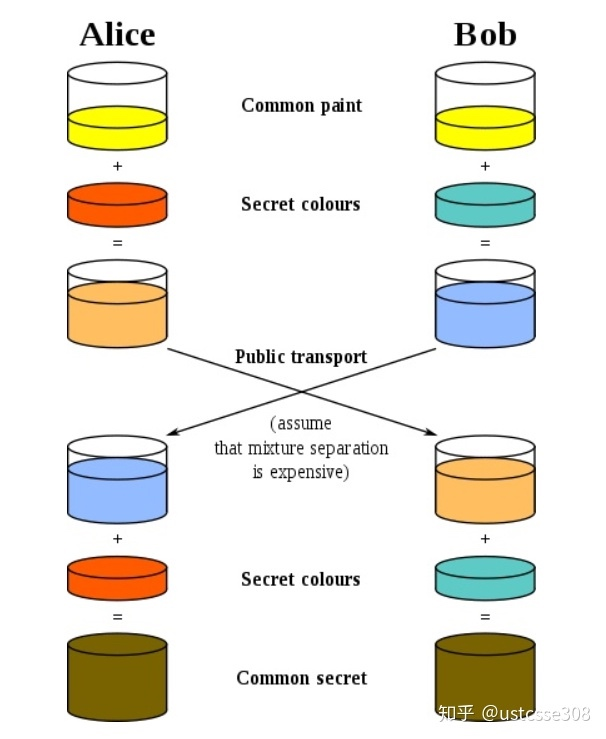
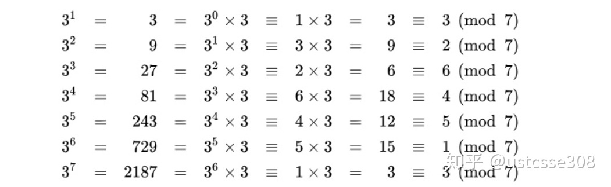
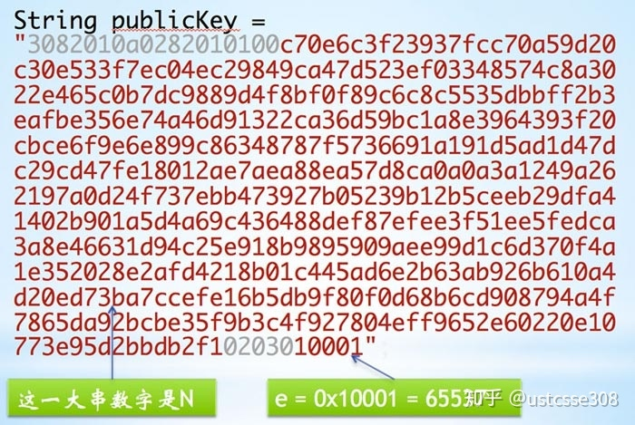
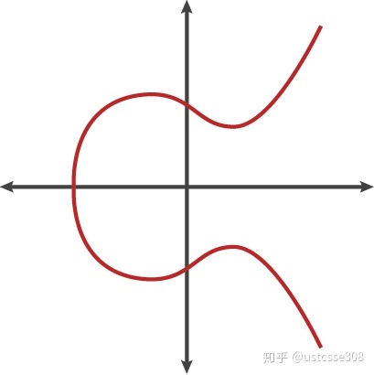
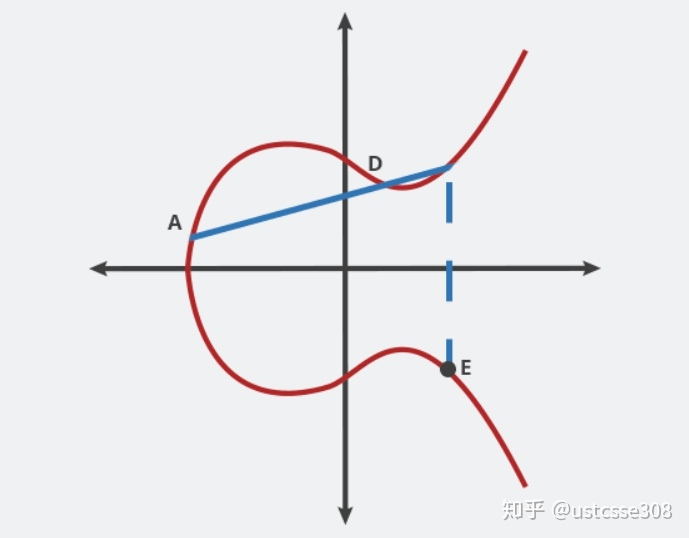
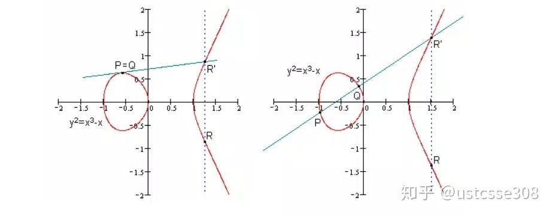
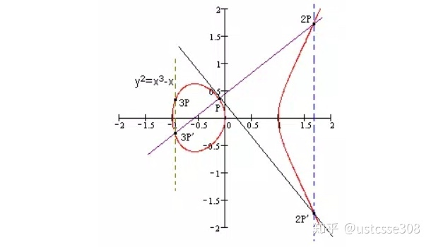
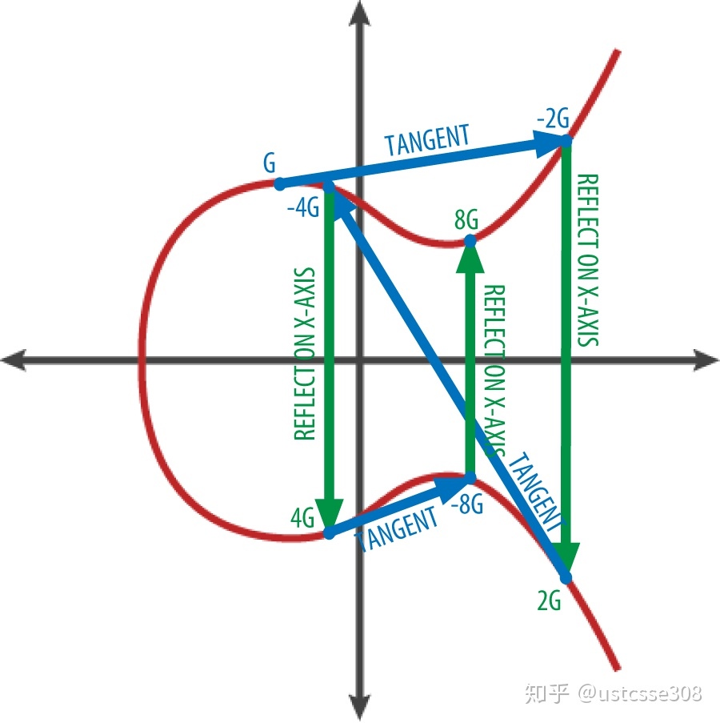

# 非对称加密
顾名思义，非对称加密的加密密钥和解密密钥是不同的，涉及两个密钥，分别称为公开密钥（public key）和私有密钥（private key）。公开密钥与私有密钥是成对出现的，如果公开密钥对数据进行加密，只有用对应的私有密钥才能解密；如果用私有密钥对数据进行加密，那么只有用对应的公开密钥才能解密。

非对称加密的发展起源于1976年的Diffie-Hellman密钥交换算法。**DH实际上并不是一种加密协议，它可以让双方在完全没有对方任何预先信息的条件下通过不安全的信道就密钥达成一致，这个密钥可以在后续的通信中作为对称密钥来加密。**

## DH算法

DH算法的过程用一个形象的描述如下：

DH协商过程，Alice和Bob首先挑选一个颜色（黄色），这个颜色是可以公开的（每次通信不同）；然后再各自挑选一个秘密的颜色（Alice橙色，Bob青色）。然后Alice和Bob各自将自己的秘密颜色和黄色进行混合，得到了另外的两个颜色（Alice橙褐色，Bob淡蓝色）。Alice和Bob分别将自己的颜色发给对方。Alice和Bob在收到对方发来的颜色后，再分别和自己的颜色相混合，此时，两人得到了一个相同的颜色（黄褐色）。

在这个过程中，攻击者Eve可以一直监听网络，并且获得Alice和Bob在网络上交换的所有信息。也即，可以获得黄色、橙褐色、淡蓝色这些信息。阻止Eve获得最终的黄褐色的是Alice和Bob分别挑选的秘密颜色，橙色和青色。也即，需要能够证明，即使Eve得到了黄色和橙褐色，Eve也不能推导出Alice的秘密颜色。

> 在数学上，DH算法的有效性依赖于计算离散对数的难度。也即，当已知大素数 p 和它的一个原根（primitive root） g ，对于给定的 b ，要计算指数 i ，是非常困难的（暴力破解），而给定 i ，计算 b 却很容易。

再用一个具体的例子来解释DH。

    1. Alice和Bob通过交流，决定选择素数 p = 23 以及原根 g = 5 。
    2. Alice选择了一个秘密整数 a = 4 ，Bob选择了秘密整数 b = 3 。
    3. Alice和bob分别使用 p, g, a 和 b 计算出A和B，其中

    A = g^a mod (p) = 5^4 mod (23) = 4

    B = g^b mod (p) = 5^3 mod (23) = 10

    4. Alice和Bob分别将这两个数字 A = 4 和 B = 10 通过网络发送给对方。

    5. Alice和Bob收到B和A之后，分别计算：

    s = B^a mod (p) = 10^4 mod (23) = 18

    s = A^b mod (p) = 4^3 mod (23) = 18            

    6. 现在Alice和Bob拥有了一个共同的密钥18。而且这个密钥从来没有在网络上传输过。

那现在看一下，DH算法可以运行的关键是什么？

> **即使攻击者Eve可以获得23、5、A和B，她仍然不能得到Alice和Bob的秘密数字4和3。也即，即使知道 5^3 mod (23) = 10 这个计算过程中的底数5，模数23和结果10，她依然不能得到指数3。这个就是DH算法所依赖的计算离散对数的难度。（证明计算离散对数很难超纲）**

当然我们这里所举的例子非常简单，在实际使用中，必须使用很大的 p, a, b 。如果 p 的长度为300位， a 和 b 长度为100位，那基本就安全了。

这里补充另外两个概念：原根和欧拉函数。

## 原根

如果a是素数p的一个原根，那么数值：

a mod p，a^2 mod p，…，a^(p-1) mod p 

是各不相同的整数，且以某种排列方式组成了从1到p-1的所有整数。

例子，3是7的原根。

反例：3不是13的原根。

    3^1 = 3 (mod 13)
    3^2 = 9 (mod 13)
    3^3 = 27 = 1 (mod 13)

## 欧拉函数

> **欧拉函数描述的问题是，任意给定正整数n，在小于等于n的正整数之中，有多少个与n构成互质关系？这个函数一般表示为φ(n)。**

> **设m是正整数，a是整数，若a模m的阶等于φ(m)，则称a为模m的一个原根。**

> 【**m有原根的充要条件是m= 1, 2, 4, p, 2p, p^n ，其中p是奇质数，n是任意正整数；也即不是所有的数都有原根】**

> **如果正整数m有原根，那么原根的个数为 φ（φ(m)）。**

> **另外补充一下欧拉定理。如果整数 a 和 m 互质，那么 a^φ(m) = 1 (mod m) 。费马小定理是欧拉定理当 m 是素数时的特例。（欧拉定理很有用，在后面RSA中还会出现。）**

譬如对于23而言，原根的个数应该是 
    
    φ(φ(23))= φ(22) = 22 * (1 - 1/2) * (1-1/11) = 10

可以很容易算出，从1~p-1的22个数中，

5, 7, 10, 11, 14, 15, 17, 19, 20, 21共10个数字是23的原根。

-------
### 补充
>  φ(n) 的计算。举例来说， φ(10) 计算的是不超过10的自然数中与10互质的数的个数。因为10=2*5，也即不超过10的自然数中，所有2的倍数，以及所有5的倍数都不与10互质。所以可以通过减去2的倍数的个数、5的倍数的个数，以及根据容斥原理，再加上同时是2和5的倍数的数字的个数，就可以算出来不超过10的自然数中与10互质的数字的个数。也即

    10 - (10 / 2) - (10 / 5) + (10 / (2 * 5)) = 4

上面的式子可以改写成：

    10 * (1 - 1/2) * (1 - 1/5) = 4

上面的式子可以进一步理解为：

    φ(10) = φ(2 * 5) = φ(2) * φ(5)

上面的公式是不是可以扩展为：

    φ(p * q) = φ(p) * φ(q)？

**_上述结论在p和q没有共同公因子的情况下是可以成立的。_**但是在 p 和 q 有共同公因子的情况下则有问题。譬如考虑 φ(8) 的情况。不大于8的自然数中与8互质的数就是去除所有2的倍数的数。因此，

    φ(8) = 8 - 8 / 2 = 8 * (1 - 1 / 2)
 
在上面的计算中，虽然 8 = 2^3  ，但是 φ(8) 的计算与次幂无关。因此，如果将8进行分解，譬如，分解成

    φ(8) = φ(2 * 4) = φ(2) * φ(4)

是有问题的。相当于多乘了1/2。也即，在质因子有幂乘的情况下，不能将质因子分解到两个乘数中去。这样看来，如果计算 φ(100)，不能将100分解成10 x 10，而应该分解为4 x 25。这样计算得出

**φ(100) = φ(4) * φ(25) = 2 * 20 = 40????????**

    同时， φ(p^n ) = p^n * (1 - 1 / p) = p^n-1 * (p - 1)也可以便于计算。

-------
所以这里有一个问题是，为什么在DH算法中，要强调使用的是原根？而不是和 p 互质的任意数字？因为根据素数的特性，不论是不是原根，下面的等式总是成立的。

    A^b mod (p) = (g^a )^b mod (p) = (g^b )^a mod (p) = B^a mod (p)
    
**这里主要涉及的问题是，破解的难度。**

如果使用的 g 不是 p 的原根，那么 g 的所有指数只能生成小于 p 的整数的一个子集。那么对于攻击者而言，此时即使是暴力破解，需要计算的也只是小于 p 的整数的子集，而不是小于 p 的整数全部。

譬如，对于素数13而言，3不是它的原根，(3^1 =3, 3^2 =9, 3^3 =1)mod（13），所以生成的模数只有3个（order），等效的指数也只有3个，降低了攻击者暴力破解的难度。

例如，在DH系统中，如果选择 g = 3，Alice选择了 a = 7 ，那么对于攻击者Eve而言，本来她需要尝试到7（遍历小于13的全部数字）才能得到 3^7 mod(13) = 3 ；但是实际上，Eve只需要知道 3^1 mod (13) = 3 就足够了。因为最终的s = [g^ab = g^7*b = (g^1 )^b = (g^1 )^b mod 13

所以大大降低了DH算法的破解难度。

另外，还需要注意一点，DH算法并没有对双方身份进行验证。当Alice和Bob希望进行通信时，Eve可以很容易地向Alice冒充自己是Bob，以及向Bob冒充自己是Alice，然后分别和Alice和Bob建立公共的对称密钥。然后，Alice到Bob的通信都会通过Eve先使用自己与Alice建立的密钥先解密，获得明文信息之后，再用Eve与Bob建立的密钥加密，传给Bob。Bob到Alice的通信亦然。这样，Alice和Bob会以为自己和对方的通信是加密的，从而是安全的，但是它们的通信会经过Eve加解密一遍。Eve在Alice和Bob之间，拦截他们的通信，并且维持通信，就称为中间人攻击。

为了防御中间人攻击，就需要一个能够验证通信双方身份的机制来防止这种攻击。

## RSA算法

RSA算法分为密钥生成和密钥使用。

Alice可以使用大质数为基础生成一对密钥，分别是公钥和私钥，一般使用公钥来加密（encryption），私钥来解密(decryption)， 所以一般用e表示公钥，d表示私钥。

在Alice生成公私钥对之后，公钥公开，所有人可见，如果Bob想给Alice发送加密信息，就可以使用Alice的公钥对信息进行加密；当Alice收到密文之后，使用自己的私钥进行解密。

在这个过程中，Alice的公钥和Bob加密之后的密文都是对攻击者Eve可见的。

**这里举一个具体的例子。**

> 1. 挑选两个质数，如 p=61和 q=53
> 2. 计算N = p*q = 3233
> 3. 计算（p-1）(q-1) = 60 * 52 = 3120 【这一步可以计算（p-1）和（q-1）的最小公倍数，从而使得计算的d比较小；17关于780的模逆是413，比2753要小】
> 4. 选择与3120互质的一个数 e = 17
> 5. 计算得出d，使得d是e关于3120的模逆，得出d = 2753（模逆可以使用Euclid扩展算法，证明略）(e * d mod 3120 = 1)
> 6. **如果明文是5， 那么密文是5^17 (mod 3233) = 3086**
> 7. **解密，3086^2753 (mod 3233) = 5**

> 公钥为(N,e) = (3233,17)
> 私钥为(N,d) = (3233,2753)

实际中的RSA公钥长这样：

**为什么RSA是不会被破解的呢？**

为了解密，关键是要找出私钥。如果已知（p-1）* (q-1)，那么就很容易算出来私钥。而为了获得（p-1）* (q-1)，就需要知道p和q的值。为了获得p和q的值，就必须对N进行因式分解。

**到目前为止，关于RSA可靠性的描述：**

对极大整数做因数分解的难度决定了RSA算法的可靠性。换言之，对一极大整数做因数分解愈困难，RSA算法愈可靠。
假如有人找到一种快速因数分解的算法，那么RSA的可靠性就会极度下降。但找到这样的算法的可能性是非常小的。今天只有短的RSA密钥才可能被暴力破解。到2008年为止，世界上还没有任何可靠的攻击RSA算法的方式。
只要密钥长度足够长，用RSA加密的信息实际上是不能被解破的。

**RSA的正确性：**

证明RSA的正确性，即证明文m经加密解密后还是m

即证  m = (m^e mod N)^d mod N    , m < N

即   m = (m^e % N)^d % N        , m < N

1. **当明文 m 与 N 互质时，可用欧拉定理**

        (m^e % N)^d % N
        = m^ed % N
        = m^kφ(N)+1 % N
        = [m(m^φ(N) % N)^k ] % N
        = m % N
        = m
    
        当m与N互质时，m^φ(N) = 1
    
2. **当明文 m 与 N 不互质时**
    
因为 n 是两个质数 p 和 q 的乘积，所以 m 必然是 p 或 q 的倍数（因为要求 m < N  ）。假设 m = kp 。

此时 m^ed = (kp)^ed ; 因为 p、q 互质，所以由费马小定理可知： (kp)^ed = (kp)^a(p-1)(q-1)+1 = (kp)(mod q)

改写一下这个式子：

(kp)^ed = b * q + kp ；

因为等式左右两边都是 p 的倍数，所以等式右边的一项 b * q 必然也是 p 的倍数。

所以等式可以改写成

(kp)^ed = c * p * q + kp ；

而 n = p * q ，所以上式左右两边同时对 n 求模，可以得到

(kp)^ed (mod n) = kp 

即 m (mod n) = m

得证。

### RSA的应用：数字签名

最普遍的应用，网站身份认证。如何证明我们连上的网站就是支付宝alipay呢？如果因为各种原因，如域名污染，我们的浏览器访问了攻击者网站，这时一定要进行验证。

验证，就是要检查一个证书。当我们以HTTPS的方式连上一个网站时，网站会首先给我们发送一个证书。这个证书里包含有它的域名、公钥等信息。同时这个证书是由专门的第三方公信机构CA使用自己的私钥签了名的。浏览器在拿到这个证书之后，首先用第三方公信机构CA的公钥对这个证书解密，然后查看和比对证书里的域名和浏览器地址栏的域名，完全匹配才认为是正确的网站。

如果域名被污染，虽然攻击者网站可以拷贝一份正常网站的证书，但是因为证书中包括了正常网站的公钥，如果它不能获得正常网站的私钥，那么它就没有办法对加密信息进行解密。从而不能正常建立连接。

那攻击者有没有可能伪造一份证书呢？只要攻击者拿不到第三方CA的私钥，就没有办法完成签名。那攻击者有没有可能伪造CA呢？

## ECC椭圆曲线加密

RSA算法是当前使用最广的非对称加密算法。但是RSA的缺点在于为了抵抗攻击，不得不增加公钥的长度。而随着长度的增加，计算量和复杂度也不断增加。正是因为非对称加密复杂度太高，所以一般仅用于在网络连接建立时的密钥协商过程。而且随着数字大小的增加，分解的效率会提高，乘法和分解的难度差距会减小。

所以RSA并不是将来密码学中最理想的系统。在理想的trapdoor函数中，正向计算（简单的计算）和反向计算（复杂计算）的难度应该随着数字的增加同步地增加。 所以需要更好的trapdoor函数。

1985年提出了基于椭圆曲线加密ECC（Elliptic Curve Cryptography）。

简单来说，椭圆曲线就是满足一个函数的一些点的集合。

椭圆曲线有各种形式，但一般而言，是包括两个变量的函数，其中一个次数是2，一个是3。一个椭圆曲线函数大概是这样：

y^2 = x^3 + ax + b

对应的曲线长这样：

虽然名字是椭圆曲线，但是本身并不像椭圆。

椭圆曲线之所以用在加密系统中，是因为它有一些很好的特性可以适合用来加密。

**椭圆曲线的一个特性是关于X轴对称。另一个特性是任何不垂直的线最多与曲线有三个交点。**

基于这些特性，在椭圆曲线上定义一些运算。（后面的“加法“和“乘法"只是为方便而取的名字，和我们所熟知的加法和乘法完全不同）

**在椭圆曲线上两点的加，指的是经过椭圆曲线上两点的线，和椭圆曲线的交点（第三个点）关于X轴的对称点。**

譬如说，在下面这张图中，A+D = E

还有这种，P+Q=R （右图）

特别地，如果要计算P + P（也即P = Q），那就作椭圆曲线在P点处的切线，与曲线相交于第二点，然后关于X轴对称得到第三点，则第三点为P点与自身的和，R = P + P。（左图）

根据这种定义，可以看出加法具有交换律。

还能定义乘法。

P+P首先得到2P。连接2P和P的直线与椭圆曲线相交，通过取与X轴对称的点，得到3P。如此，可以一直计算下去，得到kP(1 < k < n)。

**椭圆曲线难以破解的地方在于，给定点G和K，K = kG (1 < k < n)，想要推导出k是一件很困难的事情，目前没有比枚举k的值好很多的算法，而通常n会很大。**

**使用椭圆曲线进行加密通信的过程：**

1. Alice选定一条椭圆曲线EC(x,y)，并取椭圆曲线上一点，作为基点G。
2. Alice选择一个私有密钥k，并生成公开密钥K=kG。
3. Alice将EC(x,y)和点K，G传给Bob。
4. Bob接到信息后 ，将待传输的明文通过一定的方法编码到EC(x,y)上的一点M，并生成随机整数r（r<n）。
5. Bob计算点C1=M+rK；C2=rG。
6. Bob将C1、C2传给Alice。
7. Alice接到信息后，计算C1-kC2：C1-kC2=M+rK-k(rG)=M+rK-r(kG)=M；然后对点M进行解码就可以得到明文。

补充：课后有同学提出了问题，使用ECC的时候，Alice通过私有密钥k生成了公开密钥K，另外还公布了椭圆曲线。那么攻击者不需要知道k，只需要不停地计算，直到得到公开密钥K为止就行了，那同时也就得出了k。

这里的问题是，Alice自己并不需要老老实实地一个一个地加。椭圆曲线的加法应该是满足阿贝尔群【不懂】的，也即满足交换律和结合律。那么计算 kG 的时候，并不需要重复（k-1）次加法。这时候的计算复杂度差不多是 log2k 。

譬如说计算8G，这时只需要计算2G=（G+G）, 4G = (2G+2G)，以及8G=（4G+4G）即可。

10G类似，在计算出8G的情况下，再加上2G就行，而2G之前也已计算得出。

（可以对照RSA中的快速幂乘法）

## 非对称加密在区块链中的应用

在区块链中，公钥==身份。

在这之前，需要介绍一下数字签名的概念。数字签名类似于人们在纸上的签名。数字签名对应于手写签名需要有两个特点：1. 签名不能伪造，也即只有自己能做出这个签名；2. 签名是针对一份文档的，也即，一个签名只能和一个文档相关联，不能拿到一个签名用于多个文档，类似于不能把一份文件上的签名撕下来贴到另一个文件上。

具体是怎么实现呢？

> 1. 首先生成一对公私钥 (pk,sk) 。 pk 是公钥， sk 是私钥。
> 2. 签名sign。 sig = sign(sk,message) ，使用私钥对一份消息message进行处理，譬如先对message进行哈希得到摘要，然后使用私钥对摘要进行加密。
> 3. 验证verify。 verify(pk,message,sig) 。验证方法，获得输入message，签名的结果sig，以及公钥。譬如，可以使用公钥对签名结果进行解密，对message进行同样散列得到的摘要，比较解密的结果和摘要结果，如果两个相同，这验证通过，否则，验证失败。

也即，如果能够进行verify(pk,msg,sig)==true，那么，就可以认为pk确实说了msg。当然，为了以pk的身份说话，就必须有相应的私钥sk。

所以，可以认为 pk 就是身份identity，在比特币区块链中，使用 pk 的哈希作为身份。在生成一对公私钥之后，拥有 sk 的人可以控制 pk 。

使用公钥（的哈希）作为身份带来的一个好处是，分布式的身份管理。没有必要使用身份管理中心来管理这些身份。人们可以生成任意多个公钥进行交易。在区块链中，称为地址address（实际上是公钥的哈希）。

另一个好处是匿名。不过虽然地址不能直接和和现实中的人关联起来，但是通过一连串的交易还是有可能泄露身份。

